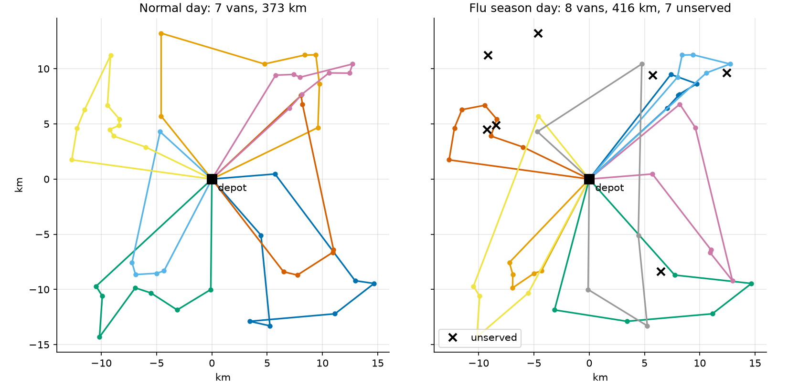
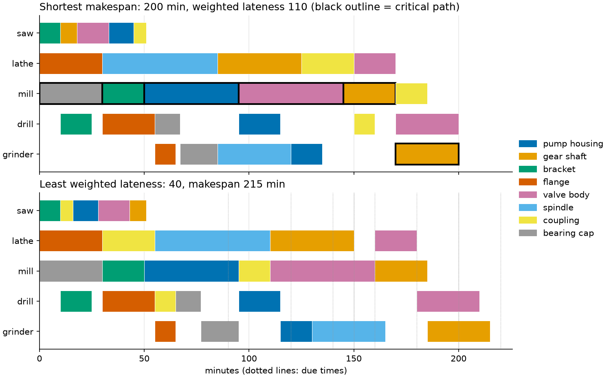
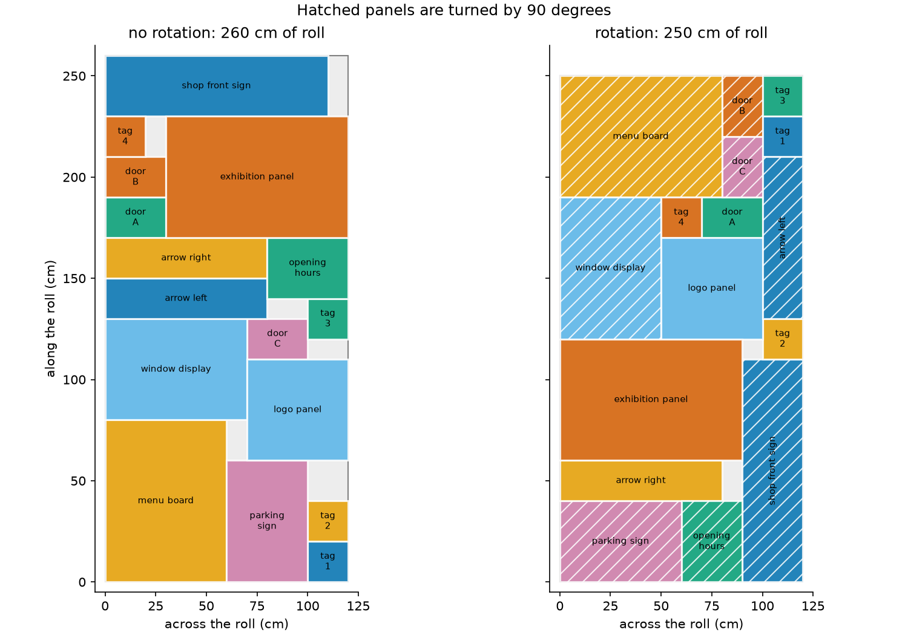
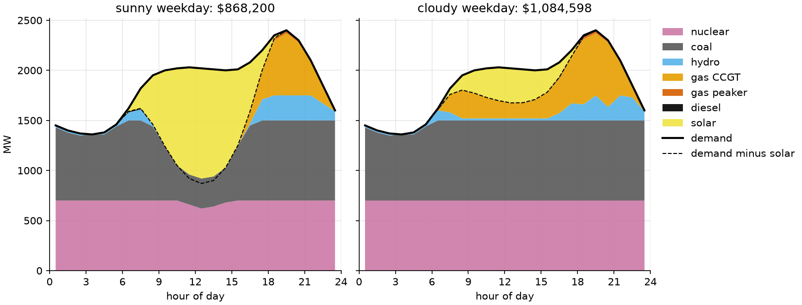

# OR-Tools examples

[](https://github.com/christianmerkwirth/ortools-examples/actions/workflows/ci.yml)
[](pyproject.toml)
[](https://developers.google.com/optimization)
[](LICENSE)

**20 tested, documented examples that show how to solve real optimization
problems with [Google OR-Tools](https://developers.google.com/optimization)
in Python.**

From a furniture workshop's first LP to a power grid's daily unit
commitment. Every example tells a story, explains the math, and proves its
own answer.

<table>
  <tr>
    <td width="33%"><a href="examples/ex13_vehicle_routing/README.md"></a></td>
    <td width="33%"><a href="examples/ex10_job_shop/README.md"></a></td>
    <td width="33%"><a href="examples/ex14_packing/README.md"></a></td>
  </tr>
  <tr>
    <td align="center"><sub><b>13</b> · Vehicle routing with time windows</sub></td>
    <td align="center"><sub><b>10</b> · Job shop scheduling</sub></td>
    <td align="center"><sub><b>14</b> · 2D strip packing</sub></td>
  </tr>
  <tr>
    <td><a href="examples/ex18_unit_commitment/README.md"></a></td>
    <td><a href="examples/ex06_facility_location/README.md"></a></td>
    <td><a href="examples/ex07_sudoku_nqueens/README.md"></a></td>
  </tr>
  <tr>
    <td align="center"><sub><b>18</b> · Unit commitment for power plants</sub></td>
    <td align="center"><sub><b>06</b> · Facility location</sub></td>
    <td align="center"><sub><b>07</b> · Sudoku and N-Queens</sub></td>
  </tr>
</table>

## Why these examples

Most solver examples stop when the solver says "optimal". These go further.
Each example:

- 📖 **tells a concrete story**: a workshop, a delivery fleet, a hospital
  roster, a power grid;
- 🧮 **explains the model** in plain words and in formulas;
- 🧹 **keeps the model apart from the data**, in short, commented code;
- 📊 **plots the result**, so you can see the answer;
- ✅ **is verified**: an independent checker, with no OR-Tools inside,
  confirms every constraint. Tests compare the result with a known optimum,
  a brute-force search, or a second solver.

## The examples

Click a name to open the example's README. Each one is a short tutorial.

### 🟢 Beginner

| #  | Example | Solver | You learn |
| -- | ------- | ------ | --------- |
| 01 | [Production planning](examples/ex01_production_planning/README.md) | MathOpt + GLOP | LP basics, shadow prices, reduced costs, what-if analysis |
| 02 | [Feed blending](examples/ex02_feed_blending/README.md) | MathOpt + GLOP | Ranged constraints, infeasibility diagnosis (IIS, elastic model), Farkas proofs |
| 03 | [Knapsack and multiple knapsack](examples/ex03_knapsack/README.md) | Knapsack solver, CP-SAT | Same problem, two solvers, scaling, side rules, DP referee |
| 04 | [Assignment](examples/ex04_assignment/README.md) | `linear_sum_assignment`, CP-SAT | Specialized vs general solvers, dual potentials as proof, pricing side rules |
| 05 | [Supply chain network flow](examples/ex05_network_flow/README.md) | `SimpleMaxFlow`, `SimpleMinCostFlow` | Max flow, min cut, bottleneck upgrades, node potentials |
| 07 | [Sudoku and N-Queens](examples/ex07_sudoku_nqueens/README.md) | CP-SAT | AllDifferent, uniqueness proofs, enumerating all solutions |

### 🟡 Intermediate

| #  | Example | Solver | You learn |
| -- | ------- | ------ | --------- |
| 06 | [Facility location](examples/ex06_facility_location/README.md) | MathOpt + HiGHS/SCIP | Binary variables, weak vs strong formulations, MIP gaps and bounds |
| 08 | [Exam timetabling](examples/ex08_exam_timetabling/README.md) | CP-SAT | Graph coloring, two encodings, symmetry breaking, clique/DSATUR bounds |
| 09 | [Nurse shift scheduling](examples/ex09_shift_scheduling/README.md) | CP-SAT | Boolean grid models, penalty literals, min-max fairness, lexicographic objectives |
| 10 | [Job shop scheduling](examples/ex10_job_shop/README.md) | CP-SAT | Interval variables, `NoOverlap`, makespan vs tardiness, critical path, Gantt charts |
| 11 | [Project scheduling (RCPSP)](examples/ex11_project_scheduling/README.md) | CP-SAT | `add_cumulative`, critical path vs resource limits, bottleneck what-if |
| 12 | [Traveling salesperson](examples/ex12_tsp/README.md) | Routing library, CP-SAT | Index manager, search strategies, guided local search, exact `add_circuit` baseline |
| 13 | [Vehicle routing with time windows](examples/ex13_vehicle_routing/README.md) | Routing library, CP-SAT | Capacity and time dimensions, fixed and span costs, optional visits, exact referee |
| 14 | [Bin packing and 2D packing](examples/ex14_packing/README.md) | CP-SAT | Symmetry breaking, L1/L2 bounds, `NoOverlap2D`, optional intervals for rotation |
| 17 | [Portfolio selection](examples/ex17_portfolio/README.md) | MathOpt (GLOP, HiGHS) | CVaR as an LP, semi-continuous weights, cardinality limits, efficient frontiers |

### 🔴 Advanced

| #  | Example | Solver | You learn |
| -- | ------- | ------ | --------- |
| 15 | [Cutting stock](examples/ex15_cutting_stock/README.md) | MathOpt (GLOP, HiGHS) + CP-SAT | Column generation, pricing knapsack, Farley bound, price and branch |
| 16 | [Sports league scheduling](examples/ex16_sports_scheduling/README.md) | CP-SAT | Break theory, circle method, template + draw model, redundant bounds |
| 18 | [Unit commitment](examples/ex18_unit_commitment/README.md) | MathOpt + HiGHS | Time-coupled MIP, tight min up/down rows, reserve, prices from a fixed-plan LP |
| 19 | [Pickup and delivery](examples/ex19_pickup_delivery/README.md) | Routing library, CP-SAT | Paired stops, same-vehicle and precedence rules, ride-time limits, LIFO |
| 20 | [Planning under uncertain demand](examples/ex20_stochastic_planning/README.md) | MathOpt + HiGHS | Two-stage stochastic MIP, what-if reruns vs one scenario model, VSS and EVPI, sample size |

## Where to start

New to optimization? Read **01 → 02 → 06** for linear and integer
programming, then **07 → 10** for constraint programming. After that, pick
whatever matches your problem.

Already know your problem? Find its type below.

| Your problem looks like… | Start with | Solver |
| ------------------------ | ---------- | ------ |
| Continuous amounts, linear costs and limits | [01](examples/ex01_production_planning/README.md), [02](examples/ex02_feed_blending/README.md) | MathOpt + GLOP |
| Yes/no decisions mixed with amounts | [06](examples/ex06_facility_location/README.md), [18](examples/ex18_unit_commitment/README.md) | MathOpt + HiGHS or SCIP |
| Logic rules, puzzles, rosters, timetables | [07](examples/ex07_sudoku_nqueens/README.md), [08](examples/ex08_exam_timetabling/README.md), [09](examples/ex09_shift_scheduling/README.md) | CP-SAT |
| Tasks on machines or crews over time | [10](examples/ex10_job_shop/README.md), [11](examples/ex11_project_scheduling/README.md) | CP-SAT intervals |
| Vehicles and stops | [12](examples/ex12_tsp/README.md), [13](examples/ex13_vehicle_routing/README.md), [19](examples/ex19_pickup_delivery/README.md) | Routing library |
| Uncertain demand or costs | [20](examples/ex20_stochastic_planning/README.md), [17](examples/ex17_portfolio/README.md) | MathOpt, scenario models |
| Flows through a network | [05](examples/ex05_network_flow/README.md) | Graph solvers |
| Items into boxes, bins, or sheets | [03](examples/ex03_knapsack/README.md), [14](examples/ex14_packing/README.md), [15](examples/ex15_cutting_stock/README.md) | Knapsack solver, CP-SAT, column generation |
| Workers to jobs, one to one | [04](examples/ex04_assignment/README.md) | `linear_sum_assignment` |

## Quick start

You need Python 3.11 or newer and [uv](https://docs.astral.sh/uv/).

```bash
git clone https://github.com/christianmerkwirth/ortools-examples.git
cd ortools-examples
uv sync

# Run one example. It prints a report and checks its own answer.
uv run python -m examples.ex01_production_planning.main

# Also write the figures to the example's figures/ folder.
uv run python -m examples.ex01_production_planning.main --plot

# Run all tests (about 450 tests, about 2 minutes).
uv run pytest
```

Without uv: `pip install ortools numpy matplotlib pytest`, then use
`python` in place of `uv run python`.

### Extra options

Every example takes `--plot`. Some examples have more options:

| Example | Option | What it does |
| ------- | ------ | ------------ |
| 03, 04 | `--benchmark` | Time the specialized solver against CP-SAT |
| 07 | `--max-n` | Count N-Queens solutions up to this board size |
| 08 | `--time-limit` | Seconds for the exam-spreading model |
| 13 | `--exact`, `--time-limit` | Also run the exact CP-SAT referee (60 s); seconds per routing solve |
| 14 | `--compare-grid` | Also solve the 2D part on a 1 cm grid (slower) |
| 15 | `--kantorovich` | Also solve the direct model (slow) |
| 16 | `--benchmark` | Compare the two models |
| 18 | `--benchmark` | Weak vs strong formulation on big fleets |
| 20 | `--convergence` | Also vary the number of scenarios |

Run any example with `--help` to see all its options.

## Layout

Every example folder has the same core files. Start reading at `model.py`.

```text
examples/
  common/                    shared helpers: text tables, plot style
  ex01_production_planning/
    README.md                the story, the model, the results
    data.py                  the problem instance
    model.py                 the OR-Tools model (start reading here)
    check.py                 independent solution checker, no OR-Tools
    main.py                  command-line entry point
    figures/                 plots used in the README
tests/
  test_ex01_production_planning.py
```

## Good to know

- **Time limits.** The routing library and some CP-SAT runs stop on a
  wall-clock limit. On a slower machine, they can return a different (but
  still valid) answer. The tests check the quality of such answers, not
  their exact value.
- **Threads.** Most CP-SAT models use 8 workers. They run fine on fewer
  cores, just with less speed-up.
- **Design rules.** [PLAN.md](PLAN.md) records the rules behind the
  examples and the decisions we made on the way.

## Tested with

OR-Tools 9.15 on Python 3.11, 3.12, and 3.13 (Linux). CI runs ruff, the
full test suite, and every example end to end on each push.

## License

[Apache-2.0](LICENSE), the same license as OR-Tools.
