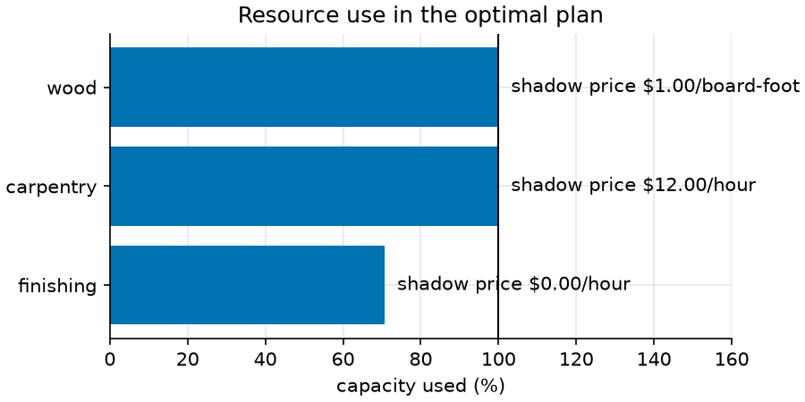
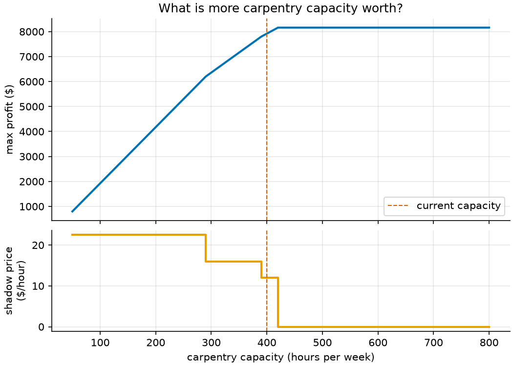

# 01 · Production planning (linear programming)

**Solver:** MathOpt with GLOP · **Problem class:** LP · **Level:** beginner

This example finds the most profitable weekly product mix for a small
furniture workshop. It then answers the questions a manager asks next:
*Which resource holds us back? What is one more hour of labor worth? Why
don't we make desks?* A linear program answers all three for free.

## The problem

The workshop makes chairs, tables, desks, and bookshelves. Each product
uses wood, carpentry time, and finishing time:

| product   | profit ($/unit) | wood (board-ft) | carpentry (h) | finishing (h) | demand (max) | promised (min) |
| --------- | --------------: | --------------: | ------------: | ------------: | -----------: | -------------: |
| chair     |              45 |               5 |             2 |             1 |          120 |              0 |
| table     |              80 |              20 |             5 |             2 |           40 |             10 |
| desk      |             110 |              30 |             8 |             4 |           25 |              0 |
| bookshelf |              60 |              12 |             4 |             3 |           30 |              0 |
| **available per week** |  |        **1200** |       **400** |       **280** |              |                |

A hotel has already ordered 10 tables. How many units of each product
should the workshop make?

## The model

**Decision variables.** $x_j$ = units of product $j$ made per week.

**Objective.** Maximize total profit:

$$\max \sum_j c_j \, x_j$$

**Constraints.**

$$
\begin{aligned}
\sum_j a_{ij} \, x_j &\le b_i && \text{for each resource } i \quad \text{(capacity)} \\
\ell_j \le x_j &\le u_j && \text{for each product } j \quad \text{(promised orders, demand)}
\end{aligned}
$$

Here $c_j$ is the unit profit, $a_{ij}$ the amount of resource $i$ that one
unit of product $j$ uses, $b_i$ the weekly capacity, and $\ell_j, u_j$ the
promised orders and the market demand.

> **Why continuous variables?** We treat the plan as a production *rate*.
> In this instance the optimum is whole numbers anyway. When whole units
> matter and the LP gives fractions, use integer variables (see
> [example 06](../ex06_facility_location/)). But integer models give no
> shadow prices, and those prices are the main lesson here.

## The OR-Tools code

All the modeling is in [`model.py`](model.py). The key lines:

```python
model = mathopt.Model(name=data.name)

# Promised orders and demand become variable bounds, not extra constraints.
quantity = {
    p.name: model.add_variable(lb=p.min_order, ub=p.max_demand, name=p.name)
    for p in data.products
}

# One capacity row per resource.
capacity = {
    r.name: model.add_linear_constraint(
        mathopt.fast_sum(
            p.usage.get(r.name, 0.0) * quantity[p.name] for p in data.products
        )
        <= r.capacity,
        name=r.name,
    )
    for r in data.resources
}

model.maximize(mathopt.fast_sum(p.profit * quantity[p.name] for p in data.products))
result = mathopt.solve(model, mathopt.SolverType.GLOP)
```

Things to notice:

- **MathOpt is solver-independent.** Change `SolverType.GLOP` to `HIGHS` or
  `PDLP` and nothing else changes. The tests run all three.
- **Always check `result.termination.reason`** before you read values. A
  solver can stop because the problem is infeasible, unbounded, or out of
  time.
- **`mathopt.fast_sum`** builds long sums much faster than Python's `sum`.
- **Duals come for free.** `result.dual_values(constraint)` gives the shadow
  price and `result.reduced_costs(variable)` the reduced cost.
- **Change the model, don't rebuild it.** `profit_curve()` sets
  `constraint.upper_bound` and solves again. This is how you run what-if
  studies fast.

## Run it

From the repository root:

```bash
uv run python -m examples.ex01_production_planning.main          # report
uv run python -m examples.ex01_production_planning.main --plot   # + figures
```

Output:

```text
Optimal weekly profit: $7,920.00

Production plan
product     units  allowed  $/unit  reduced cost
---------  ------  -------  ------  ------------
chair      120.00  0-120     45.00         16.00
table       24.00  10-40     80.00          0.00
desk         0.00  0-25     110.00        -16.00
bookshelf   10.00  0-30      60.00          0.00

Resources
resource   unit            used  capacity  slack  shadow price
---------  ----------  --------  --------  -----  ------------
wood       board-foot  1,200.00  1,200.00   0.00          1.00
carpentry  hour          400.00    400.00   0.00         12.00
finishing  hour          198.00    280.00  82.00          0.00

What the numbers say
* One more board-foot of wood is worth $1.00.
* One more hour of carpentry is worth $12.00.
* Finishing has slack; more of it is worth nothing.
* Chairs are limited by demand: each extra unit the market would buy adds $16.00.
* Desks earn too little: their unit profit must rise by more than $16.00 before making more of them pays.

Verification: the plan is feasible and provably optimal.
```

## Results

**The plan.** Make 120 chairs, 24 tables, 10 bookshelves, and no desks.
That earns $7,920 per week.

**Shadow prices** (dual values) tell you what one more unit of a resource
is worth. Wood and carpentry are used up. An extra board-foot of wood adds
$1, and an extra carpentry hour adds $12. So paying a carpenter $10 per
hour of overtime earns money, and paying $15 does not. Finishing has 82
idle hours, so its shadow price is zero.



**Reduced costs** tell you how far a product is from changing its place in
the plan:

- Desks: −16. Each desk uses 30 board-feet and 8 carpentry hours. At the
  shadow prices that costs 30 × $1 + 8 × $12 = $126. A desk earns only $110.
  So desks enter the plan only if their profit rises above $126.
- Chairs: +16. Chairs earn more than the resources they use cost, but the
  market buys only 120. Each extra chair the market would buy adds $16.

**Shadow prices hold only in a range.** The figure below solves the LP for
every carpentry capacity from 0 to 800 hours. Profit is a concave,
piecewise-linear curve. Its slope is the shadow price. The $12 price holds
from 390 to 420 hours. Above 420 hours, extra carpentry is worth nothing:
bookshelf demand runs out and wood becomes the only limit. Below 50 hours,
the 10 promised tables cannot be built, and the problem is infeasible.



### Check it by hand

At the optimum, three limits are tight: wood, carpentry, and chair demand
($x_\text{chair} = 120$). Plug in the chairs and solve for tables $T$ and
bookshelves $B$:

$$
\begin{aligned}
\text{wood:} \quad & 5 \cdot 120 + 20T + 12B = 1200 \\
\text{carpentry:} \quad & 2 \cdot 120 + 5T + 4B = 400
\end{aligned}
\quad\Rightarrow\quad T = 24,\ B = 10
$$

Tables and bookshelves are strictly between their bounds, so their reduced
costs must be zero. That gives the shadow prices $y_w$ and $y_c$:

$$
20\,y_w + 5\,y_c = 80, \qquad 12\,y_w + 4\,y_c = 60
\quad\Rightarrow\quad y_w = 1,\ y_c = 12
$$

## How we know the answer is right

[`check.py`](check.py) checks the solution without using OR-Tools:

1. **Feasibility.** Every limit holds, and the reported profit matches the
   plan.
2. **An optimality certificate.** For any prices $y \ge 0$ on the
   resources, let $d_j = c_j - \sum_i a_{ij} y_i$. Then every feasible plan
   satisfies

   $$c^\top x \;\le\; b^\top y + \sum_j \max(d_j \ell_j,\; d_j u_j).$$

   With the solver's shadow prices, this upper bound is exactly $7,920. So
   no plan can beat ours. This is LP duality, and it is a proof, not a
   heuristic.

The [tests](../../tests/test_ex01_production_planning.py) also:

- compare GLOP, HiGHS, and PDLP results,
- enumerate every vertex of the feasible region by brute force,
- re-solve with +1 unit of each resource to confirm each shadow price,
- move the desk profit just below and just above $126 to confirm the
  reduced cost,
- check that the profit curve is concave and that its slopes match the
  shadow prices, and
- check that too little carpentry gives an infeasible problem.

## Try this

- Make overtime a decision: add a variable for extra carpentry hours at
  $15 per hour, with a limit of 40. Does the plan use it? (The shadow price
  tells you before you solve.)
- Set the desk profit to $130 and solve again. Which products shrink? Why
  is the plan now fractional, and what would you do about it?
- Change `solver_type` to `mathopt.SolverType.PDLP`, a first-order method
  built for very large LPs. How close are its profit and shadow prices to
  the GLOP values?
- Make the variables integer (`model.add_integer_variable`) and solve with
  `SolverType.CP_SAT`. Why does `dual_values()` now fail?

## References

- [MathOpt user guide](https://developers.google.com/optimization/math_opt)
- [GLOP, the Google linear solver](https://developers.google.com/optimization/lp/glop)
- Bertsimas & Tsitsiklis, *Introduction to Linear Optimization*, ch. 4
  (duality) and ch. 5 (sensitivity analysis).
