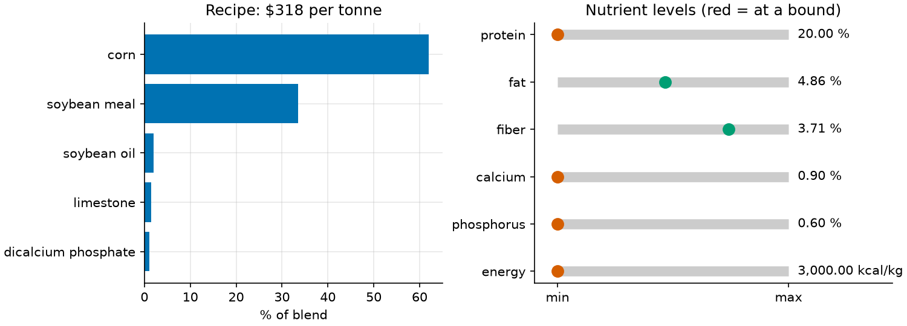
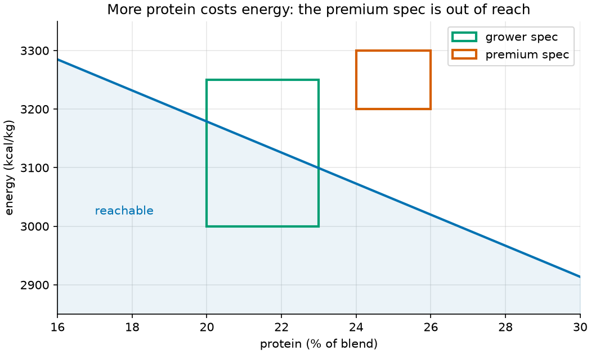

# 02 · Feed blending and infeasibility diagnosis (linear programming)

**Solver:** MathOpt with GLOP · **Problem class:** LP · **Level:** beginner

A feed mill mixes corn, soybean meal, minerals, and other ingredients into
chicken feed. The blend must meet a nutrient spec at the lowest cost. This
is the classic *diet problem*, one of the first uses of linear programming.

The second half of the example covers a problem every modeler meets: the
solver says **infeasible**, and you need to know *why*.

## The problem

Seven ingredients, each with a price and a nutrient profile:

| ingredient          | $/kg | protein % | fat % | fiber % | calcium % | phosphorus % | energy kcal/kg | max share |
| ------------------- | ---: | --------: | ----: | ------: | --------: | -----------: | -------------: | --------: |
| corn                | 0.22 |       8.5 |   3.8 |     2.2 |      0.02 |         0.28 |           3350 |           |
| soybean meal        | 0.45 |        44 |   1.5 |       7 |      0.30 |         0.65 |           2230 |           |
| wheat bran          | 0.18 |      15.5 |     4 |      11 |      0.14 |         1.15 |           1300 |       10% |
| fish meal           | 1.40 |        62 |     9 |       1 |         5 |            3 |           2800 |        5% |
| soybean oil         | 1.10 |           |    99 |         |           |              |           8800 |        5% |
| limestone           | 0.05 |           |       |         |        38 |              |                |           |
| dicalcium phosphate | 0.70 |           |       |         |        22 |         18.5 |                |           |

The **grower spec** asks for protein 20–23%, fat 3–7%, fiber at most 5%,
calcium 0.9–1.1%, phosphorus 0.6–0.9%, and energy 3000–3250 kcal/kg.

## The model

**Decision variables.** $x_j$ = share of ingredient $j$ in the blend
($0 \le x_j \le s_j$, where $s_j$ is its max share).

**Objective.** Minimize the cost of one tonne:

$$\min\ 1000 \sum_j c_j\, x_j$$

**Constraints.**

$$
\begin{aligned}
\sum_j x_j &= 1 && \text{(the shares make up the whole blend)} \\
L_n \le \sum_j a_{nj}\, x_j &\le U_n && \text{for each nutrient } n
\end{aligned}
$$

Because the shares add up to 1, the nutrient level of the blend is simply
the share-weighted average of the ingredient levels.

## The OR-Tools code

[`model.py`](model.py) builds the LP. Two MathOpt details are new compared
with [example 01](../ex01_production_planning/):

```python
# A ranged row: min <= level <= max. Python cannot chain `lb <= expr <= ub`
# into one constraint, so pass the bounds as keywords.
model.add_linear_constraint(lb=r.min, ub=r.max, expr=level, name=r.nutrient)

# Change a model in place: add a variable to an existing row.
row.set_coefficient(slack, 1.0)
```

## Run it

```bash
uv run python -m examples.ex02_feed_blending.main          # report
uv run python -m examples.ex02_feed_blending.main --plot   # + figures
```

```text
Cheapest 'broiler grower' blend: $317.86 per tonne

ingredient           % of blend  max %  $/kg
-------------------  ----------  -----  ----
corn                      61.94  100    0.22
soybean meal              33.49  100    0.45
soybean oil                2.03  5      1.10
limestone                  1.42  100    0.05
dicalcium phosphate        1.13  100    0.70

nutrient    unit        level  allowed    binding  $/unit
----------  -------  --------  ---------  -------  ------
protein     %           20.00  20-23      min       11.61
fat         %            4.86  3-7                   0.00
fiber       %            3.71  0-5                   0.00
calcium     %            0.90  0.9-1.1    min       14.53
phosphorus  %            0.60  0.6-0.9    min       47.71
energy      kcal/kg  3,000.00  3000-3250  min        0.18
```

## Results: the grower blend

The cheapest blend is mostly corn (energy) and soybean meal (protein),
with a little oil to lift the energy and two minerals for calcium and
phosphorus. It costs **$317.86 per tonne**. Fish meal and wheat bran are
not used.

Four nutrients sit at their minimum. Their shadow prices say what it
costs to ask for more:

- One more percentage point of protein costs **$11.61** per tonne.
- 100 kcal/kg more energy costs 100 × $0.18 = **$18.21** per tonne.
- Phosphorus is the most expensive per point ($47.71), but a spec moves
  it in steps of 0.05 points, so that is only $2.39 per step.



## When the spec is impossible

Marketing now asks for a **premium finisher** feed: protein at least 24%
*and* energy at least 3200 kcal/kg. The solver answers `INFEASIBLE`, and
nothing more. Two techniques tell us more.

### 1. Find a minimal conflict (deletion filter)

An *irreducible infeasible subsystem* (IIS) is a set of limits that cannot
hold together, but any smaller subset can. Commercial solvers such as
Gurobi compute one for you. In the solvers that ship with OR-Tools you can
build one yourself with a few LP solves. This is the **deletion filter**:

```python
for limit in relaxable_limits(data):
    restore = _drop(bm, limit)  # set the bound to +/- infinity
    if _is_feasible(bm):
        restore()  # needed for the conflict: put it back
        conflict.append(limit)
```

Result:

```text
A minimal conflict (these limits alone cannot all hold; any smaller set can):
  * protein >= 24
  * energy >= 3200
  * fish meal share <= 5%
  * soybean oil share <= 5%
```

This reads like a story. Protein comes from soybean meal (low energy) or
fish meal (capped at 5%). Energy comes from corn (low protein) or oil
(capped at 5%). With both caps in place, no mix delivers both.

> **Careful:** an IIS is *one* conflict. A spec can contain several. If you
> raise the oil cap, the solver still says infeasible, because now the
> *fat ≤ 7%* limit stops the extra oil. Run the filter again to find that
> second conflict: {protein ≥ 24, energy ≥ 3200, fish meal ≤ 5%, fat ≤ 7}.

### 2. Find the smallest fix (elastic model)

Which change to the spec is the smallest? Add a slack variable to every
nutrient bound, so a bound can bend at a penalty. Then minimize the total
bending. We divide each slack by its bound, so a 1% change in protein and
a 1% change in energy count the same. Ingredient caps stay hard: they
protect the birds and the product, so we do not bargain over them.

```text
Smallest change to the nutrient spec that makes it feasible:
  * energy >= 3200 kcal/kg  ->  energy >= 3,072.7 kcal/kg  (-4.0%)
```

So lower the energy target by 4%, and keep the protein target. The relaxed
premium blend costs $400.37 per tonne, which is $82 more than the grower
blend.

The figure shows the full trade-off. For each protein level, the curve
gives the highest energy that any blend can reach under the other limits.
The grower spec overlaps the reachable region. The premium spec lies
entirely above it.



## How we know the answers are right

[`check.py`](check.py) needs no OR-Tools. One function,
`lagrangian_bound`, proves both results. For any prices $t$ (on the
"shares add up to 1" row) and $y_n$ (on the nutrient rows), let
$d_j = c_j - t - \sum_n a_{nj} y_n$. Then every feasible blend costs at
least

$$t + \sum_n \min(y_n L_n,\ y_n U_n) + \sum_j \min(0,\ d_j s_j).$$

- **Optimality.** With the solver's dual values, this bound equals
  $317.86. So no blend is cheaper.
- **Infeasibility.** Set every cost to zero. Any blend would then cost 0.
  If some prices make the bound *positive*, no blend can exist. The
  elastic model's dual values are such prices: they give a bound of
  0.0398, which is exactly the elastic model's minimal violation. This is
  a *Farkas certificate*.

The [tests](../../tests/test_ex02_feed_blending.py) also:

- sample 20,000 random blends near the optimum and confirm none is
  cheaper,
- tighten each binding minimum a little and confirm the cost rises by the
  shadow price,
- confirm that the bound holds for arbitrary prices,
- check the conflict is irreducible: infeasible with only its four
  limits, feasible after dropping any one of them,
- check that the elastic fix works, and that a fix 1 kcal/kg smaller does
  not, and
- check that the frontier curve at 24% protein matches the elastic result.

## Try this

- Let the elastic model also relax ingredient caps, with a large penalty.
  Does it now prefer more fish meal or more oil?
- Fish meal prices swing a lot. At what price per kg does it enter the
  grower blend? (Hint: add `result.reduced_costs()` to the `Blend` result.)
- Change the order of `relaxable_limits()`. Does the deletion filter find a
  different conflict?
- Add a second objective: among all blends within 1% of the minimum cost,
  find the one with the most protein.

## References

- [MathOpt user guide](https://developers.google.com/optimization/math_opt)
- G. Stigler, *The Cost of Subsistence*, 1945 — the original diet problem.
- J. W. Chinneck, *Feasibility and Infeasibility in Optimization*,
  Springer, 2008 — deletion filter and elastic programming.
