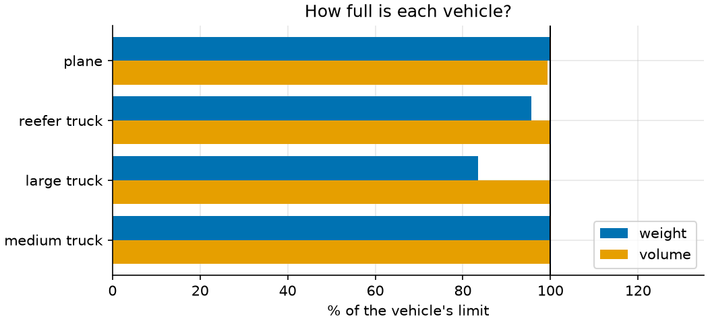
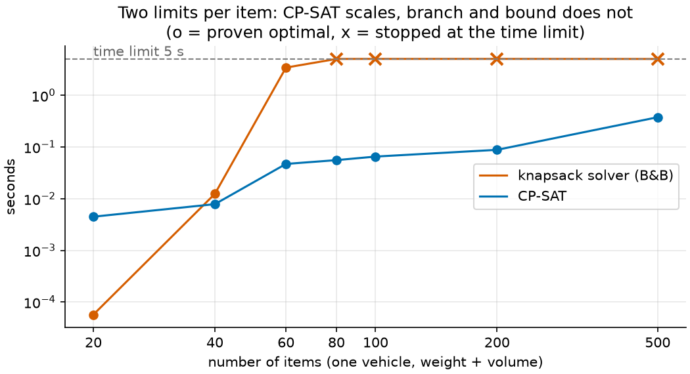

# 03 · Knapsack and multiple knapsack

**Solvers:** knapsack solver, CP-SAT · **Problem class:** 0-1 integer
programming · **Level:** beginner

After an earthquake, a relief agency has more supplies in its warehouse
than it can move at once. Which pallets go on the first plane? And when
three trucks leave, which pallet goes on which truck? This is the
*knapsack problem*: pick the most valuable set of items that fits.

The example solves the same problem with two OR-Tools solvers: a
specialized knapsack solver and the general CP-SAT solver. It shows when
each one is the right tool.

## The problem

22 pallets wait in the warehouse. Each has a **priority score** (how much
it helps in the first days), a weight, and a volume. Three of them
(vaccines, insulin, blood bags) must stay cold. In total they weigh
9,240 kg, take 37.2 m³, and score 1,245 points. See [`data.py`](data.py)
for the full list.

- **Part A:** one cargo plane takes at most 4,000 kg and 15 m³. It can
  carry cold boxes.
- **Part B:** a convoy of three trucks:

  | truck        | max kg | max m³ | fridge |
  | ------------ | -----: | -----: | :----: |
  | reefer truck |  1,800 |    8.0 |  yes   |
  | large truck  |  3,200 |   12.0 |        |
  | medium truck |  2,200 |    9.0 |        |

  Cold items may only travel on the reefer truck. Fuel drums and medical
  oxygen are hazardous goods and must not share a truck.

## The model

**Part A: multidimensional knapsack.** Let $x_i \in \{0, 1\}$ be 1 if item
$i$ goes on the plane. With score $p_i$, weight $w_i$, volume $v_i$, and
limits $W$ and $V$:

$$
\max \sum_i p_i x_i
\quad\text{subject to}\quad
\sum_i w_i x_i \le W, \qquad
\sum_i v_i x_i \le V.
$$

**Part B: multiple knapsack with side rules.** Let $x_{it} \in \{0, 1\}$
be 1 if item $i$ goes on truck $t$:

$$
\begin{aligned}
\max\ & \sum_{i,t} p_i x_{it} \\
\text{s.t.}\ & \textstyle\sum_t x_{it} \le 1 && \text{each item travels at most once} \\
& \textstyle\sum_i w_i x_{it} \le W_t,\ \ \sum_i v_i x_{it} \le V_t && \text{each truck's limits} \\
& x_{it} = 0 && \text{cold item } i \text{, truck } t \text{ without fridge} \\
& x_{\text{fuel},t} + x_{\text{oxygen},t} \le 1 && \text{for each truck } t
\end{aligned}
$$

## The OR-Tools code

All the modeling is in [`model.py`](model.py).

**The knapsack solver** takes plain lists: values, one row of weights per
limit, and the capacities.

```python
solver = knapsack_solver.KnapsackSolver(
    knapsack_solver.SolverType.KNAPSACK_MULTIDIMENSION_BRANCH_AND_BOUND_SOLVER,
    "relief plane",
)
solver.init(
    [i.value for i in items],
    [[i.weight for i in items], [_volume_units(i.volume) for i in items]],
    [vehicle.max_weight, _volume_units(vehicle.max_volume)],
)
value = solver.solve()
```

**CP-SAT** needs a few more lines, but every line reads like the math:

```python
take = {i.name: model.new_bool_var(f"take {i.name}") for i in items}
model.add(sum(i.weight * take[i.name] for i in items) <= vehicle.max_weight)
model.add(
    sum(_volume_units(i.volume) * take[i.name] for i in items)
    <= _volume_units(vehicle.max_volume)
)
model.maximize(sum(i.value * take[i.name] for i in items))
```

Things to notice:

- **Both solvers need whole numbers.** Volumes have one decimal, so the
  model counts volume in units of 0.1 m³ (`VOLUME_SCALE = 10`). Scale your
  data like this, and never round it silently.
- **Rules that the knapsack solver cannot express.** Part B needs "at most
  one truck per item" and "fuel and oxygen apart". The knapsack solver only
  knows capacity limits, so Part B uses CP-SAT only.
- **Leave out forbidden variables.** A cold item gets no variable at all
  for trucks without a fridge. This is simpler and faster than a
  constraint that forces the variable to 0.
- **`add_at_most_one`** states "each item travels at most once" and "fuel
  and oxygen apart" directly. It is clearer than a sum ≤ 1, and CP-SAT
  can reason about it as a single rule.

## Run it

```bash
uv run python -m examples.ex03_knapsack.main               # report
uv run python -m examples.ex03_knapsack.main --plot        # + figures
uv run python -m examples.ex03_knapsack.main --benchmark   # + solver timing
```

```text
Part A: one cargo plane (4,000 kg, 15 m³)

method                          score  optimal  seconds
------------------------------  -----  -------  -------
knapsack solver                   840  True     0.00
CP-SAT                            840  True     0.01
dynamic programming (check.py)    840  True

vehicle  items  kg used / max  m³ used / max  score
-------  -----  -------------  -------------  -----
plane       14  3,990 / 4,000  14.9 / 15.0      840

Left behind: field hospital tent, family tents (20), blankets (500), food rations (1000), water bottles (2000 l), chainsaws and tools, cooking sets (200), water containers (500)

========================================================================

Part B: a convoy of three trucks with side rules

Total score: 1125  (proven optimal: True)

vehicle       items  kg used / max  m³ used / max  score
------------  -----  -------------  -------------  -----
reefer truck      8  1,720 / 1,800  8.0 / 8.0        415
large truck       7  2,670 / 3,200  12.0 / 12.0      485
medium truck      4  2,200 / 2,200  9.0 / 9.0        225
...
Left behind: blankets (500), water bottles (2000 l), cooking sets (200)

Upper bound from one pooled truck (check.py): 1125
```

## Results

**The plane** carries 14 of the 22 pallets and scores 840 of 1,245
points. It is almost exactly full: 3,990 of 4,000 kg and 14.9 of 15 m³.
Both limits matter, which is why this is a *two-dimensional* knapsack.
Note what stays behind: the field hospital tent scores 90, the second
highest of all, but it uses 4.5 m³. Several small, high-priority pallets
give more points for that space. A greedy rule, "load the best score
first", takes the tent and scores only 700 points, 17% less than the
optimum.

**The convoy** carries 19 pallets and scores 1,125. The cold items ride
the reefer truck. Fuel goes on the medium truck and oxygen on the large
truck. Three bulky, low-priority pallets stay behind: blankets, water
bottles, and cooking sets.

The side rules cost nothing here: the convoy scores exactly what one big
truck with all three trucks' limits and a fridge would score. The solver
found a way to obey the rules without losing a single point. That is not
always so. Try a smaller reefer truck.



### Which solver should you use?

On this small plane, both solvers take milliseconds. But the knapsack
solver's branch and bound handles two limits per item badly. The
benchmark loads random instances with a 5-second time limit:

```text
items  B&B s  B&B score  B&B opt  CP-SAT s  CP-SAT score  CP-SAT opt
-----  -----  ---------  -------  --------  ------------  ----------
   20   0.00        680  True         0.00           680  True
   40   0.01      1,358  True         0.01         1,358  True
   60   3.44      2,130  True         0.05         2,130  True
   80   5.05      2,763  False        0.06         2,809  True
  100   5.06      3,385  False        0.07         3,552  True
  200   5.06      4,089  False        0.09         7,225  True
  500   5.04      6,298  False        0.38        18,179  True
```

From 80 items on, branch and bound hits the time limit without a proof,
and its best answer falls far behind. At 500 items it finds only a third
of the possible score. CP-SAT proves the optimum in well under a second.
(Your timings will differ; the trend will not.)



The lesson: a specialized solver is not always faster. Measure on
realistic data. With a single limit (weight only), the knapsack solver
also offers dynamic-programming and 64-item variants made for that case.
But once the problem gets a second dimension or any side rule, CP-SAT is
the safer choice.

## How we know the answers are right

[`check.py`](check.py) uses no OR-Tools:

1. **Feasibility.** `feasibility_errors` checks every rule: weight,
   volume, cold chain, hazardous pairs, and that the reported score matches
   the loaded items.
2. **An exact referee for Part A.** `best_single_vehicle_value` solves the
   plane by dynamic programming over a (weight, volume) table. It is a
   different algorithm from both solvers, and it also finds 840.
3. **An upper bound for Part B.** `pooled_bound` merges all trucks into
   one fridge truck with their summed limits and drops the hazardous-goods
   rule. Every real convoy loading fits this pooled truck, so its optimum
   bounds the convoy from above. The pooled optimum is 1,125. The convoy
   reaches it, so the convoy is optimal without trusting CP-SAT.

The [tests](../../tests/test_ex03_knapsack.py) also:

- compare the dynamic program with brute force on random 12-item
  instances,
- compare both solvers with the dynamic program on random 30-item
  instances,
- solve the convoy again as a MIP with HiGHS,
- compare the convoy with brute force on small random instances (8 items,
  2 trucks, one hazardous pair),
- check the pooled bound on random 3-truck instances, and
- check that cold items never board a vehicle without a fridge.

## Try this

- Shrink the reefer truck to 6 m³. Now the cold items compete for space.
  What do the side rules cost?
- Add a rule: the satellite phones must go on the same truck as the
  surgical kits (`model.add(x == y)`). Can the knapsack solver express it?
- Make some pallets *must-ship*: fix their variables to 1. What happens
  to the score?
- Run the benchmark with a weight limit only (drop the volume row). Try
  `KNAPSACK_DYNAMIC_PROGRAMMING_SOLVER`. Which solver wins now?

## References

- [OR-Tools knapsack guide](https://developers.google.com/optimization/pack/knapsack)
- [OR-Tools multiple knapsack guide](https://developers.google.com/optimization/pack/multiple_knapsack)
- H. Kellerer, U. Pferschy, D. Pisinger, *Knapsack Problems*, Springer,
  2004.
