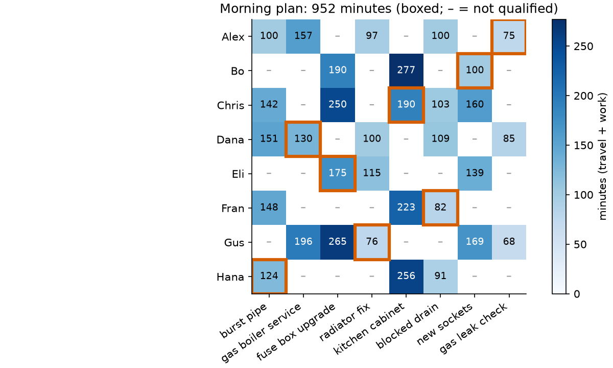
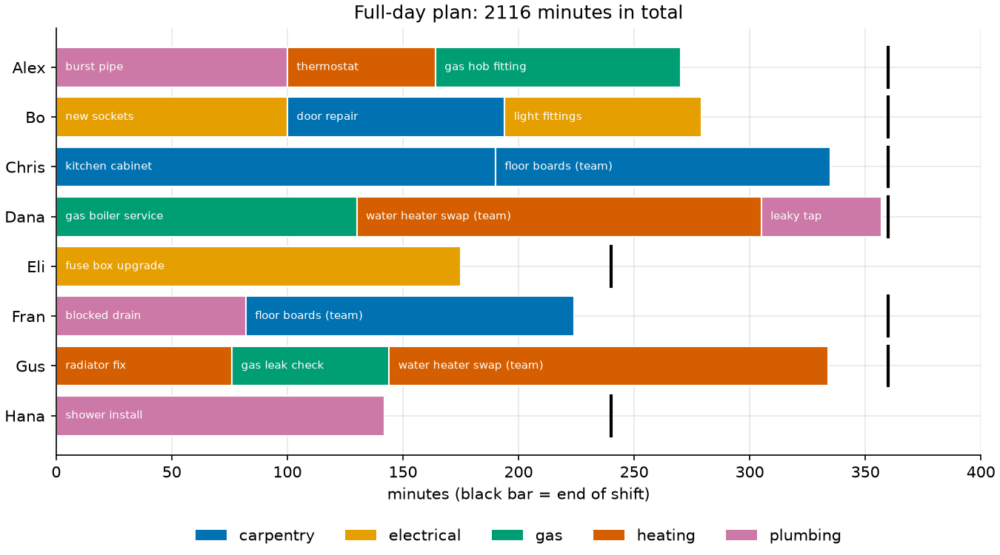

# 04 · Assignment: technicians to jobs (specialized solver vs CP-SAT)

**Solvers:** `linear_sum_assignment`, CP-SAT · **Problem class:** assignment,
generalized assignment · **Level:** beginner

A home repair company sends technicians to customers. Who should do which
job, so that the team spends the least time on the road and at work?

The example solves the same kind of question twice. First as the classic
*assignment problem*, with OR-Tools' specialized solver. Then with the
rules of a real working day, which the specialized solver cannot express.
There, CP-SAT takes over. The lesson is when to use which.

## The problem

Eight technicians work from four districts of a town. Each job needs one
trade: plumbing, electrical, gas, heating, or carpentry. Each technician
is fast in some trades, slower in others, and not qualified in some. Gas
work needs a gas certificate.

The time a technician needs for a job is

$$\text{minutes} = \text{travel time to the district} + \text{base duration} \times \text{speed factor}.$$

- **Part A, the morning.** Eight technicians, eight jobs. Each technician
  does exactly one job.
- **Part B, the full day.** Sixteen jobs. A technician may do several
  jobs, but only within their shift (six hours, or four for the two
  part-timers). Two heavy jobs need a team of two.

## The model

**Part A: the linear assignment problem.** Let $x_{tj} = 1$ if technician
$t$ does job $j$. Only qualified pairs $(t, j) \in A$ get a variable.

$$
\begin{aligned}
\min\ & \sum_{(t,j) \in A} c_{tj}\, x_{tj} \\
\text{s.t.}\ & \sum_j x_{tj} = 1 && \text{for each technician } t \\
& \sum_t x_{tj} = 1 && \text{for each job } j \\
& x_{tj} \in \{0, 1\}
\end{aligned}
$$

This problem has a special structure. Its LP relaxation always has an
integer optimum, and fast polynomial algorithms solve it (the Hungarian
method, $O(n^3)$, or the cost-scaling method that OR-Tools uses).

**Part B: a generalized assignment problem.** The same variables, but
different rules. Job $j$ needs $k_j$ people (1 or 2), and technician $t$
has a shift of $S_t$ minutes:

$$
\begin{aligned}
\sum_t x_{tj} &= k_j && \text{for each job } j \\
\sum_j c_{tj}\, x_{tj} &\le S_t && \text{for each technician } t
\end{aligned}
$$

The shift row is a knapsack constraint. With it, the problem becomes
NP-hard, and the special structure is gone.

## The OR-Tools code

Part A with [`SimpleLinearSumAssignment`](model.py):

```python
solver = linear_sum_assignment.SimpleLinearSumAssignment()
for t, tech in enumerate(data.technicians):
    for j, job in enumerate(data.jobs):
        cost = data.cost(tech, job)
        if cost is not None:  # Only qualified pairs become arcs.
            solver.add_arc_with_cost(t, j, cost)

if solver.solve() == solver.OPTIMAL:
    for t in range(solver.num_nodes()):
        job = data.jobs[solver.right_mate(t)]
```

Things to notice:

- **Missing arcs mean "not allowed".** You do not need a large penalty
  cost for forbidden pairs. If no complete assignment exists, `solve()`
  returns `INFEASIBLE`.
- **Costs must be integers.** Scale them if they are not.
- **The solver needs a square problem**: as many technicians as jobs. For
  more jobs than people, add dummy technicians with cost 0, or use CP-SAT.

Part B with CP-SAT. Each rule is one line per job or per technician:

```python
for job in data.jobs:
    model.add(sum(by_job[job.name].values()) == job.team_size)
for tech in data.technicians:
    pairs = by_tech.get(tech.name, {})
    model.add(sum(cost[p] * v for p, v in pairs.items()) <= tech.shift)
```

`solve_day()` has switches for both rules (`use_shifts`, `use_teams`).
That is a cheap way to ask "what does this rule cost us?"

> **Tip:** build the CP-SAT model with variables grouped by technician and
> by job (see `_group()` in `model.py`). Scanning all pairs for each row
> makes the Python part $O(n^3)$, which is slow for large $n$.

## Run it

```bash
uv run python -m examples.ex04_assignment.main              # report
uv run python -m examples.ex04_assignment.main --plot       # + figures
uv run python -m examples.ex04_assignment.main --benchmark  # + timing
```

```text
Part A: morning, one job each. Total: 952 minutes

technician  job                 trade       minutes
----------  ------------------  ----------  -------
Alex        gas leak check      gas              75
Bo          new sockets         electrical      100
Chris       kitchen cabinet     carpentry       190
Dana        gas boiler service  gas             130
Eli         fuse box upgrade    electrical      175
Fran        blocked drain       plumbing         82
Gus         radiator fix        heating          76
Hana        burst pipe          plumbing        124

Linear sum assignment: 952 min.  CP-SAT: 952 min (proven optimal: True).

========================================================================

Part B: full day, 16 jobs. Total: 2116 minutes

technician  minutes  shift  jobs
----------  -------  -----  ------------------------------------------------
Alex            270    360  burst pipe, thermostat, gas hob fitting
Bo              279    360  new sockets, door repair, light fittings
Chris           335    360  kitchen cabinet, floor boards
Dana            357    360  gas boiler service, water heater swap, leaky tap
Eli             175    240  fuse box upgrade
Fran            224    360  blocked drain, floor boards
Gus             334    360  radiator fix, gas leak check, water heater swap
Hana            142    240  shower install

What each rule costs
rules                           minutes  extra
------------------------------  -------  -----
no shift limits, no team jobs     1,748
+ team jobs need two people       2,083  +335
+ shift limits (the real plan)    2,116  +33

Verification: both plans meet every rule. The morning plan is
proven optimal by dual potentials; the day plan by CP-SAT.
```

## Results

**Part A.** The best morning plan takes 952 minutes. It is not greedy.
Hana's fastest job is the blocked drain (91 min), but Fran is even faster
there (82 min). So Hana takes the burst pipe instead. Alex is the fastest
choice for the burst pipe (100 min), yet the plan sends them to the gas
leak check, because only three technicians hold a gas certificate.



**Part B.** The full day takes 2,116 minutes. The table above shows what
each rule costs:

- Without any rules, every job simply goes to its fastest technician:
  1,748 minutes.
- Team jobs add 335 minutes. That is exactly the time of the second
  team member on each heavy job: Gus on the water heater swap (190 min)
  and Chris on the floor boards (145 min).
- Shift limits add only 33 minutes. Without them, Chris would work 469
  minutes and Dana 390, both over their 360-minute shift. The solver
  moves three small jobs: the door repair to Bo, the gas hob fitting to
  Alex, and the leaky tap from Chris to Dana.

Dana ends 3 minutes before the end of the shift. The plan minimizes the
total time, not the spread. So Hana works 142 minutes and Dana 357. See
"Try this" for a fairer plan.



### When to use which solver

| n   | assignment solver | CP-SAT  |
| --: | ----------------: | ------: |
|  50 |           0.002 s |  0.11 s |
| 100 |           0.008 s |  1.04 s |
| 200 |           0.021 s | 11.34 s |
| 400 |           0.159 s | 27.64 s |

(Random square instances from `--benchmark`. Times depend on your
machine. Both solvers find the same optimum every time.)

The specialized solver is 50 to 500 times faster. So:

- **Pure assignment** (one-to-one, costs only): use
  `linear_sum_assignment`. It scales to many thousands of nodes.
- **Any extra rule** (capacities, teams, forbidden combinations, fairness):
  use CP-SAT, or a MIP solver. You pay in speed, and you gain freedom.
- **More jobs than people, no other rules**: add zero-cost dummy
  technicians and stay with the fast solver.

## How we know the answer is right

[`check.py`](check.py) uses no OR-Tools code.

1. **Feasibility.** `feasibility_errors()` checks every rule: qualified
   pairs only, the right number of people per job, one job each (Part A),
   and shift limits (Part B).
2. **An optimality certificate for Part A.** `check.py` has its own small
   Hungarian method. Besides the plan, it returns a *potential* $u_t$ for
   every technician and $v_j$ for every job, such that

   $$u_t + v_j \le c_{tj} \quad \text{for every qualified pair}.$$

   Add this up over the $n$ pairs of *any* complete plan. Every $u_t$ and
   every $v_j$ appears exactly once, so every plan costs at least
   $\sum_t u_t + \sum_j v_j$. Here that sum is 952, which is the cost of
   our plan. So no plan is cheaper. For example, Fran has $u = 169$ and
   the blocked drain has $v = -87$: $169 - 87 = 82$, exactly Fran's time
   for that job.

The [tests](../../tests/test_ex04_assignment.py) also:

- try all 8! = 40,320 morning plans,
- compare the assignment solver, CP-SAT, and the Hungarian method on
  random instances, with brute force for $n = 7$ and certificates for
  $n = 30$ and $n = 80$,
- solve Part B again as a MIP with HiGHS, a second independent solver,
- check Part B by brute force on a small instance with a team job,
- check that, without rules, each job goes to its fastest technician,
- check that impossible instances raise an error, and
- check that the checker catches broken rules.

## Try this

- **Fairness.** Add an integer variable for the longest working day, and
  minimize `total + 5 * longest`. How much total time does a fairer plan
  cost?
- **Overtime.** Allow 60 minutes of overtime per technician at a penalty
  of 2 per minute. Does the plan use it?
- **Skills.** Make the two team jobs need at least one expert (speed
  factor 1.0) in the team.
- **Dummy technicians.** Solve a 6-technician, 8-job morning with
  `linear_sum_assignment` by adding two dummy technicians with cost 0.
  Which jobs stay open?

## References

- [OR-Tools assignment guide](https://developers.google.com/optimization/assignment)
- [CP-SAT assignment examples](https://developers.google.com/optimization/assignment/assignment_cp)
- H. W. Kuhn, *The Hungarian Method for the Assignment Problem*, Naval
  Research Logistics Quarterly, 1955.
- R. Burkard, M. Dell'Amico, S. Martello, *Assignment Problems*, SIAM,
  2012.
