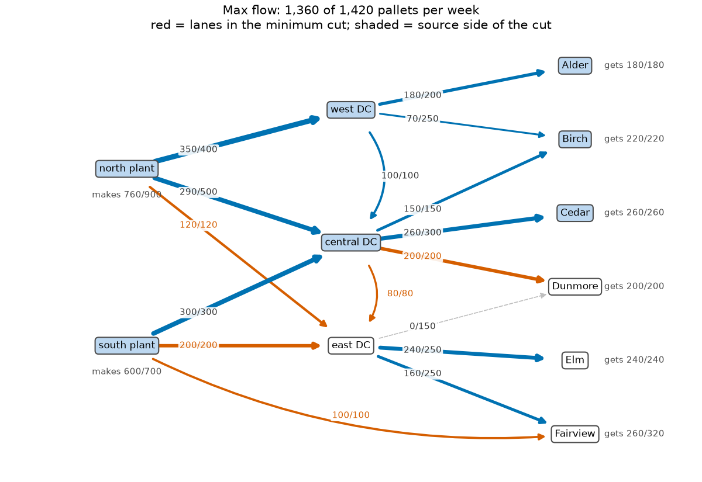
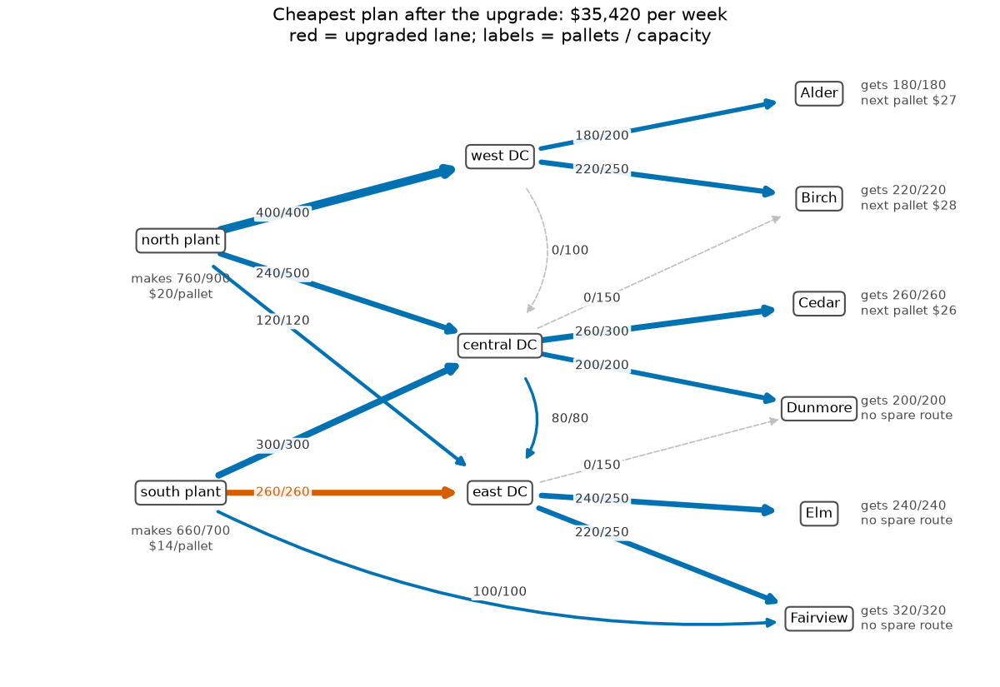

# 05 · Supply chain network flow (max flow, min cut, min-cost flow)

**Solvers:** `SimpleMaxFlow`, `SimpleMinCostFlow` · **Problem class:**
network flow · **Level:** beginner

A bottled-water company ships pallets from two plants, through three
distribution centers (DCs), to six stores. The stores want more water
than the trucks can move. This example answers three questions:

1. How many pallets can the network deliver at most?
2. Which lanes hold it back, and which upgrade pays off?
3. After the upgrade, what is the cheapest way to serve every store?

Network flow problems are a special kind of linear program. OR-Tools has
dedicated graph solvers for them. They are fast, exact, and they always
give whole-number flows.

## The problem

| plant       | capacity (pallets/week) | production cost ($/pallet) |
| ----------- | ----------------------: | -------------------------: |
| north plant |                     900 |                         20 |
| south plant |                     700 |                         14 |

| store    | Alder | Birch | Cedar | Dunmore | Elm | Fairview | **total** |
| -------- | ----: | ----: | ----: | ------: | --: | -------: | --------: |
| demand   |   180 |   220 |   260 |     200 | 240 |      320 | **1,420** |

Sixteen truck lanes connect the sites. Each lane has a capacity (pallets
per week) and a transport cost per pallet. Most lanes go plant → DC → store.
Two lanes move stock between DCs, and one direct lane runs from the south
plant to Fairview. See [`data.py`](data.py) for the full list.

## The model

Add two virtual nodes. A **SOURCE** feeds every plant, and every store
feeds a **SINK**:

- arc SOURCE → plant: capacity = plant capacity, cost = production cost,
- arc store → SINK: capacity = store demand, cost = 0.

Now every pallet travels from SOURCE to SINK. Let $f_{uv}$ be the pallets
per week on arc $(u, v)$, with capacity $u_{uv}$ and unit cost $c_{uv}$.

**Max flow.** Deliver as many pallets as possible:

$$
\max \sum_{s} f_{s,\text{SINK}}
\quad \text{s.t.} \quad
\sum_{u} f_{uv} = \sum_{w} f_{vw} \ \ \text{(every real node } v\text{)},
\qquad 0 \le f_{uv} \le u_{uv}.
$$

**Min-cost flow.** Send exactly the total demand $D$ at the lowest cost:

$$
\min \sum_{(u,v)} c_{uv} f_{uv}
\quad \text{s.t.} \quad
\text{the same conservation and capacity rules, and } \sum_{s} f_{s,\text{SINK}} = D.
$$

A **cut** splits the nodes into two sets: one with SOURCE, one with SINK.
Its capacity is the total capacity of the arcs from the SOURCE side to
the SINK side. Every pallet must cross the cut, so **no flow can be larger
than any cut**. The max-flow min-cut theorem says the largest flow equals
the smallest cut. The arcs of that smallest cut are the bottleneck.

## The OR-Tools code

All the modeling is in [`model.py`](model.py). The graph solvers know
nodes only by integer ids, so we first number the nodes.

```python
solver = max_flow.SimpleMaxFlow()
for a in arcs:
    # Arc ids count up from 0 in the order we add the arcs.
    solver.add_arc_with_capacity(index[a.tail], index[a.head], a.capacity)
status = solver.solve(index[SOURCE], index[SINK])

flow_value = solver.optimal_flow()
source_side = solver.get_source_side_min_cut()  # Node ids.
```

```python
solver = min_cost_flow.SimpleMinCostFlow()
for a in arcs:
    solver.add_arc_with_capacity_and_unit_cost(
        index[a.tail], index[a.head], a.capacity, a.unit_cost
    )
solver.set_node_supply(index[SOURCE], total_demand)  # Supplies must balance.
solver.set_node_supply(index[SINK], -total_demand)

status = solver.solve()  # INFEASIBLE if the demand cannot be met.
# ... or: deliver the max flow, and among those plans the cheapest one.
status = solver.solve_max_flow_with_min_cost()
```

Things to notice:

- **Integers only.** Capacities, costs, and supplies are 64-bit integers.
  The algorithms use exact integer arithmetic, so there is no round-off,
  and the flow on every arc is a whole number. If your data has decimals,
  scale it (for example, cents instead of dollars).
- **Whole-number flows for free.** A network flow LP with integer
  capacities always has an integer optimal solution. You never need a MIP
  solver to ship whole pallets.
- **`solve_max_flow_with_min_cost()`** treats the supplies as upper
  limits. It is handy when the demand cannot be met in full.
- **Max flow ignores cost.** `SimpleMaxFlow` finds *a* maximum flow, not
  a cheap one. Use the min-cost solver when cost matters.

## Run it

```bash
uv run python -m examples.ex05_network_flow.main          # report
uv run python -m examples.ex05_network_flow.main --plot   # + figures
```

Output (shortened):

```text
Part 1 - How much can the network deliver?

Stores want 1,420 pallets per week.
The network can deliver at most 1,360. Short: 60.

Minimum cut (the arcs that limit the flow):
kind   arc                      capacity
-----  -----------------------  --------
lane   north plant -> east DC        120
lane   south plant -> east DC        200
lane   central DC -> east DC          80
lane   central DC -> Dunmore         200
lane   south plant -> Fairview       100
store  Alder demand                  180
store  Birch demand                  220
store  Cedar demand                  260
Cut capacity: 1,360 pallets

What if we add 60 pallets per week to one lane in the cut?
upgraded lane            delivered  weekly cost $
-----------------------  ---------  -------------
north plant -> east DC       1,420         35,960
south plant -> east DC       1,420         35,420
central DC -> east DC        1,420         35,900
central DC -> Dunmore        1,360         34,160
south plant -> Fairview      1,420         35,540

Best choice: upgrade south plant -> east DC.

Part 2 - Cheapest plan after the upgrade: $35,420 per week

plant        made  capacity  $/pallet
-----------  ----  --------  --------
north plant   760       900        20
south plant   660       700        14
...

Cost of one more pallet at each store (node potentials):
store     marginal cost
--------  -------------
Alder     $27
Birch     $28
Cedar     $26
Dunmore   no route
Elm       no route
Fairview  no route

Verification: the max flow equals the cut capacity (so both are
optimal), and the plan has no negative cycle (so it is the cheapest).
```

## Results

### Part 1: the bottleneck is the road into the east

The network delivers at most **1,360** of the 1,420 pallets. The minimum
cut has capacity 1,360 too, so this is a proof: no plan can do better.



Read the cut like this. The shaded nodes can still receive more pallets
from SOURCE. The white nodes cannot. Every red lane runs from the shaded
side to the white side, and every red lane is full. The east region
(east DC, Dunmore, Elm, Fairview) wants 760 pallets, but only 700 can
reach it: 120 + 200 + 80 into the east DC, 200 into Dunmore, and 100 on the
direct lane to Fairview.

The cut also lists the demand of Alder, Birch, and Cedar. These arcs are
full because those stores get all they want.

### Which upgrade?

Add 60 pallets per week to one lane in the cut, then solve again:

- Four of the five upgrades close the gap. **South plant → east DC** is
  the cheapest to run: $35,420 per week. It uses the cheaper south plant.
- **Central DC → Dunmore gains nothing**, even though it is in the cut.
  Dunmore already gets all 200 pallets it wants. Another cut of the same
  size (with Dunmore's demand in place of this lane) still holds the flow
  at 1,360. A minimum cut is often not unique. So always check an upgrade
  by solving again.

### Part 2: the cheapest plan

After the upgrade, every store gets its full demand at **$35,420 per
week**. That is $1,260 more than the best plan before the upgrade
($34,160 for 1,360 pallets). So the 60 extra pallets cost $21 each to make
and move.



The south plant is cheaper, but it makes only 660 of its 700 pallets. All
three lanes out of it are full, so the rest must come from the north
plant at $20 per pallet.

**Node potentials** give the cost of one more pallet at each store. For
Cedar it is $26: $20 to make it at the north plant, $3 to the central DC,
and $3 to Cedar. These are the *shadow prices* of the store demands, as in
[example 01](../ex01_production_planning/). Dunmore, Elm, and Fairview show
"no route": every lane into the east region is full again. The next
pallet there needs another upgrade.

## How we know the answers are right

[`check.py`](check.py) checks every result without OR-Tools:

1. **Feasibility.** Every flow is a whole number, stays within its
   capacity, and is conserved at every plant, DC, and store. The reported
   totals and costs match the arc flows.
2. **Max flow = min cut.** `cut_capacity` adds up the capacity of the arcs
   that cross the solver's cut. It equals the flow value. Because no flow
   can exceed any cut, both are optimal.
3. **No negative cycle.** The *residual network* has an arc wherever we
   can send more (at cost $c$) or send less (at cost $-c$). A cycle of
   negative cost in it would be a way to reroute pallets and save money.
   A flow is the cheapest of its size if and only if no such cycle exists.
   The checker searches for one with the Bellman–Ford algorithm.
4. **Potentials.** Shortest-path distances from SOURCE in the residual
   network are the node potentials $\pi$. On every residual arc the
   reduced cost $c_{uv} + \pi_u - \pi_v$ is at least 0. This is the dual
   side of the same proof.

The [tests](../../tests/test_ex05_network_flow.py) also:

- try all 2,048 cuts by brute force and confirm the smallest is 1,360,
- solve every problem again as a plain LP with GLOP and compare,
- show that the pure max-flow answer delivers the same 1,360 pallets but
  costs $34,460, and that the checker finds a negative cycle in it,
- raise Cedar's demand by one pallet and confirm the cost rises by its
  potential, $26,
- confirm that the Dunmore upgrade gains nothing, and
- repeat the checks on eight random networks.

## Try this

- Raise the north plant's production cost to $25. Does the best upgrade
  change?
- Let a store accept a shortfall, at a penalty per missing pallet. Then
  `solve()` always finds a plan. (Hint: add an arc SOURCE → store with
  that penalty as its cost.)
- Give the DC-to-DC transfer lanes a fixed weekly fee if they are used at
  all. Why do the graph solvers no longer fit? (See
  [example 06](../ex06_facility_location/) for fixed costs.)
- Use `add_arcs_with_capacity_and_unit_cost` with numpy arrays to build a
  network with 100,000 arcs, and time the solver.

## References

- [OR-Tools network flows guide](https://developers.google.com/optimization/flow)
- Ahuja, Magnanti & Orlin, *Network Flows: Theory, Algorithms, and
  Applications*, Prentice Hall, 1993 — ch. 6 (max flow) and ch. 9
  (min-cost flow optimality conditions).
- L. R. Ford & D. R. Fulkerson, *Maximal flow through a network*, 1956.
