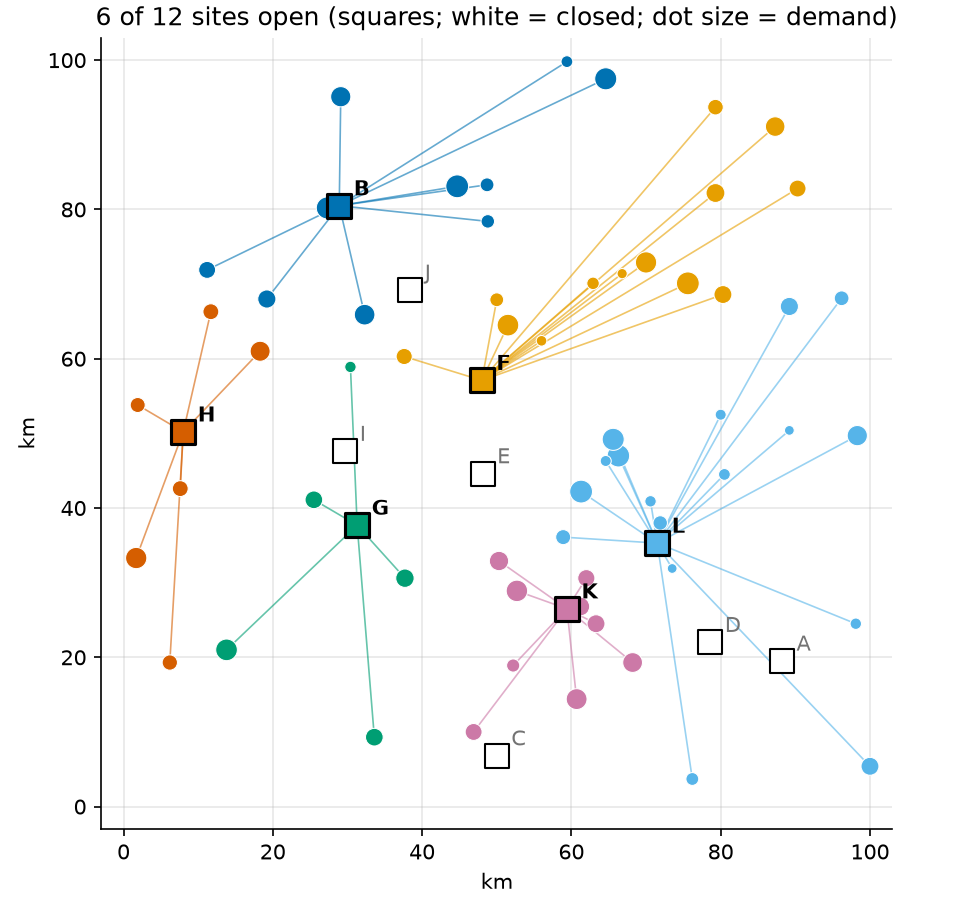
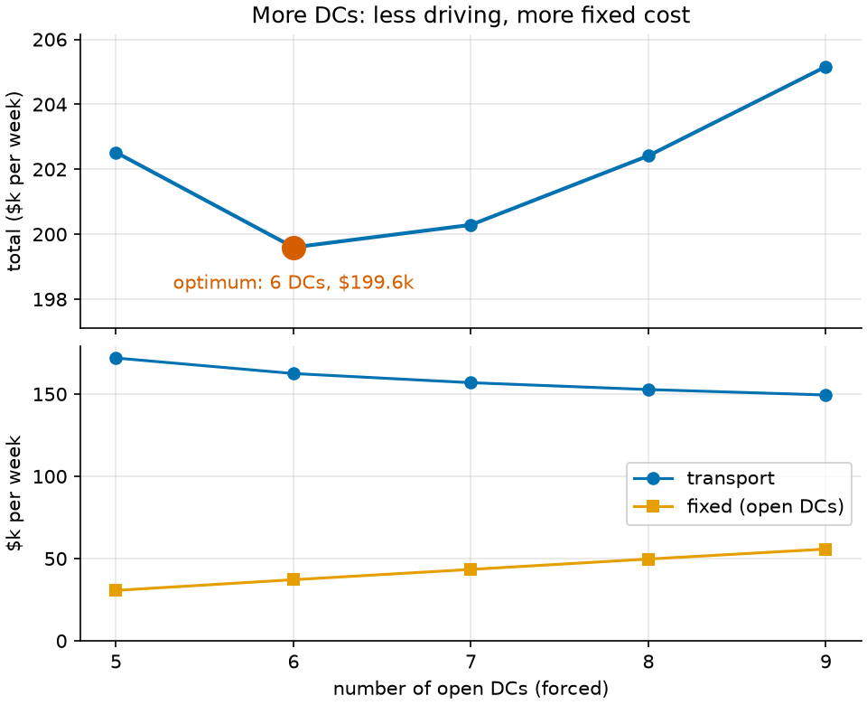

# 06 · Facility location (mixed-integer programming)

**Solver:** MathOpt with HiGHS and SCIP · **Problem class:** MIP · **Level:** intermediate

A grocery wholesaler serves 60 towns. It can open distribution centers
(DCs) at 12 candidate sites. Which sites should it open, and which DC
should serve each town?

This is the first example with **yes/no decisions**. A DC is open or
closed; there is no "40% of a warehouse". Such decisions need integer
variables, and that turns the LP from examples 01 and 02 into a
mixed-integer program (MIP). The example shows:

- how to model yes/no decisions with binary variables,
- why two correct models of the same problem can differ greatly in
  quality (weak vs strong formulation), and
- how to read a MIP solver's two bounds and its gap.

## The problem

Towns and candidate sites are random points on a 100 km × 100 km map
(fixed seed, so every run is the same). Each town orders 10–60 pallets
per week, 2,072 in total. Each site has:

- a **capacity** of 367–544 pallets per week (5,424 in total), and
- a **fixed cost** of $5,830–$6,610 per week if open (rent, staff,
  energy).

Transport costs $2.00 per pallet and km, out and back. Each town must get
all its pallets from one DC (single sourcing).

## The model

**Decision variables.**

- $y_j \in \{0, 1\}$: 1 if site $j$ opens.
- $x_{ij} \in \{0, 1\}$: 1 if site $j$ serves town $i$.

**Objective.** Minimize fixed plus transport cost per week:

$$\min \sum_j f_j\, y_j + \sum_{i,j} t_{ij}\, x_{ij}$$

where $t_{ij} = 2 \cdot \text{distance}_{ij} \cdot d_i \cdot 2.00$ is the
weekly cost to serve town $i$ from site $j$.

**Constraints.**

$$
\begin{aligned}
\sum_j x_{ij} &= 1 && \text{for each town } i \quad \text{(one supplier)} \\
\sum_i d_i\, x_{ij} &\le C_j\, y_j && \text{for each site } j \quad \text{(capacity; closed sites ship 0)} \\
x_{ij} &\le y_j && \text{for each pair } (i, j) \quad \text{(strong formulation only)}
\end{aligned}
$$

### Weak and strong formulations

The last row looks redundant. The capacity row already forbids a closed
site ($y_j = 0$) to serve anyone. For **integer** solutions, the rows add
nothing. So why add 720 more rows?

Because the solver works with the **LP relaxation**: the same model with
$0 \le y_j \le 1$ in place of $y_j \in \{0, 1\}$. Without the extra rows,
the LP can open a site to exactly the share it needs. A site that serves
40% of its capacity is "40% open" and pays only 40% of its fixed cost.
That makes the LP far too optimistic. With $x_{ij} \le y_j$, a town that
is fully served by site $j$ forces $y_j = 1$, so the LP pays the full
fixed cost.

The LP relaxation gives the **lower bound** that branch-and-bound starts
from. The closer it is to the true optimum, the less searching the solver
must do.

## The OR-Tools code

[`model.py`](model.py) builds both versions. Binary variables are
integer variables with bounds 0 and 1:

```python
open_ = {
    s.name: model.add_variable(lb=0, ub=1, is_integer=True, name=f"open {s.name}")
    for s in data.sites
}
```

Pass `is_integer=False` and you have the LP relaxation (`relax=True` in
`build_model`).

The capacity row links both kinds of variables. MathOpt lets you write a
variable on both sides:

```python
load = mathopt.fast_sum(c.demand * assign[c.name, s.name] for c in data.customers)
model.add_linear_constraint(load <= s.capacity * open_[s.name])
```

Solve parameters set the stopping rules. A MIP solver stops when the
**relative gap** between its best solution and its proven bound drops
below a tolerance, or when it runs out of time:

```python
params = mathopt.SolveParameters(
    time_limit=timedelta(seconds=60),
    relative_gap_tolerance=1e-6,
)
result = mathopt.solve(model, mathopt.SolverType.HIGHS, params=params)

bounds = result.termination.objective_bounds
bounds.primal_bound  # cost of the best plan found
bounds.dual_bound  # no plan can cost less than this
```

Two things to notice:

- **Round binary values.** Solvers return floats such as `0.9999999`. Use
  `value > 0.5`, never `value == 1`.
- **No shadow prices.** A MIP has no dual values. `result.dual_values()`
  fails here. If you need the economic insight from
  [example 01](../ex01_production_planning/), fix the integer decisions
  and solve the LP that remains.

## Run it

```bash
uv run python -m examples.ex06_facility_location.main          # report
uv run python -m examples.ex06_facility_location.main --plot   # + figures
```

```text
Optimal weekly cost: $199,596.26
  fixed cost of 6 open DCs: $37,150.00
  transport cost:            $162,446.26

open site  towns  load  capacity  used %   fixed $
---------  -----  ----  --------  ------  --------
site B        10   398       466   85.41  6,270.00
site F        13   444       447   99.33  6,190.00
site G         5   180       518   34.75  6,500.00
site H         6   209       395   52.91  5,960.00
site K         9   355       367   96.73  5,830.00
site L        17   486       495   98.18  6,400.00

Closed: site A, site C, site D, site E, site I, site J

========================================================================

Weak vs strong formulation
instance        formulation    LP bound  MIP optimum  root gap
--------------  -----------  ----------  -----------  --------
tight capacity  weak         178,098.05   199,596.26  10.8%
tight capacity  strong       199,188.06   199,596.26  0.2%
loose capacity  weak         152,000.28   197,689.43  23.1%
loose capacity  strong       197,689.43   197,689.43  0.0%

solver  formulation     optimum  seconds  nodes
------  -----------  ----------  -------  -----
HIGHS   weak         199,596.26     0.13      1
HIGHS   strong       199,596.26     0.40      1
GSCIP   weak         199,596.26     0.08      1
GSCIP   strong       199,596.26     0.08      1

========================================================================

Large instance: 25 sites, 150 towns. Stop at 1% gap or after 10 s.
                                 $ per week
-------------------------------  ----------
best plan found (primal bound)   338,527.92
proven lower bound (dual bound)  338,343.39
gap 0.05% after 2.1 s
termination: OPTIMAL, which here means 'within 1% of the best possible'
```

Solve times depend on your machine; the costs and bounds do not.

## Results

### The plan

Open 6 of the 12 sites: B, F, G, H, K, and L. The total cost is
**$199,596 per week**: $37,150 for the DCs and $162,446 for transport.

Four DCs run at 85–99% of capacity. Capacity, not distance alone, decides
who serves whom. In the map, site F serves towns far to the north-east
because site L, which is closer to some of them, is full. Site G runs at
only 35%. It still earns its fixed cost, because it sits near towns in
the west center that the other DCs could reach only by long trips.



### The trade-off

What if the company insists on a fixed number of DCs? The figure solves
the model with exactly 5, 6, …, 9 open sites (one extra constraint:
$\sum_j y_j = k$). Each extra DC saves transport but adds fixed cost. The
best balance is 6 DCs. Five DCs cost $2,900 more per week; nine cost
$5,600 more. Four DCs cannot work at all: even the four largest sites
hold fewer than 2,072 pallets.



### Weak vs strong: what the numbers say

The **root gap** is how far the LP relaxation lies below the true
optimum. It measures how much work branch-and-bound has left.

- With tight capacities, the weak LP is 10.8% too low; the strong LP only
  0.2%.
- With loose capacities (every site 10× bigger), the weak LP is 23.1%
  too low. The strong LP is *exactly* the optimum. Its LP solution is
  already integer, so there is nothing left to search.

And yet, in the solver table, both formulations solve in a fraction of a
second, at the root node. Why? Modern MIP solvers repair weak models
themselves. Presolve and cutting planes find rows such as
$x_{ij} \le y_j$ automatically (SCIP and HiGHS call them *implied bound
cuts*).

So is the lesson wrong? No. It is just less visible on small models:

- Solvers find the easy repairs, like this one. They cannot find every
  strong formulation. On large or unusual models, the formulation you
  write often decides whether the solver finishes in seconds or not at
  all.
- Many methods use the LP bound directly: Lagrangian relaxation, column
  generation (example 15), and LP-based
  heuristics. They see only what you write.
- Write the strong model, then measure. The extra rows cost you little.

### Gaps and bounds

A MIP solver always reports two numbers:

- the **primal bound**: the cost of the best plan it has found, and
- the **dual bound**: a proven limit, so no plan can be cheaper.

The relative gap between them is the most that the plan can lie above
the best possible cost. On the large instance (25 sites, 150 towns), we ask
the solver to stop at 1% gap. It finds a plan within 0.05% of the best
possible in about two seconds. Note that the termination reason is still
`OPTIMAL`. In MathOpt, `OPTIMAL` means "optimal within the gap tolerance
you set". The default tolerance differs from solver to solver (HiGHS
stops at 0.01%, SCIP at 0%). So set it yourself. This example uses
`relative_gap_tolerance=1e-6` everywhere else.

## How we know the answer is right

[`check.py`](check.py) needs no OR-Tools:

1. **Feasibility.** Every town has exactly one supplier, every supplier is
   open, and no DC ships more than its capacity.
2. **Cost.** The cost is recomputed from the data and matches the
   solver's value.
3. **Brute force.** On a small instance (5 sites, 8 towns), `numpy`
   tries all $5^8 = 390{,}625$ ways to assign towns to sites, in about
   0.2 seconds. An optimal plan never opens a site that serves nobody, so
   this covers every plan. The MIP optimum ($65,938.34) matches.

The [tests](../../tests/test_ex06_facility_location.py) also:

- solve the main instance with HiGHS and SCIP, in both formulations, and
  check that all four give the same optimum,
- compare the MIP with brute force on four small instances,
- check that the strong LP bound is tighter than the weak one, and that it
  is exact with loose capacities,
- check that no forced number of DCs beats the optimum,
- check that four DCs are infeasible, and
- check that a gap-limited solve returns a valid plan and valid bounds.

## Try this

- Allow split deliveries: make $x_{ij}$ continuous, the share of town
  $i$'s demand served by site $j$. How much does the cost drop? Is the
  model easier to solve?
- Add a service rule: every town must be within 50 km of its DC. Which
  sites must open now?
- Make the strong formulation even stronger with a cover row:
  $\sum_j C_j\, y_j \ge \sum_i d_i$. Does the root gap change?
- Switch to `mathopt.SolverType.CP_SAT`. It solves this MIP too, and on
  this instance it is fast. How does it do on the large instance?

## References

- [MathOpt user guide](https://developers.google.com/optimization/math_opt)
- [Mixed-integer programming in OR-Tools](https://developers.google.com/optimization/mip)
- L. A. Wolsey, *Integer Programming*, 2nd ed., Wiley, 2020 — chapter 1
  (formulations) and chapter 2 (bounds).
- G. Cornuéjols, G. L. Nemhauser, L. A. Wolsey, "The uncapacitated
  facility location problem", in *Discrete Location Theory*, Wiley, 1990.
