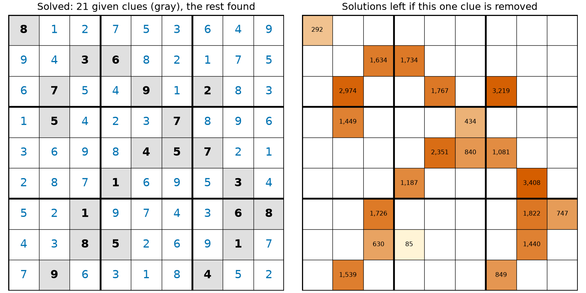
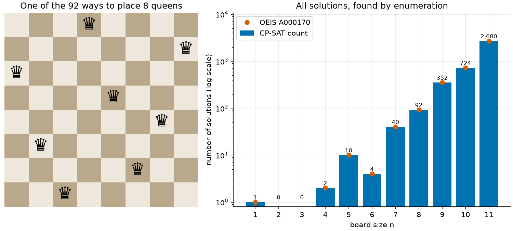

# 07 · Sudoku and N-Queens (constraint satisfaction)

**Solver:** CP-SAT · **Problem class:** constraint satisfaction · **Level:** beginner

Some problems have no "best" answer. You only need *an* answer that breaks
no rule, or you want to know *how many* answers exist. Two classic puzzles
show how CP-SAT handles this:

- **Sudoku:** solve a famous hard puzzle, prove that its solution is
  unique, show that every clue is needed, and build a new puzzle.
- **N-Queens:** place n queens on an n×n board so that no two attack each
  other, and count *all* the ways to do it.

## The problems

**Sudoku.** Fill a 9×9 grid with the digits 1 to 9, so that every row,
every column, and every 3×3 box holds each digit exactly once. Some cells
are given. We use the puzzle that Arto Inkala published in 2012, often
called "the world's hardest Sudoku". It has 21 clues.

**N-Queens.** A chess queen attacks along its row, its column, and both
diagonals. Place n queens on an n×n board so that no queen attacks
another. For n = 8 there are 92 solutions.

## The models

### Sudoku

**Variables.** $x_{rc} \in \{1, \dots, 9\}$ is the digit in row $r$,
column $c$. For a given cell, the domain shrinks to one value:
$x_{rc} \in \{g_{rc}\}$.

**Constraints.**

$$
\begin{aligned}
&\text{AllDifferent}(x_{r1}, \dots, x_{r9}) && \text{for each row } r \\
&\text{AllDifferent}(x_{1c}, \dots, x_{9c}) && \text{for each column } c \\
&\text{AllDifferent}(x_{rc} : (r, c) \in B) && \text{for each 3×3 box } B
\end{aligned}
$$

There is no objective. That is all.

### N-Queens

**Variables.** $q_i \in \{0, \dots, n-1\}$ is the column of the queen in
row $i$. This choice already puts exactly one queen in each row.

**Constraints.** Two queens in rows $i$ and $j$ share a diagonal when
$|q_i - q_j| = |i - j|$. That splits into two cases: $q_i - i = q_j - j$
(down-right diagonals) or $q_i + i = q_j + j$ (down-left diagonals). So:

$$
\text{AllDifferent}(q_i),\quad
\text{AllDifferent}(q_i - i),\quad
\text{AllDifferent}(q_i + i)
$$

## The OR-Tools code

All the modeling is in [`model.py`](model.py).

**Domains fix the givens.** A given digit is a variable whose domain holds
one value. No extra constraint is needed:

```python
cell = [
    [
        model.new_int_var(v, v, f"cell {r},{c}")
        if v
        else model.new_int_var(1, 9, f"cell {r},{c}")
        for c, v in enumerate(row)
    ]
    for r, row in enumerate(puzzle)
]
for i in range(9):
    model.add_all_different(cell[i])  # Row i.
    model.add_all_different(cell[r][i] for r in range(9))  # Column i.
    ...  # Box i.
```

**AllDifferent takes expressions.** The queens' diagonals need no helper
variables:

```python
queen = [model.new_int_var(0, n - 1, f"queen in row {i}") for i in range(n)]
model.add_all_different(queen)
model.add_all_different(queen[i] - i for i in range(n))
model.add_all_different(queen[i] + i for i in range(n))
```

`add_all_different` is a *global constraint*. CP-SAT reasons about the
whole group at once. It sees, for example, that if three cells in a row
can only hold 4 or 7, the puzzle is broken. Many separate `x != y`
constraints cannot see this.

**Proving uniqueness.** Solve once. Then add "at least one empty cell
must differ from that solution" and solve again. If the second model is
infeasible, the solution is unique. The constraint uses *enforcement
literals*: `add(...).only_enforce_if(d)` holds only when the Boolean `d`
is true.

```python
d = model.new_bool_var(f"differs {r},{c}")
model.add(cell[r][c] != first[r][c]).only_enforce_if(d)
...
model.add_bool_or(differs)  # At least one cell must differ.
```

**Enumerating all solutions.** Give the solver a callback. CP-SAT calls
`on_solution_callback` once for each solution:

```python
class _Collector(cp_model.CpSolverSolutionCallback):
    def on_solution_callback(self) -> None:
        self.count += 1
        ...
        if self.limit is not None and self.count >= self.limit:
            self.stop_search()


solver.parameters.enumerate_all_solutions = True
solver.parameters.num_workers = 1
solver.solve(model, collector)
```

> **Use one worker for enumeration.** With several workers, each worker
> searches on its own and reports what it finds. The same solution can
> then come back more than once, and some may not come back at all. In
> five runs with 8 workers on OR-Tools 9.15, the callback reported 135 to
> 156 solutions for 8 queens, of which only 72 to 85 were distinct. The
> right answer is 92.

**Building a puzzle.** `make_puzzle()` starts from a full grid and visits
the cells in random order. It blanks each cell and keeps it blank only if
the solution stays unique. Every clue that remains is needed.

## Run it

```bash
uv run python -m examples.ex07_sudoku_nqueens.main            # report
uv run python -m examples.ex07_sudoku_nqueens.main --plot     # + figures
uv run python -m examples.ex07_sudoku_nqueens.main --max-n 12 # bigger count
```

Output (timings vary from run to run):

```text
Sudoku: 'Inkala 2012' (21 clues)

8 . . | . . . | . . .      8 1 2 | 7 5 3 | 6 4 9
. . 3 | 6 . . | . . .      9 4 3 | 6 8 2 | 1 7 5
. 7 . | . 9 . | 2 . .      6 7 5 | 4 9 1 | 2 8 3
------+-------+------      ------+-------+------
. 5 . | . . 7 | . . .      1 5 4 | 2 3 7 | 8 9 6
. . . | . 4 5 | 7 . .      3 6 9 | 8 4 5 | 7 2 1
. . . | 1 . . | . 3 .      2 8 7 | 1 6 9 | 5 3 4
------+-------+------      ------+-------+------
. . 1 | . . . | . 6 8      5 2 1 | 9 7 4 | 3 6 8
. . 8 | 5 . . | . 1 .      4 3 8 | 5 2 6 | 9 1 7
. 9 . | . . . | 4 . .      7 9 6 | 3 1 8 | 4 5 2

Solved in 0.021 s.
Uniqueness: the model 'solution must differ in some cell' is infeasible, so the solution is unique.
Minimality: remove any one clue and the puzzle has between 85 and 3,408 solutions.
  Without the 8 in the top-left corner: 292 solutions (CP-SAT), 292 (backtracking check).

New puzzle from the same solution (26 clues, built in 1.4 s):

. . . | . . . | 6 4 9
9 . 3 | 6 . 2 | . . .
. 7 . | . . . | . 8 .
------+-------+------
1 . . | 2 . . | . . 6
. 6 . | . . 5 | . . .
. 8 . | . . 9 | . 3 4
------+-------+------
. 2 . | . . . | 3 . .
. . . | . 2 6 | . 1 .
7 . . | 3 . . | . 5 .

========================================================================

8 queens, one solution (Q = queen):

  . . . Q . . . .
  . . . . . . . Q
  Q . . . . . . .
  . . . . Q . . .
  . . . . . . Q .
  . Q . . . . . .
  . . . . . Q . .
  . . Q . . . . .

All 8-queens solutions: 92 found, 92 distinct, 0 invalid.

Number of solutions by board size

 n  CP-SAT  backtracking  OEIS A000170  CP-SAT s
--  ------  ------------  ------------  --------
 1       1             1             1      0.00
 2       0             0             0      0.00
 3       0             0             0      0.00
 4       2             2             2      0.00
 5      10            10            10      0.01
 6       4             4             4      0.01
 7      40            40            40      0.01
 8      92            92            92      0.07
 9     352           352           352      0.15
10     724           724           724      0.50
11   2,680         2,680         2,680      2.38

Verification: every solution obeys all rules, and all counts agree.
```

## Results

**The "hardest" Sudoku is easy for CP-SAT.** It needs about 0.02 seconds.
"Hard" in Sudoku means hard for people, who need long chains of logic.
The solver's propagation and search handle it at once.

**The solution is unique, and every clue counts.** The left grid shows
the solution, with the 21 givens in gray. The right grid shows what
happens when you remove one clue: the puzzle then has between 85 and
3,408 solutions. So the puzzle is *minimal*. No clue is spare.



**New puzzles are cheap.** From the same solution grid, `make_puzzle`
built a new 26-clue puzzle with a unique solution in about 1.4 seconds.
It made about 160 small CP-SAT solves (two per cell).

**N-Queens counts grow fast.** The number of solutions grows roughly
exponentially with n. CP-SAT finds all 92 placements for 8 queens in
0.07 s and all 2,680 for 11 queens in about 2 s. With `--max-n 12`, it
finds all 14,200 placements for 12 queens. That took between 6 and 12
seconds in our runs.



**Know when a general solver is not the best tool.** For *counting*
queens, the plain backtracking in [`check.py`](check.py), only about 20
lines of pure Python, beats CP-SAT. It counts the 14,200 solutions for
n = 12 in under half a second. CP-SAT pays for each solution: it calls
back into Python, and its search is built for richer models. The CP-SAT
model shines when the rules change. Add a rule such as "no queen in the
corners" or "queens on given squares", and the model needs one more line.
The hand-written search needs to be rewritten.

## How we know the answers are right

[`check.py`](check.py) uses no OR-Tools. It has two kinds of tools:

1. **Rule checkers.** `sudoku_errors` checks that every row, column, and
   box holds the digits 1 to 9, and that no given digit changed.
   `queens_errors` checks every pair of queens for a shared column or
   diagonal.
2. **Independent counters.** `count_sudoku_backtracking` and
   `count_queens_backtracking` count solutions with plain backtracking.
   This is a different method from CP-SAT, so when the counts agree, a
   modeling error is very unlikely.

The [tests](../../tests/test_ex07_sudoku_nqueens.py) check:

- the solver's Sudoku solution equals the published solution,
- uniqueness in three ways: the "differs" model, CP-SAT enumeration, and
  backtracking,
- minimality: removing any of the 21 clues gives a second solution,
- the 292 solutions without the top-left clue, counted by both methods,
- that a contradictory puzzle and a subtly unsolvable puzzle have no
  solution,
- that the generated puzzle is unique and minimal,
- the N-Queens counts against OEIS A000170: CP-SAT for n = 1 to 10 and
  backtracking for n = 1 to 12,
- that all 92 eight-queens solutions are valid and distinct, and
- valid single placements up to n = 50, and none for n = 2 and 3.

## Try this

- Count the 8-queens solutions that differ by more than a rotation or a
  mirror. (Answer: 12.) Hint: map each solution to the smallest of its 8
  rotated and mirrored copies, and count the distinct results.
- Solve a 16×16 Sudoku (digits 1 to 16, 4×4 boxes). What must change?
- Solve *Killer Sudoku*: cages of cells must add up to a given sum, with
  no repeated digit in a cage. Use `add_all_different` plus `add(sum(...)
  == total)`.
- Turn on enumeration with `num_workers = 8` and count the 8-queens
  solutions. Which solutions come back twice?
- Make `make_puzzle` keep clues in symmetric pairs (cell and its
  180° rotation), the way published puzzles usually do.

## References

- [CP-SAT solver guide](https://developers.google.com/optimization/cp/cp_solver)
- [N-Queens in OR-Tools](https://developers.google.com/optimization/cp/queens)
- [OEIS A000170](https://oeis.org/A000170) — the number of N-Queens
  solutions.
- G. McGuire, B. Tugemann, G. Civario, *There is no 16-clue Sudoku*,
  Experimental Mathematics, 2014.
