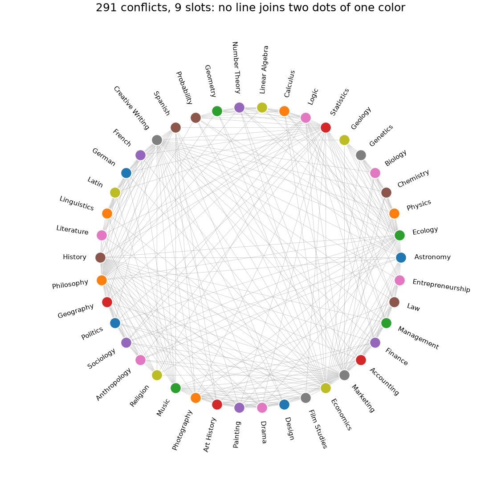
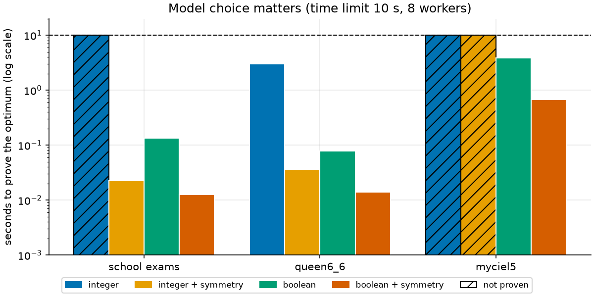
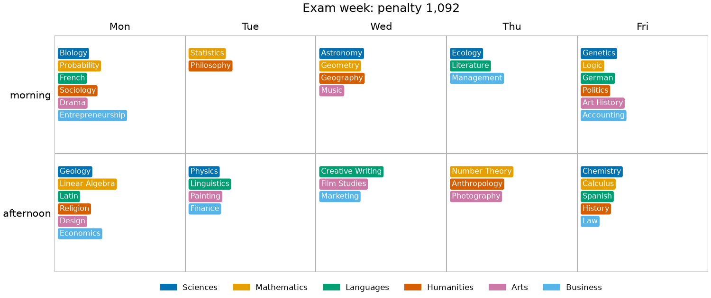

# 08 · Exam timetabling (graph coloring)

**Solver:** CP-SAT · **Problem class:** graph coloring, constraint
programming · **Level:** intermediate

A school must fit 42 final exams into one week. A student cannot sit two
exams at the same time. How few time slots does the school need? And once
the week is fixed, how do we keep each student's exams apart, so nobody
writes two exams on one day?

The first question is *graph coloring*, one of the classic hard problems.
This example shows that the way you write the model, and whether you
break its symmetry, can change the solve time from milliseconds to
"not proven after 10 seconds".

## The problem

The school has six departments with seven courses each. Each of the 300
students takes four courses in their home department. One student in
five also takes an open elective from another department. (The data is
random but seeded, see [`data.py`](data.py).)

Draw each exam as a dot. Join two dots with a line when at least one
student takes both exams. This is the **conflict graph**. A timetable
gives each dot a color (a time slot), and no line may join two dots of
the same color. The fewest colors that work is the graph's *chromatic
number*, $\chi(G)$.



## The model

### Part 1: the fewest slots

**Integer encoding.** One variable $s_e \in \{0, \dots, H-1\}$ per exam,
where $H$ is an upper bound on the slots:

$$
\min\ k \quad \text{s.t.} \quad s_a \ne s_b \ \ \forall (a,b) \in E,
\qquad k = 1 + \max_e s_e
$$

**Boolean encoding.** One true/false variable $x_{e,c}$ per exam and
slot, plus $u_c$ = "slot $c$ is used":

$$
\begin{aligned}
\min\ & \sum_c u_c \\
\text{s.t.}\ & \textstyle\sum_c x_{e,c} = 1 && \forall e && \text{(one slot per exam)} \\
& x_{a,c} + x_{b,c} \le u_c && \forall (a,b) \in E,\ \forall c && \text{(no clash; only in used slots)}
\end{aligned}
$$

**Bounds.** Both models use two cheap bounds:

- A **clique** is a set of exams that all conflict with each other. A
  clique of size $q$ needs $q$ slots, so $\chi(G) \ge q$.
- **DSATUR**, a greedy heuristic, finds a coloring with $H$ colors, so
  $\chi(G) \le H$. We never need more than $H$ slots, which keeps the
  model small.

**Symmetry breaking.** Swap two slots in any timetable and you get another
valid timetable with the same number of slots. With 9 slots there are
9! = 362,880 copies of every solution. A solver that proves "8 slots are
not enough" must rule out all of them. We remove most of the copies:

- Fix the clique: its $q$ exams get slots $0, 1, \dots, q-1$. They must
  differ anyway, so this loses no solution.
- In the Boolean model, also use the slots in order: $u_{c+1} \le u_c$.

### Part 2: a kinder week

Now the week is fixed: 5 days with a morning and an afternoon slot. For
every student, each pair of their exams costs

- **3 points** if both are on the same day, and
- **1 point** if they are on two days in a row.

We minimize the total. With $w_{ab}$ = the number of students who take
both $a$ and $b$, and Boolean flags $d_{ab}$ (same day) and $n_{ab}$
(next day):

$$
\min \sum_{(a,b) \in E} w_{ab}\,(3\,d_{ab} + n_{ab})
\quad\text{s.t.}\quad
\begin{aligned}[t]
& y_{a,t} + y_{b,t} - 1 \le d_{ab} && \forall t \\
& y_{a,t} + y_{b,t+1} - 1 \le n_{ab},\ \ y_{a,t+1} + y_{b,t} - 1 \le n_{ab} && \forall t
\end{aligned}
$$

where $y_{e,t}$ = "exam $e$ is on day $t$" is the sum of the slot
variables of that day.

## The OR-Tools code

All models are in [`model.py`](model.py). The two Part 1 encodings:

```python
# Integer encoding: "!=" is a native CP-SAT constraint.
color = {n: model.new_int_var(0, upper - 1, n) for n in graph.nodes}
for a, b in graph.edges:
    model.add(color[a] != color[b])
num_colors = model.new_int_var(len(clique), upper, "num_colors")
model.add_max_equality(num_colors - 1, list(color.values()))

# Boolean encoding: exactly one slot per exam, no shared slot per edge.
for n in graph.nodes:
    model.add_exactly_one(x[n, c] for c in colors)
for a, b in graph.edges:
    for c in colors:
        model.add(x[a, c] + x[b, c] <= used[c])

# Symmetry breaking: pin the clique, use slots in order.
for k, node in enumerate(clique):
    model.add(x[node, k] == 1)
for c in colors[:-1]:
    model.add_implication(used[c + 1], used[c])
```

Things to notice:

- **Read the bound, not just the answer.** `solver.objective_value` is the
  best solution found. `solver.best_objective_bound` is what CP-SAT has
  *proven*. When they are equal, the status is `OPTIMAL`.
- **Give the solver what you know.** The lower bound on `num_colors` from
  the clique, and the small domain from DSATUR, both come from fast
  pure-Python code in [`bounds.py`](bounds.py).
- **Redundant constraints.** Part 2 adds constraints that remove no
  timetable, but raise the lower bound. Exams that all conflict (a
  clique) need different slots. Spread $k$ such exams over 5 days and
  they always cost at least a fixed number of points, for example 2 for
  $k = 4$ and 12 for $k = 7$. Each student's exams form a clique, and so do
  most courses of a department:

  ```python
  for clique in cliques:
      floor = min_student_penalty(len(clique), data.days, per_day)
      pairs = itertools.combinations(sorted(clique, key=order.get), 2)
      model.add(sum(pair_penalty[p] for p in pairs) >= floor)
  ```

- **Recount the objective.** The flags $d_{ab}$ and $n_{ab}$ only have
  lower limits. If CP-SAT stops at the time limit, a flag can still be on
  without need. So `spread_exams` counts the true penalty from the slots.
  The tests caught this: once, CP-SAT reported 1,098 for a timetable that
  really cost 1,097.

## Run it

```bash
uv run python -m examples.ex08_exam_timetabling.main          # ~20 s
uv run python -m examples.ex08_exam_timetabling.main --plot   # + benchmark, ~1 min
```

Output (one run; CP-SAT uses 8 parallel workers, so times and the Part 2
result change a little from run to run):

```text
42 exams, 300 students

Part 1: the fewest slots

Conflict graph: 42 exams, 291 conflicting pairs (34% of all pairs)

Lower bound, largest clique: 8 exams
  Design, Photography, Music, Art History, Painting, History, Drama, Creative Writing
Upper bound, DSATUR greedy:  9 slots
CP-SAT:                      9 slots (optimal, bound 9, 0.02 s)

Part 2: spread the exams over 5 days x 2 slots

Penalty (3 per same-day pair, 1 per next-day pair, per student):
timetable                           penalty
----------------------------------  -------
DSATUR slots, in order                1,663
CP-SAT spread (stopped after 20 s)    1,092
CP-SAT lower bound                      859
Sum of best cases per student           718

So the best possible timetable has a penalty between 859 and 1,092.

students with ...  2 exams on 1 day  exams on 2 days in a row
-----------------  ----------------  ------------------------
DSATUR, in order                219                        81
CP-SAT spread                   148                       152

Verification: both timetables have no clashes; backtracking confirms
that 9 slots are the minimum.
```

## Results

### Part 1: 9 slots, and why the model matters

The largest clique has 8 exams: six Arts courses, plus History and
Creative Writing, which Arts students take as electives. So the school
needs at least 8 slots. DSATUR finds a timetable with 9. CP-SAT closes the
gap in 0.02 s: **9 slots are the minimum**. No 8-slot timetable exists,
even though no 9 exams all conflict with each other.

The benchmark solves three graphs with all four model variants (`--plot`
runs it):

| graph | integer | integer + symmetry | Boolean | Boolean + symmetry |
| ----- | ------: | -----------------: | ------: | -----------------: |
| school exams (χ = 9) | not proven in 10 s | 0.02 s | 0.14 s | 0.01 s |
| queen6_6 (χ = 7) | 2.99 s | 0.04 s | 0.08 s | 0.01 s |
| myciel5 (χ = 6) | not proven in 10 s | not proven in 10 s | 3.89 s | 0.67 s |



Two lessons:

1. **Symmetry breaking** gives a speed-up of 6 to more than 500 times
   here. Without it, the integer model cannot even prove the school result.
2. **The Boolean encoding is stronger.** The constraint
   $x_{a,c} + x_{b,c} \le u_c$ is linear, so CP-SAT's LP relaxation and
   its clause learning both get a grip on it. The Mycielski graph myciel5
   has no triangles (its largest clique has 2 nodes), yet it needs 6
   colors. The clique bound is useless there, and only the Boolean model
   proves the answer.

### Part 2: a week that students can live with

Filling the 9 DSATUR slots in order (Monday morning first) gives 219 of
300 students two exams on one day. CP-SAT uses the tenth slot and spreads
the exams: the penalty falls from 1,663 to 1,092, and the number of
students with two exams on one day falls from 219 to 148. Many of them now
have exams on two days in a row instead, which costs less.



Monday and Friday get the most exams. A day at the end of the week has
only one neighbor day, so its exams cause fewer next-day penalties.

**How good is 1,092?** CP-SAT does not prove optimality in 20 s. But it
proves that no timetable can do better than 859. So the timetable is at
most 27% above the optimum. The redundant constraints matter here. In our
tests, the bound was only 723 after 30 s without the department cliques,
and 586 after 60 s with no redundant constraints at all. A gap that is still open is normal for timetabling. More time,
or a stronger model (try the ideas below), would close it further.

## How we know the answers are right

[`check.py`](check.py) uses no OR-Tools:

1. **Hard rules.** `coloring_errors` checks every edge. `timetable_errors`
   reads the student enrollments directly, not the conflict graph, so a
   bug in the graph would show up.
2. **Exact chromatic number by backtracking.** A simple search tries
   $k = 1, 2, \dots$ colors and confirms that the school needs exactly 9
   slots. It takes 0.01 s here. The tests check it against plain brute
   force on small random graphs.
3. **Objective recount and an independent bound.** `student_penalties`
   recomputes the Part 2 penalty student by student. `penalty_lower_bound`
   adds up each student's best case (718). No timetable can beat it.

The [tests](../../tests/test_ex08_exam_timetabling.py) also:

- solve graphs with a known chromatic number with both encodings:
  Petersen (3), myciel3 (4), myciel4 (5), $C_7$ (3), $C_8$ (2), $K_6$ (6),
  and queen5_5 (5),
- check that symmetry breaking never removes the optimum, on random
  graphs,
- check the clique finder and DSATUR against brute force,
- solve a tiny week (6 exams, 3 days) with and without the redundant
  constraints, and compare with all 46,656 possible timetables, and
- check that the Part 2 week is valid, that its bound lies between the
  per-student bound and the penalty, and that it beats the DSATUR week by
  more than 25%.

## Try this

- Give CP-SAT a head start in Part 2: pass the DSATUR timetable as a
  solution hint (`model.add_hint`). Does the penalty after 20 s improve?
- Break the symmetries of Part 2. The morning and afternoon of a day can
  be swapped, and the week can be run backwards. (We tried a simple
  version: it raised the bound a little, but the timetables got worse.)
- Change the penalties: make a next-day pair cost 0. How many students
  then have two exams on one day?
- Add a rule: the Mathematics exams must be in the morning.
- Run `color_integer` on `mycielski_graph(5)` with a 60 s limit. Does it
  ever prove 6?

## References

- [CP-SAT documentation](https://developers.google.com/optimization/cp/cp_solver)
- D. Brélaz, *New methods to color the vertices of a graph*, Comm. ACM
  22(4), 1979 — the DSATUR heuristic.
- M. W. Carter, G. Laporte, S. Y. Lee, *Examination timetabling:
  algorithmic strategies and applications*, J. Oper. Res. Soc. 47, 1996.
- [DIMACS graph coloring instances](https://mat.tepper.cmu.edu/COLOR/instances.html)
  — the source of the myciel and queen graphs.
