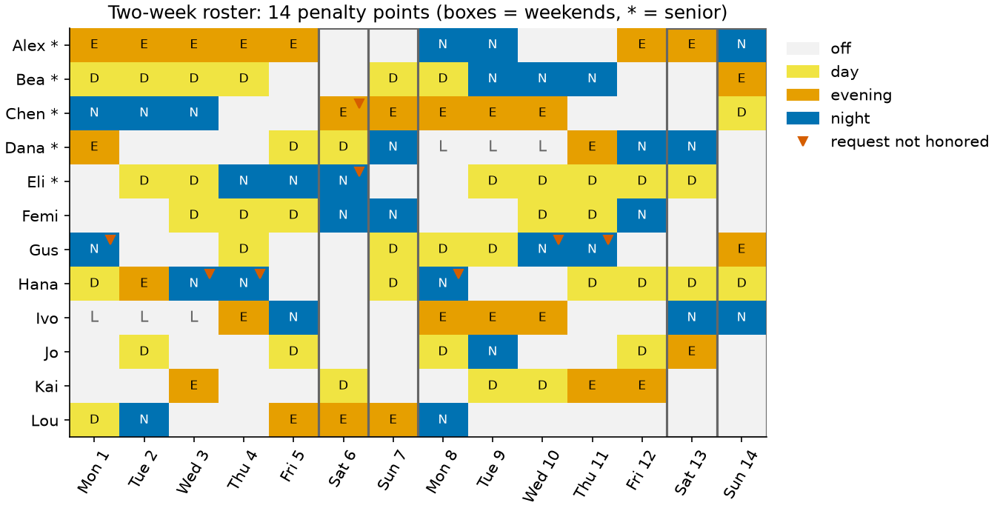
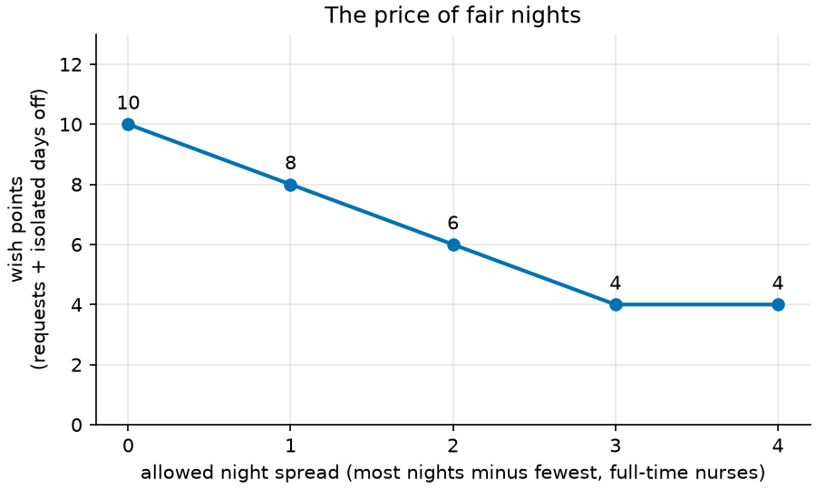

# 09 · Nurse shift scheduling (constraint programming)

**Solver:** CP-SAT · **Problem class:** Boolean optimization with soft
constraints · **Level:** intermediate

A hospital ward needs a nurse roster for the next two weeks. Some rules
are law or safety: every shift needs enough nurses and a senior, and
nurses need rest between shifts. Other rules are wishes: a day off for a
wedding, no night shifts, a fair share of weekends. This example builds
a roster that keeps every hard rule and breaks as few wishes as possible.
It also shows what to do when goals compete.

## The problem

- **12 nurses**: 5 seniors (marked `*`), 7 others. Nine work full time;
  Jo, Kai, and Lou work part time. Dana and Ivo have three days of
  approved leave.
- **14 days, 3 shifts a day**: day (07–15), evening (15–23), night
  (23–07). Day 0 is a Monday.

**Hard rules** (never broken):

| rule | detail |
| ---- | ------ |
| coverage | weekdays: 3 day, 2 evening, 2 night nurses; weekends: 2/2/2 |
| skill mix | at least one senior on every shift |
| one shift a day | a nurse works at most one shift per day |
| rest | no day or evening shift after a night; no day shift after an evening |
| days in a row | at most 5 working days in a row |
| contract | full time: 8–10 shifts (6–7 for Dana and Ivo, who are on leave); part time: 4–6 |
| leave | no shift on a day of approved leave |

**Soft rules** (each break costs penalty points):

| rule | points |
| ---- | -----: |
| a request for a day off, or for no shift of one type | 1–3 per request (set by the nurse's need) |
| an isolated day off (work, off, work) | 2 each |
| night spread: most nights minus fewest, full-time nurses | 4 per night |
| weekend spread: same for weekend shifts | 4 per shift |

Two wishes pull hard against the rules:

- Four of the five seniors ask for the first Saturday off. Saturday
  needs three seniors, so at most two of them get it.
- Gus and Hana ask for no nights at all (1 point per night). But fair
  nights want them to take their share.

## The model

**Decision variables.** $x_{n,d,s} \in \{0,1\}$ is 1 if nurse $n$ works
shift $s$ on day $d$. A helper $w_{n,d} = \sum_s x_{n,d,s}$ says whether
nurse $n$ works on day $d$ at all.

**Hard rules.**

$$
\begin{aligned}
\sum_s x_{n,d,s} &\le 1 && \text{one shift a day} \\
\sum_n x_{n,d,s} &\ge r_{d,s} && \text{coverage} \\
\sum_{n \in \text{seniors}} x_{n,d,s} &\ge 1 && \text{skill mix} \\
x_{n,d,a} &\Rightarrow \neg x_{n,d+1,b} && \text{for each forbidden pair } (a,b) \\
\sum_{t=d}^{d+5} w_{n,t} &\le 5 && \text{at most 5 days in a row} \\
m_n \le \sum_d w_{n,d} &\le M_n && \text{contract} \\
w_{n,d} &= 0 && \text{for each leave day}
\end{aligned}
$$

**Objective.** Minimize total penalty points:

$$
\min \sum_{\text{requests } q} p_q \, \ell_q
\;+\; 2 \sum_{n,d} \text{iso}_{n,d}
\;+\; 4\,(\max_n N_n - \min_n N_n)
\;+\; 4\,(\max_n W_n - \min_n W_n)
$$

Here $\ell_q$ is the literal that breaks request $q$, $\text{iso}_{n,d}$
flags an isolated day off, and $N_n$ and $W_n$ count the nights and
weekend shifts of full-time nurse $n$.

## The OR-Tools code

[`model.py`](model.py) builds the model. Five CP-SAT patterns do all the
work.

**1. A grid of Booleans, plus an explicit "off" option.** With
`add_exactly_one`, every nurse-day has exactly one of off, D, E, or N:

```python
off = model.new_bool_var(f"{n.name}_{d}_off")
model.add_exactly_one([off, *(x[n.name, d, s] for s in codes)])
work[n.name, d] = ~off
```

**2. Implications for forbidden sequences.**

```python
model.add_implication(x[n.name, d, a], ~x[n.name, d + 1, b])
```

**3. Penalty literals for soft rules.** For a request, the penalty literal
is the very event the nurse wants to avoid. No extra variable is needed:

```python
lit = work[r.nurse, r.day] if r.shift is None else x[r.nurse, r.day, r.shift]
request_terms.append(r.weight * lit)
```

For a pattern such as an isolated day off, add one clause that forces a
flag to 1 when the pattern occurs. The objective keeps it 0 otherwise:

```python
model.add_bool_or([~work[n, d - 1], work[n, d], ~work[n, d + 1], iso])
```

**4. Min-max fairness.** `add_max_equality` and `add_min_equality` give
the largest and smallest count. Their difference is the spread:

```python
model.add_max_equality(most, counts)
model.add_min_equality(fewest, counts)
return most - fewest
```

**5. Two-stage (lexicographic) optimization with a hint.** Solve for the
most important goal, lock in its value, then optimize the rest. The first
roster is a ready-made hint for the second solve:

```python
rm.model.minimize(first_expr)
stage1 = solve_model(rm, data)
rm.model.add(first_expr <= stage1_value)
rm.model.minimize(rest_expr)
for (n, d, s), var in rm.x.items():
    rm.model.add_hint(var, stage1.assignment[n, d] == s)
```

After a solve, `solver.best_objective_bound` tells you how good the
roster is: no roster can score below the bound. If the bound equals the
score, the roster is optimal.

## Run it

```bash
uv run python -m examples.ex09_shift_scheduling.main          # report
uv run python -m examples.ex09_shift_scheduling.main --plot   # + figures
```

```text
Roster for 'ward, two weeks': 14 penalty points (proven optimal, best bound 14, 0.53 s)

nurse     Mo Tu We Th Fr Sa Su Mo Tu We Th Fr Sa Su
Alex    * E  E  E  E  E  .  .  N  N  .  .  E  E  N
Bea     * D  D  D  D  .  .  D  D  N  N  N  .  .  E
Chen    * N  N  N  .  .  E! E  E  E  E  .  .  .  D
Dana    * E  .  .  .  D  D  N  L  L  L  E  N  N  .
Eli     * .  D  D  N  N  N! .  .  D  D  D  D  D  .
Femi      .  .  D  D  D  N  N  .  .  D  D  N  .  .
Gus       N! .  .  D  .  .  D  D  D  N! N! .  .  E
Hana      D  E  N! N! .  .  D  N! .  .  D  D  D  D
Ivo       L  L  L  E  N  .  .  E  E  E  .  .  N  N
Jo        .  D  .  .  D  .  .  D  N  .  .  D  E  .
Kai       .  .  E  .  .  D  .  .  D  D  E  E  .  .
Lou       D  N  .  .  E  E  E  N  .  .  .  .  .  .

D/E/N = day/evening/night, . = off, L = leave, * = senior,
! = a request on that day is not honored

Penalty points
soft rule          points
-----------------  ------
requests               10
isolated days off       0
night spread            0
weekend spread          4
total                  14

Requests not honored
  * Chen: day off on Sat 6 (2 points)
  * Eli: day off on Sat 6 (2 points)
  * Gus: no N shift on Mon 1 (1 point)
  * Gus: no N shift on Wed 10 (1 point)
  * Gus: no N shift on Thu 11 (1 point)
  * Hana: no N shift on Wed 3 (1 point)
  * Hana: no N shift on Thu 4 (1 point)
  * Hana: no N shift on Mon 8 (1 point)

Three ways to rank the goals (penalty points per soft rule)
strategy        requests  isolated days off  night spread  weekend spread  total
--------------  --------  -----------------  ------------  --------------  -----
weighted sum          10                  0             0               4     14
fairness first        14                  2             0               0     16
wishes first           4                  0            12               4     20

Verification: every hard rule holds, the penalties match an
independent count, and CP-SAT proved the roster optimal.
```

(The workload table is left out here.) CP-SAT runs 8 workers in parallel,
so the roster itself can differ from run to run. Many rosters share the
optimal score. The penalty numbers stay the same.

## Results

CP-SAT finds a roster with **14 penalty points** and proves in about half
a second that no roster scores less.



**The Saturday conflict.** Saturday needs three seniors, and only Dana
did not ask for it off. So two of the four wishes must break. The solver
breaks the two cheapest ones (Chen and Eli, 2 points each) and grants
Alex's and Bea's (3 points each).

**Nights.** Every full-time nurse works exactly 3 nights, Gus and Hana
included. That breaks 6 of their no-night wishes (6 points). It keeps the
night spread at 0, which saves more points than it costs.

**Weekends.** The weekend spread is 1 shift (4 points). Getting it to 0 is
possible, but it costs more in broken wishes than it saves.

### The weights decide the roster

A weighted sum mixes goals that people value in different ways. How many
wish points is one extra night for one nurse worth? The figure answers
the question for this ward. Each point is a separate solve. The night
spread is a hard limit, and the solver minimizes all other penalties:



Each extra night of spread spares Gus and Hana one night each and saves
2 wish points. At a spread of 3, they work no nights at all, and only 4
points are left. Beyond that, nothing improves: the 4
points left are the Saturday conflict. This is the **epsilon-constraint
method**. It shows the decision makers the whole trade-off, so they do
not have to pick weights blind.

The strategy table shows a second way: rank the goals. *Fairness first*
gets perfect fairness (spread 0 for nights and weekends) and then honors
as many wishes as it can. *Wishes first* breaks only the 4 Saturday
points. Gus and Hana then work no nights, so their 6 nights go to
someone else. In our run, the part-time nurses Jo and Lou took 4 and 5
nights. The spread rule counts full-time nurses only, so it does not see
this. A fairness measure protects only the people it counts.

Neither strategy is wrong. They are different policies,
and the choice belongs to the ward, not to the solver.

## How we know the answer is right

[`check.py`](check.py) shares no code with the model and uses no
OR-Tools:

1. **Hard rules.** `hard_rule_errors` re-checks coverage, skill mix, one
   shift a day, rest, days in a row, contracts, and leave.
2. **Penalties.** `penalty_breakdown` recounts every soft-rule penalty from
   the roster. It must match the solver's score exactly.
3. **Optimality.** CP-SAT proves optimality: its best bound equals the
   score. As an independent referee, `brute_force_optimum` tries every
   roster of a tiny ward (4 nurses, 3 days, 2 shifts, about half a million
   rosters) and finds the same optimum as CP-SAT.

The [tests](../../tests/test_ex09_shift_scheduling.py) also check that:

- brute force and CP-SAT agree on the tiny ward for four weight settings,
- the Saturday conflict is resolved as the weights demand,
- leave is respected, and releasing it never makes the roster worse,
- a new heavy request moves the nurse off that day,
- without Alex and Bea the ward is infeasible (the three remaining seniors
  can work at most 27 shifts, but 42 shifts need a senior),
- each lexicographic stage keeps what the stage before it reached, and
- the trade-off curve is exactly 10, 8, 6, 4, 4, and every roster on it
  keeps its night limit.

## Try this

- Give Gus and Hana a weight of 5 per night. Where does the roster land
  now? Predict it from the trade-off figure first.
- Add a rule "no more than 3 nights in a row" with a window constraint,
  like the one for working days.
- Replace the min-max spread with the sum of absolute deviations from the
  average. Do the rosters look fairer to you?
- Make the ward smaller (remove one full-time nurse) and watch the solve
  time and the penalty grow. When does CP-SAT stop proving optimality
  within 20 seconds? Look at `roster.gap`.

## References

- [CP-SAT employee scheduling guide](https://developers.google.com/optimization/scheduling/employee_scheduling)
- [OR-Tools `shift_scheduling_sat.py` sample](https://github.com/google/or-tools/blob/stable/examples/python/shift_scheduling_sat.py)
  — a larger model with more rule types.
- E. K. Burke et al., *The State of the Art of Nurse Rostering*, Journal
  of Scheduling 7, 2004.
