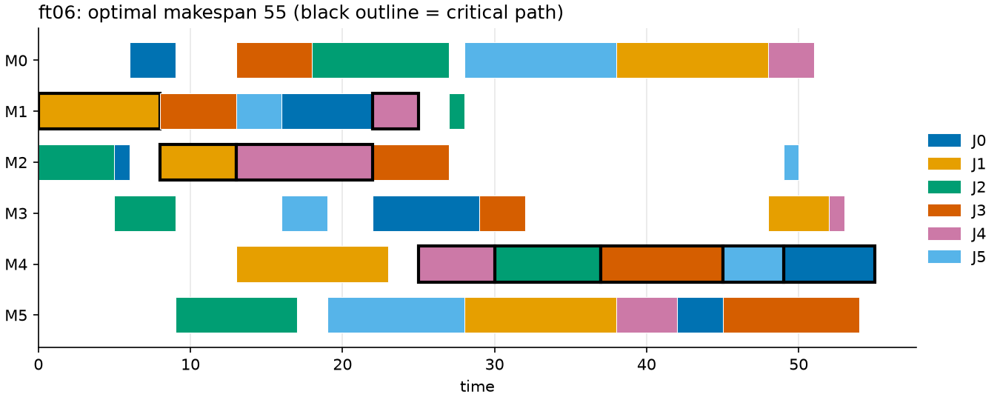
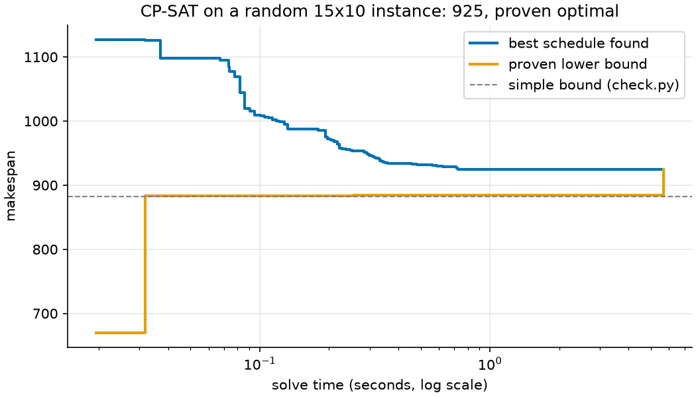

# 10 · Job shop scheduling (constraint programming)

**Solver:** CP-SAT · **Problem class:** scheduling · **Level:** intermediate

A machine shop has eight orders. Each order visits a few machines in a
fixed order: saw, then mill, then drill, and so on. A machine works on one
order at a time. When is each operation done, so that the last order is
finished as early as possible?

This is the *job shop problem*, one of the hardest classic problems in
scheduling. CP-SAT's interval variables make the model short and the
solver fast. The example also shows how to read a schedule: find its
bottleneck, its critical path, and the trade-off between finishing early
and delivering on time.

## The problem

Eight jobs, five machines, times in minutes. A higher weight marks a rush
order: each minute late costs more.

| job          | route (minutes per step)                    | due | weight |
| ------------ | ------------------------------------------- | --: | -----: |
| pump housing | saw 12 > mill 45 > drill 20 > grinder 15    | 150 |      3 |
| gear shaft   | saw 8 > lathe 40 > mill 25 > grinder 30     | 180 |      1 |
| bracket      | saw 10 > drill 15 > mill 20                 |  90 |      2 |
| flange       | lathe 30 > drill 25 > grinder 10            | 120 |      1 |
| valve body   | saw 15 > mill 50 > lathe 20 > drill 30      | 220 |      3 |
| spindle      | lathe 55 > grinder 35                       | 160 |      1 |
| coupling     | saw 6 > lathe 25 > drill 10 > mill 15       | 140 |      2 |
| bearing cap  | mill 30 > drill 12 > grinder 18             | 200 |      1 |

The example also solves two famous benchmarks from the OR-Library:
**ft06** (Fisher and Thompson, 1963; 6 jobs × 6 machines) and **la01**
(Lawrence, 1984; 10 jobs × 5 machines). Their optimal makespans, 55 and
666, are known. They test the model.

## The model

**Decision variables.** $s_o$ = start time of operation $o$. Each
operation has a fixed duration $p_o$ and machine $m_o$.

**Objective.** Minimize the makespan $C_{\max}$:

$$\min\ C_{\max} = \max_{j}\ (s_{\text{last}(j)} + p_{\text{last}(j)})$$

**Constraints.**

$$
\begin{aligned}
s_{o'} &\ge s_o + p_o && \text{for consecutive operations } o \to o' \text{ of a job} \\
\text{NoOverlap}\big(\{[s_o,\ s_o + p_o) : m_o = m\}\big) && && \text{for each machine } m
\end{aligned}
$$

**Second goal: weighted tardiness.** With due dates $d_j$ and weights
$w_j$, minimize $\sum_j w_j \max(0,\ C_j - d_j)$, where $C_j$ is the
finish time of job $j$.

> **Why not a MIP?** A MIP model needs a binary variable for every pair of
> operations on the same machine ("does $a$ go before $b$?") and big-M
> constraints. CP-SAT reasons about intervals directly, and its
> scheduling propagators are much stronger. For pure scheduling, it is the
> right tool.

## The OR-Tools code

All the modeling is in [`model.py`](model.py). The key lines:

```python
# Each operation: start, duration, end, tied together in one interval.
start[key] = model.new_int_var(0, horizon, f"start {job.name} #{k}")
end[key] = model.new_int_var(0, horizon, f"end {job.name} #{k}")
interval = model.new_interval_var(start[key], op.duration, end[key], name)
on_machine[op.machine].append(interval)

# Route order within a job.
model.add(start[job.name, k] >= end[job.name, k - 1])

# One operation at a time per machine.
for intervals in on_machine.values():
    model.add_no_overlap(intervals)

# Makespan = latest end of all jobs.
model.add_max_equality(makespan, last_ends)
model.minimize(makespan)
```

Things to notice:

- **The horizon** is the sum of all durations: one operation after the
  other. No optimal schedule is longer. A tight horizon keeps the
  variable domains small, and that helps the solver.
- **`new_interval_var`** links start, duration, and end. The solver keeps
  `start + duration == end` for you.
- **`add_no_overlap`** is a *global constraint*. One call covers all the
  pairs of operations on a machine.
- **`add_max_equality`** makes the makespan exactly the latest end.
- **Weighted tardiness** uses a classic trick. A variable $t_j \ge 0$
  with $t_j \ge C_j - d_j$ equals $\max(0, C_j - d_j)$ once we minimize
  it.
- **Two goals, one after the other.** `solve_lexicographic()` first finds
  the best value of one goal. It then adds that value as a cap and
  optimizes the second goal. Many schedules share the shortest makespan;
  this picks the best of them for lateness.
- **A solution callback** (`_ProgressRecorder`) records every better
  schedule CP-SAT finds, with the time and the best proven bound.
- **Parallel search.** `num_workers = 8` runs a portfolio of strategies at
  the same time. The optimal *value* is always the same, but the
  schedule itself can differ from run to run when there are ties.

## Run it

```bash
uv run python -m examples.ex10_job_shop.main          # report
uv run python -m examples.ex10_job_shop.main --plot   # + figures
```

Output (start and finish times can differ between runs; the totals do
not):

```text
Shortest schedule for the machine shop: 200 minutes
(proven optimal: True)

job           route                         start  finish  due  late
------------  ----------------------------  -----  ------  ---  ----
pump housing  saw > mill > drill > grinder     10     145  150     0
gear shaft    saw > lathe > mill > grinder     28     200  180    20
bracket       saw > drill > mill                0      50   90     0
flange        lathe > drill > grinder          55     120  120     0
valve body    saw > mill > lathe > drill       36     200  220     0
spindle       lathe > grinder                   0      95  160     0
coupling      saw > lathe > drill > mill       22     185  140    45
bearing cap   mill > drill > grinder            0      60  200     0

Machine use
machine  busy (min)  utilization
-------  ----------  -----------
saw              51  26%
lathe           170  85%
mill            185  92%
drill           112  56%
grinder         108  54%

Lower bounds (no schedule can be shorter)
bound                  minutes
---------------------  -------
longest job                115
busiest machine            185
machine + head + tail      195

Critical path (delay any of these and the whole schedule slips):
from   to  machine  job
----  ---  -------  ------------
   0   30  mill     bearing cap
  30   50  mill     bracket
  50   95  mill     pump housing
  95  145  mill     valve body
 145  170  mill     gear shaft
 170  200  grinder  gear shaft

Two goals, two schedules
priority                 makespan  weighted lateness  optimal
-----------------------  --------  -----------------  -------
shortest makespan first       200                110  True
least lateness first          215                 40  True

Benchmarks from the OR-Library
instance  size  makespan  known optimum  simple bound  proven  time
--------  ----  --------  -------------  ------------  ------  ------
ft06      6x6         55             55            52  True    0.03 s
la01      10x5       666            666           666  True    0.04 s

Verification: every schedule is feasible, and both benchmarks
match their known optimal makespan.
```

## Results

**The shortest schedule takes 200 minutes**, and CP-SAT proves that no
schedule is shorter. The **mill is the bottleneck**: it is busy 185 of
the 200 minutes (92%). The saw is idle three quarters of the time; buying
a second saw would not help at all.

The **critical path** shows why 200 is the best possible. The mill runs
five jobs back to back from minute 0 to 170, with no gap. Then the gear
shaft still needs 30 minutes on the grinder. Speed up any step on this
chain, and the whole schedule gets shorter. Speed up anything else, and
nothing changes.

**Finishing early is not the same as being on time.** The shortest
schedule delivers the gear shaft 20 minutes late and the rush coupling
order 45 minutes late. That is a weighted lateness of 1 × 20 + 2 × 45 =
110. If we optimize lateness first, the weighted lateness drops to 40, and
the makespan grows by only 15 minutes to 215. Which schedule is better
depends on what the customer contracts say. The model lets you pick.


**Benchmarks.** CP-SAT solves ft06 to its known optimum of 55, and la01
to 666, and proves both optimal in a fraction of a second. For la01, the
busiest machine alone needs 666 time units, so a simple bound proves the
optimum too.



**How the solver gets there.** On harder instances, CP-SAT works from
both sides at once. It finds better and better schedules (blue), and it
proves higher and higher lower bounds (orange). When the two lines meet,
the schedule is optimal. The figure shows a random 15 × 10 instance. In
our run, CP-SAT found a schedule within about 1% of the optimum in half a
second. It then needed several more seconds to reach 925 and to prove
that no schedule is shorter. Proving is often the hard part. Note how
far the solver's own bound rises above the simple bound from
[`check.py`](check.py).



## How we know the answer is right

[`check.py`](check.py) checks schedules without OR-Tools:

1. **Feasibility.** Every operation exists once, starts at time 0 or
   later, follows its job's route, and never overlaps another operation on
   the same machine. The makespan and the weighted lateness are computed
   again from the start times.
2. **Lower bounds.** Three simple bounds that no schedule can beat: the
   longest job, the busiest machine, and the busiest machine plus the
   shortest way in (head) and out (tail). When the makespan equals a
   bound, the schedule is optimal without any solver proof (as for la01).
3. **Brute force.** For tiny instances, `brute_force_makespan` tries
   every order of operations on every machine and computes the earliest
   schedule for each.

The [tests](../../tests/test_ex10_job_shop.py) also:

- solve ft06 and la01 to their known optimal makespans (55 and 666),
- prove ft06 cannot finish in 54: with that cap, CP-SAT reports
  infeasible,
- compare CP-SAT with brute force on seven small random instances,
- check the story instance results (200; 110 vs 40 lateness; 215),
- confirm every lower bound is at most the optimum,
- confirm the critical path starts at 0, has no gaps, and ends at the
  makespan,
- break schedules on purpose and confirm the checker catches each error,
  and
- confirm that recorded solver progress only improves over time.

## Try this

- Give the mill a twin (add a second mill and let jobs use either one).
  CP-SAT can model the choice with *optional intervals*
  (`new_optional_interval_var`). How much shorter does the schedule get?
- Add a setup time on the lathe that depends on which job came before.
  Hint: model the job order on the lathe with `add_circuit`.
- Make the grinder unavailable from minute 60 to 90 (a maintenance
  break). Add a fixed interval to its no-overlap list.
- Run `random_instance(20, 15, seed=1)` with a 10-second limit. Does
  CP-SAT prove optimality? What happens with `num_workers = 1`?

## References

- [CP-SAT scheduling guide](https://developers.google.com/optimization/scheduling/job_shop)
- [OR-Library job shop instances](http://people.brunel.ac.uk/~mastjjb/jeb/orlib/jobshopinfo.html)
- H. Fisher and G. L. Thompson, *Probabilistic learning combinations of
  local job-shop scheduling rules*, 1963 (ft06).
- S. Lawrence, *Resource constrained project scheduling: an experimental
  investigation of heuristic scheduling techniques*, 1984 (la01).
- M. Pinedo, *Scheduling: Theory, Algorithms, and Systems*, Springer.
