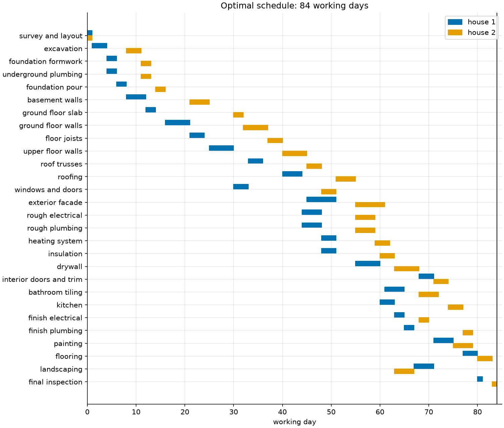
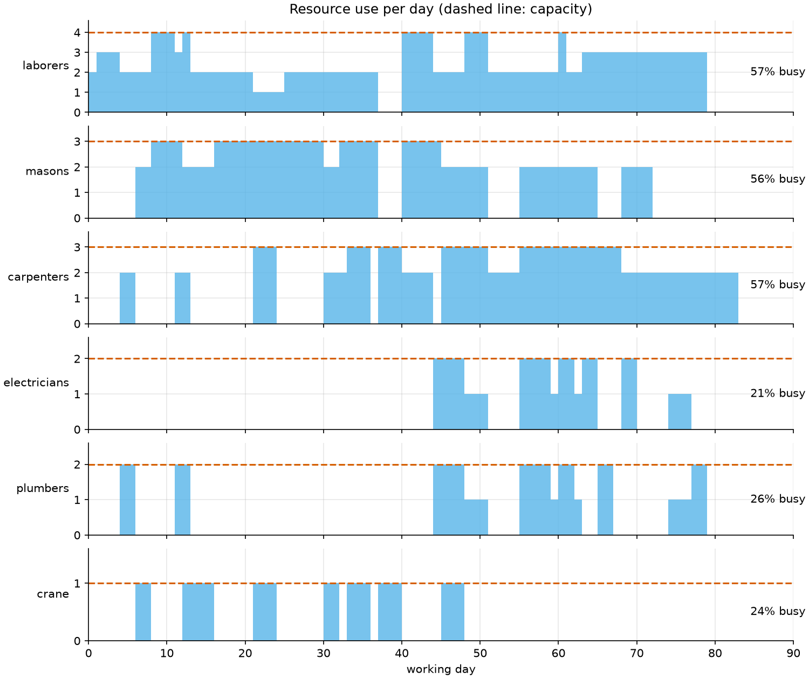

# 11 · Project scheduling with limited crews (RCPSP)

**Solver:** CP-SAT · **Problem class:** resource-constrained project
scheduling · **Level:** intermediate

A builder puts up two houses side by side. Each house has 28 activities,
from the survey to the final inspection. The houses do not depend on each
other, but they share the same crews and the same crane. How fast can the
builder finish both? And which extra hire would help most?

This is the *resource-constrained project scheduling problem* (RCPSP). The
classic critical path method ignores resources. This example shows how
much that can mislead you, and how CP-SAT handles the resources exactly.

## The problem

Each activity has a duration in working days, a list of predecessors that
must end first, and a crew need for every day it runs. Some examples:

| activity           | days | must wait for                       | needs per day                  |
| ------------------ | ---: | ----------------------------------- | ------------------------------ |
| excavation         |    3 | survey and layout                   | 3 laborers                     |
| foundation pour    |    2 | foundation formwork                 | 2 masons, 2 laborers, crane    |
| floor joists       |    3 | ground floor walls                  | 3 carpenters, crane            |
| rough plumbing     |    4 | roofing, windows and doors          | 2 plumbers                     |
| drywall            |    5 | insulation                          | 3 carpenters                   |
| kitchen            |    3 | drywall                             | 2 carpenters, plumber, electrician |
| final inspection   |    1 | flooring, finish plumbing, landscaping, heating | —                  |

The full list is in [`data.py`](data.py). The builder has, on every day:

| laborers | masons | carpenters | electricians | plumbers | crane |
| -------: | -----: | ---------: | -----------: | -------: | ----: |
|        4 |      3 |          3 |            2 |        2 |     1 |

## The model

**Decision variables.** $s_a$ = start day of activity $a$. Its end is
$s_a + d_a$, where $d_a$ is its duration.

**Objective.** Minimize the makespan $C_{\max}$, the day the last activity
ends:

$$\min\ C_{\max}, \qquad C_{\max} \ge s_a + d_a \quad \text{for all } a$$

**Constraints.**

$$
\begin{aligned}
s_b &\ge s_a + d_a && \text{for each precedence } a \to b \\
\sum_{a\,:\ s_a \le t < s_a + d_a} q_{ar} &\le Q_r && \text{for each resource } r \text{ and each day } t
\end{aligned}
$$

Here $q_{ar}$ is the number of units of resource $r$ that activity $a$
needs per day, and $Q_r$ is the number available. The second line is the
hard part: it must hold on *every* day, for every set of activities that
happens to overlap.

## The OR-Tools code

[`model.py`](model.py) needs only three CP-SAT building blocks:

```python
# 1. An interval variable ties start, duration, and end together.
start[a] = model.new_int_var(0, horizon - a.duration, f"start {a.name}")
end[a] = model.new_int_var(a.duration, horizon, f"end {a.name}")
interval[a] = model.new_interval_var(start[a], a.duration, end[a], a.name)

# 2. Precedences are plain linear constraints.
model.add(start[successor] >= end[predecessor])

# 3. One cumulative constraint per resource replaces the "every day" sum.
model.add_cumulative(
    [interval[a] for a in users], [a.needs(r) for a in users], r.capacity
)

model.add_max_equality(makespan, list(end.values()))
model.minimize(makespan)
```

Things to notice:

- **`add_cumulative` is the key.** It states the daily limit for all days
  at once, without a variable per day. CP-SAT reasons about it with
  special algorithms (time tabling, energetic reasoning, edge finding).
- **The horizon matters.** Every start variable needs an upper bound. The
  sum of all durations is always safe. A known schedule gives a smaller
  one, and `extra_unit_gains()` uses the current makespan for that.
- **Two solve phases.** Many schedules share the shortest makespan. Phase
  1 finds that makespan with 8 parallel workers. Phase 2 fixes it and
  minimizes the sum of start days with one worker. The result has no
  needless gaps, and it is the same on every run.

## Run it

```bash
uv run python -m examples.ex11_project_scheduling.main          # report
uv run python -m examples.ex11_project_scheduling.main --plot   # + figures
```

```text
Project: row of 2 houses, 56 activities

method                           days  meaning
-------------------------------  ----  -----------------
critical path (unlimited crews)    57  lower bound
resource energy bound              48  lower bound
priority-rule heuristic            98  feasible schedule
CP-SAT                             84  proven optimal

Shared crews stretch the project by 27 days (47%).

Schedule (start day - end day)
activity                 house 1    house 2
-----------------------  ---------  ---------
survey and layout          0 - 1      0 - 1
excavation                 1 - 4      8 - 11
...
flooring                  77 - 80    80 - 83
landscaping               67 - 71    63 - 67
final inspection          80 - 81    83 - 84

What if we add one unit of a resource?
resource      now  with one more  days saved
------------  ---  -------------  ----------
laborers        4              5           0
masons          3              4           0
carpenters      3              4           6
electricians    2              3           0
plumbers        2              3           0
crane           1              2           0

Verification: the schedule meets every precedence and every
daily crew limit; CP-SAT proved that no shorter schedule exists.
```

CP-SAT finds and proves the optimum in about 0.05 seconds. The tidy
second phase takes about half a second.

## Results

**The critical path is far too optimistic.** With unlimited crews, the
houses could go up in parallel, and both would be done in 57 days. With
the real crews, the best possible schedule takes **84 days**, 47% longer.
For a single house, the gap is small (60 days against 57). The problem is
the *sharing*: the two houses keep asking for the same crews at the same
time.

**A good heuristic is not good enough.** A classic priority rule (serial
schedule generation, smallest latest-finish-time first) needs 98 days.
CP-SAT saves two working weeks over it, and it proves that no schedule
can beat 84 days.



The Gantt chart shows how the solver handles the conflict. It does not
run the houses side by side. It staggers them: house 2 starts its
excavation on day 8, after house 1 has moved on. The masons and
carpenters then hand work back and forth between the two houses.

**Hire a carpenter.** The what-if study solves the problem again with one
more unit of each resource. Only an extra carpenter helps, and it saves 6
days (84 → 78). The reason is in the data: floor joists, roof trusses,
and drywall each need *all three* carpenters. While one house has
carpenters on those jobs, all carpentry in the other house stops.

The resource chart holds a surprise. The carpenters are only 57% busy,
which is no more than the laborers. The bottleneck is not the busiest
crew. It is the crew that blocks the activities on the longest chain.
Utilization alone would not tell you this. Re-solving does.



## How we know the answer is right

[`check.py`](check.py) needs no OR-Tools:

1. **Feasibility.** It checks every precedence and, for each resource,
   adds up the demand on each single day.
2. **Lower bounds.** The critical path (57 days) and the energy bound
   (48 days) are two classic bounds. The energy bound says: the project
   needs 144 carpenter-days and has 3 carpenters, so it takes at least 48
   days. Both are below 84. The gap shows why CP-SAT's own proof is needed
   here: simple bounds cannot prove this optimum.
3. **A second, independent method.** The serial schedule generation
   scheme (SGS) builds a schedule from any priority list. For makespan,
   some optimal schedule always comes out of some list. So trying every
   list solves tiny projects exactly.

The [tests](../../tests/test_ex11_project_scheduling.py) also:

- solve one house and 4 random 10-activity projects with a **time-indexed
  MIP** in MathOpt and HiGHS: one binary variable per activity and start
  day. This is a completely different model. It must give the same
  makespan as CP-SAT,
- compare CP-SAT with the exhaustive SGS search on 6 random 6-activity
  projects,
- check the bounds, the heuristic result (98 days), and the what-if
  gains, and
- feed broken schedules to the checker to make sure it catches them.

> **Note:** the time-indexed MIP is too slow for the two-house instance
> (HiGHS did not finish within two minutes). That is typical.
> Time-indexed models grow with the horizon, while CP-SAT's cumulative
> constraint does not.

## Try this

- Build three houses: use `housing_row(3)` in `main.py`. How long does
  the project take now? Is the carpenter still the bottleneck?
- Hire the extra carpenter for part of the project only. (Hint: model the
  carpenter capacity as 4 and add a dummy interval that uses one
  carpenter during the days you *don't* pay for.)
- Let some activities be split, for example painting. Model each day of
  painting as its own interval.
- Add a deadline for house 1, because its buyer wants to move in early.
  What does that cost house 2?

## References

- [CP-SAT scheduling primer](https://github.com/google/or-tools/blob/stable/ortools/sat/docs/scheduling.md)
- [OR-Tools RCPSP sample](https://github.com/google/or-tools/blob/stable/examples/python/rcpsp_sat.py)
- R. Kolisch, *Serial and parallel resource-constrained project
  scheduling methods revisited*, European Journal of Operational
  Research, 1996.
- PSPLIB, the standard RCPSP benchmark library:
  <https://www.om-db.wi.tum.de/psplib/>
