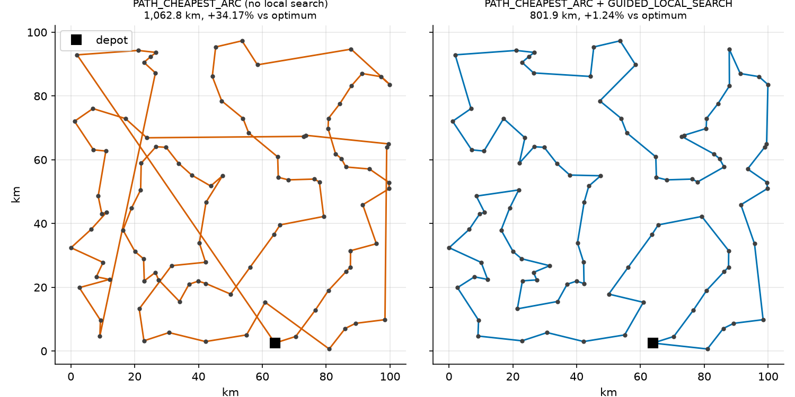
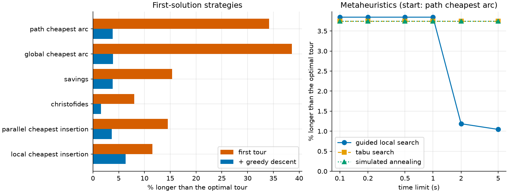

# 12 · Traveling salesperson (routing library)

**Solver:** OR-Tools routing library, plus CP-SAT as an exact referee ·
**Problem class:** TSP · **Level:** intermediate

A field technician must inspect 99 cell towers. The technician starts at
the depot, visits every tower once, and drives back. Which order gives the
shortest trip? This is the *traveling salesperson problem* (TSP), the most
studied problem in combinatorial optimization.

The OR-Tools **routing library** is built for this kind of problem. It is
a heuristic: it finds very good tours fast, but it never proves that a
tour is optimal. So this example also asks: *how good is "very good"?* We
answer with an exact CP-SAT model and, for small instances, with classic
dynamic programming.

## The problem

- 100 sites (depot + 99 towers), placed at random in a 100 km × 100 km
  region (seed 42).
- The distance between two sites is the straight-line distance, rounded
  to whole meters. A real project would use road distances from a map
  service; nothing else in the model changes.

## The model

Let $d_{ij}$ be the distance from site $i$ to site $j$, and let
$x_{ij} = 1$ if the tour drives from $i$ straight to $j$.

$$
\begin{aligned}
\min\ & \sum_{i \ne j} d_{ij}\, x_{ij} \\
\text{s.t.}\ & \sum_{j} x_{ij} = 1, \quad \sum_{j} x_{ji} = 1 && \text{for each site } i \quad \text{(leave once, arrive once)} \\
& \text{the chosen arcs form one single cycle} && \text{(no sub-tours)} \\
& x_{ij} \in \{0, 1\}
\end{aligned}
$$

The "one single cycle" rule is the hard part. Without it, the cheapest
answer is a set of small separate loops. The classic MIP model (DFJ)
needs an exponential number of constraints to forbid them. The MTZ model
in example 13 needs only a polynomial number, but its LP bound is weaker.
The routing library
avoids the issue: it works with a *successor* for each stop, so a tour is
always one path. CP-SAT has a special constraint, `add_circuit`, that
enforces exactly this rule.

## The OR-Tools code

All the modeling is in [`model.py`](model.py).

### 1. Indices versus sites

```python
manager = pywrapcp.RoutingIndexManager(len(matrix), num_vehicles, depot)
routing = pywrapcp.RoutingModel(manager)
```

The routing library has its own **index** for each stop. Your data uses
**site numbers** (nodes). With one vehicle they often look the same, but
they are not the same thing. With several vehicles or several depots,
they differ. Always convert with `manager.IndexToNode(index)` and
`manager.NodeToIndex(node)`. Mixing the two up is the most common bug in
routing code.

### 2. Tell the solver the distances

The classic way is a Python callback:

```python
def distance(from_index, to_index):
    return matrix[manager.IndexToNode(from_index)][manager.IndexToNode(to_index)]


transit = routing.RegisterTransitCallback(distance)
```

The solver calls this function millions of times. Each call crosses from
C++ into Python. When you have the full matrix anyway, hand it over in
one go:

```python
transit = routing.RegisterTransitMatrix(matrix)  # stays in C++
routing.SetArcCostEvaluatorOfAllVehicles(transit)
```

On the 100-site instance, the matrix version was about 3–8 times faster
on our machine (0.04 s versus 0.15–0.34 s for the default search). It finds
exactly the same tours. The tests check that.

**Why integers?** The routing library adds up costs as 64-bit integers.
So we count distances in meters, not in kilometers with decimals.
Rounding each leg to a meter is far below anything that matters here.

### 3. Choose a search strategy

```python
params = pywrapcp.DefaultRoutingSearchParameters()
params.first_solution_strategy = (
    routing_enums_pb2.FirstSolutionStrategy.PATH_CHEAPEST_ARC
)
params.local_search_metaheuristic = (
    routing_enums_pb2.LocalSearchMetaheuristic.GUIDED_LOCAL_SEARCH
)
params.time_limit.FromMilliseconds(2000)
solution = routing.SolveWithParameters(params)
```

The search has two phases:

1. A **first-solution strategy** builds one tour fast.
   `PATH_CHEAPEST_ARC` always drives on to the nearest unvisited site.
   `SAVINGS`, `CHRISTOFIDES`, and the insertion methods build the tour in
   other ways.
2. **Local search** then improves it with small moves (swap two stops,
   reverse a stretch, and so on). By default, it is a *greedy descent*:
   it stops at the first tour that no single move can improve. A
   **metaheuristic** such as guided local search can escape that point.
   It never stops on its own, so it needs a time limit.

### 4. Read the tour

```python
index = routing.Start(vehicle)
route = [manager.IndexToNode(index)]
while not routing.IsEnd(index):
    index = solution.Value(routing.NextVar(index))
    route.append(manager.IndexToNode(index))
```

### 5. The exact referee: CP-SAT

```python
arc = {
    (i, j): model.new_bool_var(f"{i}->{j}")
    for i in range(n)
    for j in range(n)
    if i != j
}
model.add_circuit([(i, j, lit) for (i, j), lit in arc.items()])
model.minimize(sum(matrix[i][j] * lit for (i, j), lit in arc.items()))
```

One Boolean per arc, and `add_circuit` does the rest. CP-SAT proves the
optimum for this 100-site instance in a few seconds. It can't scale the
way the routing library can, but up to about a hundred sites it is a
precise yardstick.

## Run it

```bash
uv run python -m examples.ex12_tsp.main          # report (~15 s)
uv run python -m examples.ex12_tsp.main --plot   # + figures (~40 s)
```

```text
Instance: depot + 99 cell towers

CP-SAT exact baseline: 792.1 km (proven optimal, lower bound 792.1 km, 7.7 s)

First-solution strategies (gap = % longer than the CP-SAT tour)
strategy                     first km  gap %  after descent km  gap %
---------------------------  --------  -----  ----------------  -----
PATH_CHEAPEST_ARC            1,062.79  34.17            822.56   3.84
GLOBAL_CHEAPEST_ARC          1,097.90  38.60            822.92   3.89
SAVINGS                        913.93  15.38            822.51   3.84
CHRISTOFIDES                   855.78   8.04            804.56   1.57
PARALLEL_CHEAPEST_INSERTION    907.18  14.53            821.11   3.66
LOCAL_CHEAPEST_INSERTION       883.71  11.56            842.23   6.33

PATH_CHEAPEST_ARC + guided local search (2 s): 801.9 km, gap 1.24%

Verification: all 14 tours are valid round trips, their
lengths match the map, and none beats the CP-SAT lower bound.
```

The time-limited results depend on the speed and load of your machine.
Your guided-local-search tour may be a little shorter or longer.

## Results

**The optimal tour is 792.1 km.** CP-SAT proves it: its lower bound
equals the tour length.

**First tours are rough.** The nearest-neighbor tour (`PATH_CHEAPEST_ARC`)
is 34% too long. It goes well at the start, then has to cross the whole
map to pick up the sites it left behind. Christofides builds the best
first tour here (8% too long).

**Greedy descent fixes most of that.** After local search, every strategy
is within 1.6–6.3% of the optimum. Different start tours end in different
local optima, so the first strategy still matters. Christofides ends best
(1.6%).

**Guided local search gets close to optimal.** It penalizes the long arcs
of each local optimum, so the search moves on instead of getting stuck.
After 2 seconds it is about 1% above the optimum. Given enough time, it
often finds the optimal tour; it just cannot *prove* it is optimal.



The left map shows the typical faults of a greedy first tour: long jumps
and crossing edges. A tour with crossing edges is never optimal, because
reversing the stretch between the crossings makes it shorter. Local
search removes all of them.



Two lessons from the right panel:

- **Guided local search is the metaheuristic to try first for routing.**
  With default settings, tabu search and simulated annealing hardly
  improved on greedy descent here (their lines overlap at 3.75%).
- **Results depend on time.** Guided local search improves in steps. On
  one of our 60-site test instances it stayed 3.95% above optimal for
  2 s, and then found the optimum by 3 s. So give it a real time budget,
  and compare tours at equal time.

## How we know the answers are right

[`check.py`](check.py) uses no OR-Tools. It has:

1. **A tour checker.** The tour starts and ends at the depot, visits each
   site exactly once, and its length, recomputed from the coordinates with
   numpy, matches the length the solver reports.
2. **Two exact solvers for small instances:**
   - **Brute force** tries all $(n-1)!$ orders (up to 9 sites).
   - **Held–Karp dynamic programming** solves up to ~13 sites in a split
     second. `best[S][j]` is the shortest path from the depot through all
     sites in the set $S$ that ends at $j$. It needs $O(2^n n^2)$ steps
     instead of $O(n!)$.

The [tests](../../tests/test_ex12_tsp.py) use three levels:

- **Exact, small:** Held–Karp equals brute force (5, 7, 9 sites). The
  routing library with guided local search finds exactly the Held–Karp
  optimum on five instances with 6 to 13 sites. CP-SAT matches
  Held–Karp on 8 and 12 sites.
- **Exact, medium:** on three 60-site instances, CP-SAT proves the
  optimum, and guided local search (3 s) must come within **2%** of it.
  We test the gap, not the exact length, because time-limited runs vary.
- **Sanity:** every first-solution strategy gives a valid tour; local
  search never makes a tour worse; the matrix and the Python callback give
  identical tours; a depot other than site 0 works.

## Try this

- Start guided local search from `CHRISTOFIDES` instead of
  `PATH_CHEAPEST_ARC`. Does a better start help after 2 seconds?
- Double the instance to 200 sites. How long does CP-SAT need now? Is the
  routing library's gap still about 1%?
- Make the distances asymmetric (one-way streets, or uphill versus
  downhill for a drone). Which parts of the code must change? (Hint: only
  the matrix. Held–Karp's closing step assumes symmetry — fix that too.)
- Set `params.log_search = True` and watch the search improve the tour.

## References

- [OR-Tools guide: traveling salesperson problem](https://developers.google.com/optimization/routing/tsp)
- [Routing options: search strategies and limits](https://developers.google.com/optimization/routing/routing_options)
- D. Applegate, R. Bixby, V. Chvátal, W. Cook, *The Traveling Salesman
  Problem: A Computational Study*, Princeton University Press, 2006.
- M. Held and R. M. Karp, "A dynamic programming approach to sequencing
  problems", *J. SIAM* 10(1), 1962.
