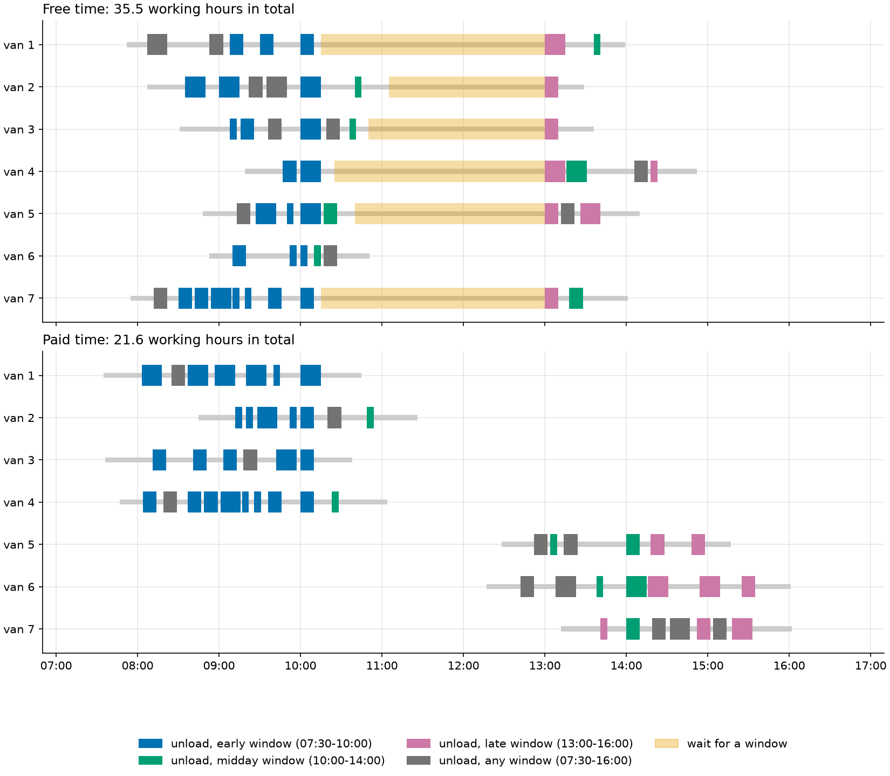

# 13 · Vehicle routing with capacities and time windows

**Solver:** OR-Tools routing library, plus CP-SAT as an exact referee ·
**Problem class:** CVRPTW · **Level:** intermediate

A pharmaceutical wholesaler delivers medicine to 50 pharmacies every
morning. Each pharmacy orders a few crates, needs some minutes to unload,
and accepts goods only in a delivery window. Vans carry 40 crates and work
one shift. Which van goes where, and in which order?

This is the *capacitated vehicle routing problem with time windows*
(CVRPTW), the workhorse of real delivery planning. It builds on
[example 12](../ex12_tsp/): one route becomes many, and every route must
respect a load limit and a clock.

The example plans three days:

1. **A normal day.** Serve everyone with as few vans and kilometers as
   possible.
2. **The same day, with paid driver time.** Waiting now costs money. The
   plan changes a lot.
3. **A flu season day.** Demand is up, two drivers are sick, and not every
   pharmacy can get its crates today. Which ones wait until tomorrow?

## The problem

- **Customers:** 50 pharmacies in four towns and the countryside around a
  depot (a 30 km × 30 km region, seed 7). Each orders 1–8 crates and
  needs 5–15 minutes to unload.
- **Time windows** for the start of unloading:

  | window | from  | to    | share |
  | ------ | ----- | ----- | ----: |
  | early  | 07:30 | 10:00 |   40% |
  | midday | 10:00 | 14:00 |   20% |
  | late   | 13:00 | 16:00 |   20% |
  | any    | 07:30 | 16:00 |   20% |

- **Fleet:** up to 10 vans of 40 crates. The shift runs from 07:00 to
  17:00.
- **Roads:** road distance is the straight-line distance × 1.3, a common
  rule of thumb for city streets. Vans average 30 km/h.
- **Costs** are all in one unit, meters of driving:
  - each km driven costs 1 km,
  - each van used costs 40 km (driver, lease, insurance),
  - in scenario 2, each working minute costs 1 km (about $30/h wages
    against $0.50/km running cost),
  - in scenario 3, each crate not delivered costs 15 km.

## The model

Let $x_{ijk} = 1$ if van $k$ drives from stop $i$ straight to stop $j$.
Let $q_i$ be the demand, $s_i$ the service time, $[a_i, b_i]$ the time
window, $\tau_{ij}$ the driving time, $d_{ij}$ the distance, $Q$ the van
capacity, and $F$ the fixed cost per van. Let $T_i$ be the start of
service at $i$.

$$
\begin{aligned}
\min\ & \sum_{k} \sum_{i,j} d_{ij}\, x_{ijk} \;+\; F \cdot (\text{vans used}) \;+\; \sum_{i \text{ unserved}} p_i \\
\text{s.t.}\ & \text{each customer is visited by at most one van, exactly once if it cannot be dropped} \\
& \textstyle\sum_{i \in \text{route } k} q_i \le Q && \text{(capacity)} \\
& x_{ijk} = 1 \;\Rightarrow\; T_j \ge T_i + s_i + \tau_{ij} && \text{(time flows along the route)} \\
& a_i \le T_i \le b_i && \text{(time windows)} \\
& \text{every route starts at the depot after 07:00 and ends there by 17:00}
\end{aligned}
$$

"$\ge$" in the time rule allows waiting: a van that arrives early waits
until the window opens.

## The OR-Tools code

All the modeling is in [`model.py`](model.py). The setup (index manager,
distance matrix, search parameters) is the same as in example 12. The new
ideas are *dimensions*, *fixed costs*, and *disjunctions*.

### 1. Capacity: a dimension that adds up demand

```python
demand = routing.RegisterUnaryTransitVector([s.demand for s in data.stops])
routing.AddDimensionWithVehicleCapacity(
    demand,
    0,  # No slack: load only changes by demand.
    [data.capacity] * vans,  # One capacity per van (fleets may differ).
    True,  # Every van starts empty.
    "Load",
)
```

A **dimension** is a quantity that accumulates along a route. Its value
at a stop is the *cumul variable*. Here the cumul is the load so far, and
the solver keeps it within each van's capacity. A *unary* callback depends
on one stop only.

### 2. Time: a dimension with slack and windows

```python
transit_time = [
    [data.stops[i].service + drive[i][j] for j in range(n)] for i in range(n)
]
routing.AddDimension(
    routing.RegisterTransitMatrix(transit_time),
    shift,  # Max waiting at one stop: we do not limit it.
    data.shift_end,  # No cumul may pass the end of the shift.
    False,  # Do not force vans to leave at time 0.
    "Time",
)
time_dim = routing.GetDimensionOrDie("Time")
for c in data.customers:
    stop = data.stops[c]
    time_dim.CumulVar(manager.NodeToIndex(c)).SetRange(stop.open, stop.close)
```

- The transit from $i$ to $j$ is **service at $i$ plus the drive**. So the
  cumul at $j$ is the moment the van can start unloading there. Putting
  the service time into the transit is the standard trick.
- **Slack** is waiting. If the van arrives at 07:50 and the window opens
  at 08:00, the slack at that stop is 10 minutes.
- `CumulVar(index).SetRange(open, close)` is the time window. Note the
  conversion from stop number to routing index.
- `AddVariableMaximizedByFinalizer` and `AddVariableMinimizedByFinalizer`
  on the start and end cumuls make each van leave as late and return as
  early as its route allows. Without them, the reported times may contain
  needless waiting.

### 3. Fixed costs: use fewer vans

```python
routing.SetFixedCostOfAllVehicles(data.fixed_cost)
```

A van that leaves the depot costs a fixed amount on top of its distance.
This makes the solver use a van only if it saves more than 40 km.

### 4. Paid time: span costs

```python
time_dim.SetSpanCostCoefficientForAllVehicles(data.minute_cost)
```

The **span** of a van is the time from leaving the depot to coming back.
A span cost charges every minute of it, waiting included.

### 5. Optional visits: disjunctions with penalties

```python
for c in data.customers:
    routing.AddDisjunction([manager.NodeToIndex(c)], data.drop_penalty(c))
```

A disjunction says "visit one node of this list, or pay the penalty". With
one node per list, every pharmacy becomes optional at its own price.
Without disjunctions, every node must be visited, and the solver returns
no solution if that is impossible.

### 6. Reading the solution

```python
index = routing.Start(v)
while True:
    route.append(manager.IndexToNode(index))
    times.append(solution.Min(time_dim.CumulVar(index)))
    if routing.IsEnd(index):
        break
    index = solution.Value(routing.NextVar(index))
```

`solution.Min(cumul)` is the start of service at that stop.

### 7. An exact referee in CP-SAT

`solve_exact` builds the same problem in CP-SAT. Its
`add_multiple_circuit` constraint is a routing constraint: arcs must form
cycles through the depot, and a self-loop $(i, i)$ means "skip $i$". Load
and time are integer variables, linked by implications
(`only_enforce_if`). CP-SAT proves the optimum for up to about 25
customers here. For 50 customers it does not finish, but its lower bound
tells us how good the routing plan is.

## Run it

```bash
uv run python -m examples.ex13_vehicle_routing.main            # ~15 s
uv run python -m examples.ex13_vehicle_routing.main --plot     # + figures
uv run python -m examples.ex13_vehicle_routing.main --exact    # + CP-SAT bound (60 s)
```

The routing library runs guided local search with a time limit (4 s per
scenario by default, `--time-limit` to change it). Results with a time
limit vary a little between runs and machines. The output below is from
the run that made the figures.

```text
Normal day: 50 pharmacies, 262 crates, 10 vans of 40 crates

van    stops  crates      km  leaves  back   wait min
-----  -----  -------  -----  ------  -----  --------
van 1      7  40 / 40  63.27  07:52   13:59       165
van 2      7  40 / 40  60.58  08:07   13:29       115
van 3      7  39 / 40  55.17  08:31   13:36       130
van 4      6  37 / 40  53.67  09:19   14:52       155
van 5      8  38 / 40  45.84  08:48   14:10       140
van 6      5  32 / 40  41.08  08:53   10:51         0
van 7     10  36 / 40  53.39  07:55   14:01       165

Cost: 7 vans x 40 km + 373.0 km driven = 653.0 km-equivalent
Total working time of all vans: 2,133 min (35.5 h)

Simple lower bound (check.py): at least 7 vans and 439.2 km-equivalent; the plan is at most 49% above it.
CP-SAT, 60 s: best plan 640.4, proven lower bound 630.4 km-equivalent. The routing plan is at most 3.6% above the optimum.

========================================================================

Same day, but each working minute now costs 1 km (driver wages).

van    stops  crates      km  leaves  back   wait min
-----  -----  -------  -----  ------  -----  --------
van 1      7  39 / 40  49.45  07:35   10:45         0
van 2      7  37 / 40  53.06  08:45   11:26         0
van 3      6  40 / 40  57.77  07:36   10:38         0
van 4     10  33 / 40  54.23  07:47   11:04         0
van 5      6  40 / 40  57.05  12:28   15:17         0
van 6      7  36 / 40  69.31  12:17   16:01         0
van 7      7  37 / 40  47.22  13:12   16:02         0

Cost: 7 vans x 40 km + 388.1 km driven + 1,293 working min x 1 km = 1,961.1 km-equivalent
Total working time of all vans: 1,293 min (21.6 h)

========================================================================

Flu season day: 346 crates, but 8 vans carry at most 320. Dropping a pharmacy costs 15 km per crate.

van    stops  crates      km  leaves  back   wait min
-----  -----  -------  -----  ------  -----  --------
van 1      5  40 / 40  35.81  08:53   13:44       165
van 2      5  40 / 40  32.78  09:17   11:02         0
van 3      5  40 / 40  64.68  08:05   11:04         0
van 4      7  40 / 40  42.41  08:52   14:01       165
van 5      6  40 / 40  58.99  09:15   14:24       110
van 6      5  40 / 40  45.87  09:23   13:42       117
van 7      5  40 / 40  60.35  08:31   13:29       132
van 8      5  40 / 40  74.97  09:04   14:07        99

Cost: 8 vans x 40 km + 415.9 km driven + 390 km penalties = 1,125.9 km-equivalent
Total working time of all vans: 2,053 min (34.2 h)
Unserved today: 7 pharmacies, 26 crates: pharmacy 3 (2), pharmacy 5 (5), pharmacy 13 (4), pharmacy 32 (2), pharmacy 35 (2), pharmacy 37 (4), pharmacy 38 (7)

Verification: a replay of every route confirms capacities,
time windows, and shifts, and the costs match the map.
```

## Results

### Normal day

The plan uses **7 vans**, the minimum the crates allow (262 crates / 40
per van, rounded up). They drive 373.0 km. With the fixed costs, the day
costs 653.0 km-equivalent.

How good is that? The simple bound in `check.py` is too weak to say (49%).
CP-SAT, given 60 seconds, finds a better plan (640.4) and proves that no
plan can cost less than 630.4. So the 4-second routing plan is **at most
3.6% above the optimum**, and at least 2.0% above the best plan we know.
In a 5-minute run, CP-SAT reached the same 640.4 and raised the bound to
631.3; it does not close the gap. More time helps the routing library too: 643.5
after 30 s in one of our runs.


### Paid driver time

The free-time plan has a flaw that the map hides. Look at the timeline:
six of the seven vans serve their early customers, then **wait two to
three hours** for the 13:00 late window. Driver time costs nothing in the
model, so the solver happily parks a van to save a few kilometers.

When each working minute costs 1 km, the plan changes shape. Four vans
work only in the morning, and three only in the afternoon. Nobody waits.

| | free time | paid time |
| --- | ---: | ---: |
| vans | 7 | 7 |
| km driven | 373.0 | 388.1 |
| working hours | 35.5 | 21.6 |
| cost at paid rates (km-equivalent) | 2,786.0 | 1,961.1 |

Driving 15 km more saves 14 hours of paid time, about 30% of the day's
cost. The lesson: **the objective is the model.** If a cost is missing
from it, the solver will exploit that.



### Flu season day

The pharmacies order 346 crates, but 8 vans carry only 320. At least 26
crates must wait. The plan drops **exactly 26 crates** (7 pharmacies), so
it loses no more than it must. Which pharmacies wait depends on how much
driving each visit costs, and the list can change a little between runs.
CP-SAT found a slightly cheaper plan in 5 minutes (1,108.2 against
1,125.9 here), but it could not prove a useful bound on this instance.

## How we know the answers are right

[`check.py`](check.py) uses no OR-Tools:

1. **Replay.** `plan_errors` drives every route minute by minute: leave,
   drive, wait if the window is closed, unload, drive on. It checks every
   window, every load, and the shift end. It also checks the solver's own
   timetable, stop by stop, and that every customer is served once (or
   reported as dropped, when that is allowed).
2. **Cost.** `plan_cost` recomputes distances from the map coordinates and
   adds fixed costs, penalties, and paid time.
3. **Exact optimum for small instances.** `exact_optimum` enumerates every
   feasible route by depth-first search. Then dynamic programming over
   sets of customers picks the best combination of routes. For paid time
   it uses `shortest_span`: leaving one minute later brings the van back
   at most one minute later, so the latest feasible departure is best,
   and a binary search finds it.
4. **A lower bound for the big instance.** `simple_lower_bound` says: the
   crates need at least ⌈262 / 40⌉ = 7 vans, and every customer is entered
   once, over at least its shortest incoming road. The plan meets the van
   bound exactly. The distance part of this bound is weak, so we also use
   CP-SAT's proven bound.

The [tests](../../tests/test_ex13_vehicle_routing.py):

- On 7 small instances (6–10 customers, with and without drops and paid
  time), brute force, CP-SAT, and the routing library find exactly the
  same optimal cost.
- The normal-day plan is feasible, uses the minimum of 7 vans, and lies
  within 7% of CP-SAT's proven lower bound (10 s run).
- The flu-day plan drops no more than 8 crates beyond what cannot fit.
- With paid time, total working time falls by more than 25%, and the plan
  is cheaper than the free-time plan valued at the same rates.
- `shortest_span` matches a search over every departure minute.
- The checker catches an overloaded van, a missed window, a forgotten
  customer, and a misreported cost.

## Try this

- **Two trips per van.** In the paid-time plan, some vans work only in the
  morning and others only in the afternoon. Let one driver do both: model
  each van as two "virtual" vehicles and link their times. How much does
  the fleet shrink?
- **A heterogeneous fleet.** Replace two vans by one truck with 80 crates
  (`AddDimensionWithVehicleCapacity` takes one capacity per vehicle).
- **Priorities.** Give hospital pharmacies a much higher drop penalty. Do
  they survive the flu season day?
- **Lunch breaks.** Drivers need 30 minutes off between 11:30 and 13:30.
  Look up `SetBreakIntervalsOfVehicle` in the routing library.
- **Balance the work.** Add `time_dim.SetGlobalSpanCostCoefficient(...)`
  to penalize the longest route. How does the plan change?

## References

- [OR-Tools: vehicle routing](https://developers.google.com/optimization/routing/vrp)
- [OR-Tools: capacity constraints](https://developers.google.com/optimization/routing/cvrp)
- [OR-Tools: time windows](https://developers.google.com/optimization/routing/vrptw)
- [OR-Tools: penalties and dropping visits](https://developers.google.com/optimization/routing/penalties)
- P. Toth, D. Vigo (eds.), *Vehicle Routing: Problems, Methods, and
  Applications*, 2nd ed., SIAM, 2014.
- M. M. Solomon, "Algorithms for the vehicle routing and scheduling
  problems with time window constraints", *Operations Research* 35(2),
  1987.
