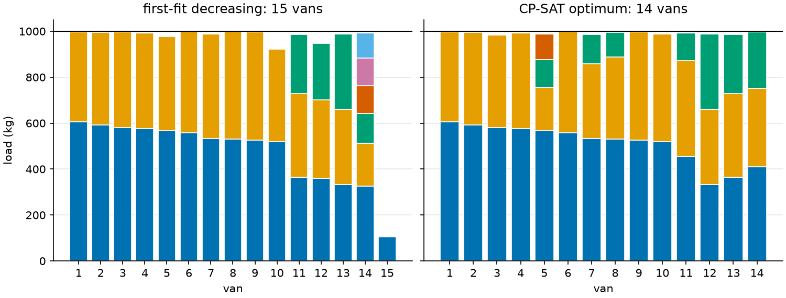

# 14 · Bin packing and 2D packing

**Solver:** CP-SAT · **Problem class:** packing · **Level:** intermediate

Packing problems are everywhere: crates into vans, files onto disks,
virtual machines onto servers, panels out of a sheet of material. This
example shows two classic forms:

- **Part 1, bin packing (1D).** A wholesaler loads crates into delivery
  vans. How few vans carry one day's crates?
- **Part 2, strip packing (2D).** A sign maker cuts acrylic panels from a
  roll 120 cm wide. How little of the roll does one order need?

Along the way you learn why **symmetry breaking** can decide whether a
proof takes milliseconds or never ends, how to compute **lower bounds**
that prove a packing optimal without the solver, and how
**`add_no_overlap_2d`** with **optional intervals** lets each panel choose
its orientation.

## The problem

**Part 1.** Each van carries at most 1,000 kg. Each working day brings 36
crates between 100 and 700 kg. The five days come from a seeded random
generator in [`data.py`](data.py). We picked the seeds so that each day
shows a different case (see the results).

**Part 2.** The order has 16 panels, from 20 × 20 cm price tags to a
110 × 30 cm shop front sign. All sizes are multiples of 10 cm. Panels may
be turned by 90 degrees. The roll is 120 cm wide.

## The model

### Part 1: bin packing

Let $x_{ib} = 1$ if crate $i$ goes into van $b$, and $u_b = 1$ if van $b$
is used. With crate weights $s_i$ and capacity $C$:

$$
\begin{aligned}
\min\ & \sum_b u_b \\
\text{s.t.}\ & \textstyle\sum_b x_{ib} = 1 && \text{each crate travels once} \\
& \textstyle\sum_i s_i\, x_{ib} \le C\, u_b && \text{capacity; an unused van stays empty}
\end{aligned}
$$

The number of candidate vans comes from a heuristic (first-fit
decreasing, below).

**Symmetry breaking.** Swap the loads of two vans and you get a "new"
solution with the same cost. With 15 vans, every packing has 15! ≈ 1.3
trillion copies. To prove that no packing with fewer vans exists, a
solver must rule out all of them. Three rules keep one copy only:

1. Sort crates from heaviest to lightest. Crate $k$ may only go into vans
   $0, \dots, k$. (Number each van by its heaviest crate.)
2. Use vans in order: $u_{b+1} \le u_b$.
3. Crates over $C/2$ can never share a van, so the $k$-th such crate goes
   straight into van $k$.

### Part 2: strip packing

Each panel $p$ gets a position $(x_p, y_p)$ and a choice of orientation.
For each orientation $o$ with width $w_{po}$ and height $h_{po}$ there is a
literal $r_{po}$:

$$
\begin{aligned}
\min\ & L \\
\text{s.t.}\ & \textstyle\sum_o r_{po} = 1 && \text{one orientation per panel} \\
& r_{po} \Rightarrow x_p + w_{po} \le W,\ \ y_p + h_{po} \le L && \text{inside the roll} \\
& \text{no two present rectangles overlap}
\end{aligned}
$$

## The OR-Tools code

All modeling is in [`model.py`](model.py). The bounds and the first-fit
decreasing heuristic are in [`bounds.py`](bounds.py), pure Python, so
both the model and the checker can use them.

**Symmetry breaking** is mostly about *which variables exist*:

```python
allowed = {
    (i, b)
    for i in range(len(names))
    for b in range(n_bins)
    if not symmetry_breaking or b <= i  # crate i only in vans 0..i
}
...
for b in range(n_bins - 1):
    model.add_implication(used[b + 1], used[b])  # use vans in order
for i, s in enumerate(size):
    if s > data.capacity / 2:
        model.add(x[i, i] == 1)  # big crates open their own van
```

**Optional intervals** let each panel choose its orientation. One x and
one y variable per panel; one pair of intervals per orientation; a literal
says which pair is present:

```python
present = model.new_bool_var(f"{p.name} rotated={rotated}")
x_intervals.append(model.new_optional_fixed_size_interval_var(x, sw, present, ""))
y_intervals.append(model.new_optional_fixed_size_interval_var(y, sh, present, ""))
model.add(x + sw <= strip_width).only_enforce_if(present)
model.add(y + sh <= length).only_enforce_if(present)
...
model.add_exactly_one(literals)
model.add_no_overlap_2d(x_intervals, y_intervals)
```

`add_no_overlap_2d` ignores absent intervals, so only the chosen
orientation takes up space.

Things to notice:

- **Scale to the grid.** All sizes are multiples of 10 cm, so the model
  divides them by their greatest common divisor. The domains get 10 times
  smaller. Over five runs of each, the median solve time with rotation was
  1.5 s on the 10 cm grid and 7.6 s on a 1 cm grid
  (`--compare-grid` shows one run). The optimum does not change; see the
  grid bound below.
- **Reproducible comparisons.** CP-SAT with several workers is not
  deterministic, and wall-clock time depends on the machine. For the
  symmetry comparison we use one worker and a *work limit*
  (`max_deterministic_time`). Then the same run gives the same result on
  any machine.
- **Parallel workers matter for proofs.** With one worker, CP-SAT finds
  the 250 cm layout but cannot prove it optimal within 60 s: its bound
  stays far below. With 8 workers, the portfolio includes workers that
  push the bound, and the proof takes a second or two.

## Run it

```bash
uv run python -m examples.ex14_packing.main                  # report
uv run python -m examples.ex14_packing.main --plot           # + figures
uv run python -m examples.ex14_packing.main --compare-grid   # + 1 cm grid run
```

```text
Part 1: crates into vans (capacity 1,000 kg)

day  total kg  L1  L2  FFD  optimum  proof work  plain
---  --------  --  --  ---  -------  ----------  ----------------------
Mon    13,883  14  14   15       14  0.023       15 / 14, no proof
Tue    14,909  15  15   16       16  0.026       16 / 15, no proof
Wed    15,115  16  18   18       18  0.004       18 / 17, no proof
Thu    13,000  13  13   14       14  0.048       14 / 13, no proof
Fri    14,214  15  15   15       15  0.013       15, proven after 0.058

L1, L2: lower bounds. FFD: first-fit decreasing. 'optimum' and 'proof
work': CP-SAT with symmetry breaking, and the work it needed for the
proof. 'plain': the same model without symmetry breaking, stopped
after 0.5 work units (vans found / best proven lower bound).

========================================================================

Part 2: 16 panels from a roll 120 cm wide

setting      length cm  our bound  CP-SAT bound  waste  seconds
-----------  ---------  ---------  ------------  -----  -------
no rotation        260        250           260  4.8%   0.04
rotation           250        250           250  1.0%   1.97
```

The Part 1 table is the same on every machine. In Part 2, the times and
the exact layout change from run to run; the lengths do not.

## Results

### Part 1: a week of vans

Each day teaches something different:

| day | what happens |
| --- | ------------ |
| Mon | First-fit decreasing needs 15 vans; the optimum is 14. The plain model never finds the 14-van packing. With symmetry breaking, CP-SAT finds and proves it in 0.023 work units. |
| Tue | Both lower bounds say 15, but the optimum is 16. Only search can prove that 15 vans are impossible. The plain model cannot; the broken-symmetry model can. |
| Wed | 16 crates weigh over 500 kg, so no two of them fit in one van. The gaps they leave are too small for the other crates. L2 sees both facts and proves 18 vans on its own; L1 only says 16. |
| Thu | Like Tuesday: the bounds say 13, the optimum is 14. |
| Fri | An easy day: every bound and the heuristic agree on 15. |

Symmetry breaking proves every day's optimum in at most 0.048 work units
(well under a tenth of a second). Without it, four of five days stay
unproven after 0.5 work units, ten times the effort.

On Monday the heuristic wastes a whole van: its 15th van carries a single
105 kg crate. The optimal packing spreads the light crates better.



### Part 2: the sign order

Without rotation, the order needs **260 cm** of roll and wastes 4.8% of
the material. With rotation, it needs **250 cm** and wastes 1.0%. Turning
panels saves 10 cm of roll, or 1,200 cm² of acrylic, per order.


Why is 250 cm optimal? The panels cover 29,700 cm². On a roll 120 cm
wide, that needs at least 29,700 / 120 = 247.5 cm, so 248 cm. All sizes are
multiples of 10 cm, and we can always push every panel down and left until
it touches an edge or another panel. Then every coordinate is a sum of
panel sizes, so the best length is a multiple of 10 cm too: at least
250 cm. The layout reaches it. Without rotation the same bound is 250 cm,
but CP-SAT proves that 260 cm is the best possible.

## How we know the answers are right

[`check.py`](check.py) and [`bounds.py`](bounds.py) use no OR-Tools.

1. **Feasibility.** `bin_packing_errors` checks that each crate travels
   exactly once and no van is overloaded. `strip_packing_errors` checks
   that each panel has its own size (or its turned size, if allowed), lies
   inside the roll, and overlaps no other panel, and that the reported
   length is the real one.
2. **Lower bounds.** L1 (total weight / capacity) and the Martello–Toth
   bound L2 hold for every packing. When CP-SAT's result equals one of
   them (Mon, Wed, Fri), the result is optimal without trusting CP-SAT.
   The same holds for the 250 cm layout and the area-and-grid bound.
3. **Known optima.** `guillotine_instance` cuts a rectangle into pieces
   with straight cuts, turns half of them, and shuffles them. The pieces
   fill the rectangle with no waste, so the best length is exactly the
   rectangle's height.

The [tests](../../tests/test_ex14_packing.py) also:

- compare both bin packing models with exhaustive search
  (`min_bins_brute_force`) on 8 random 9-item instances,
- check L1 and L2 on hand-worked cases, for example four 6 kg items in
  10 kg bins: L1 = 3, but L2 = 4, the optimum,
- check that symmetry breaking proves Mon–Thu and the plain model does
  not (deterministic, so the test is stable),
- reassemble 5 guillotine-cut rectangles and check the known optimum,
- check that panels that must not turn stay upright, and that a panel
  wider than the roll is detected, and
- give broken packings to the checkers to make sure they catch them.

## Try this

- Drop rule 3 (big crates in their own van) and rerun the comparison. How
  much of the speed-up does each rule give?
- Add a second limit to the vans, for example volume. Is it still bin
  packing? (Compare with [example 03](../ex03_knapsack/).)
- Mark the shop front sign and both arrows as `can_rotate=False`, as for a
  brushed-metal finish with a grain direction. What does that cost?
- Change the roll width to 100 cm or 150 cm. How do the length and the
  waste change?
- Pack the panels into the fewest *sheets* of 120 × 100 cm instead of one
  long roll. (Hint: add a sheet index to each panel, and use one
  `add_no_overlap_2d` per sheet with optional intervals.)

## References

- [CP-SAT scheduling and packing primer](https://github.com/google/or-tools/blob/stable/ortools/sat/docs/scheduling.md)
- [OR-Tools bin packing guide](https://developers.google.com/optimization/pack/bin_packing)
- S. Martello, P. Toth, *Knapsack Problems: Algorithms and Computer
  Implementations*, Wiley, 1990 — chapter 8, bin packing and the L2 bound.
- A. Lodi, S. Martello, M. Monaci, "Two-dimensional packing problems: a
  survey", *European Journal of Operational Research* 141 (2002).
