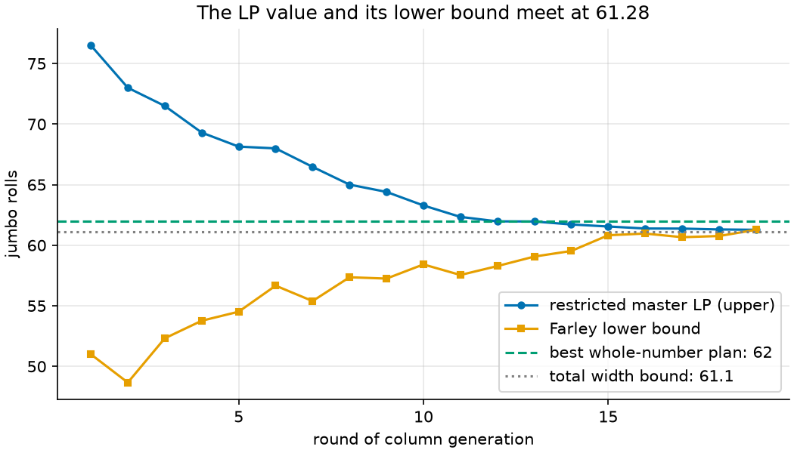
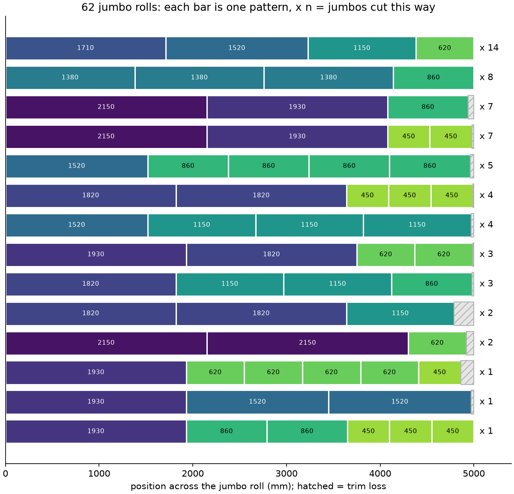

# 15 · Cutting stock with column generation

**Solvers:** MathOpt (GLOP, HiGHS) + CP-SAT · **Problem class:** integer
programming with column generation · **Level:** advanced

A paper mill makes "jumbo" rolls 5,000 mm wide. Customers order narrower
rolls. A slitter cuts each jumbo across its width into a few narrow rolls.
How should the mill cut, so that it uses as few jumbo rolls as possible?

This is the *cutting stock problem*. It is the classic case for **column
generation**: a model with far too many variables to write down, solved by
creating only the variables that help. The example combines three
solvers: GLOP for an LP, CP-SAT for a knapsack, and HiGHS for the final
integer program.

## The problem

This week's orders:

| width (mm) | 2150 | 1930 | 1820 | 1710 | 1520 | 1380 | 1150 | 860 | 620 | 450 |
| ---------- | ---: | ---: | ---: | ---: | ---: | ---: | ---: | --: | --: | --: |
| rolls      |   18 |   20 |   18 |   14 |   25 |   22 |   34 |  40 |  26 |  30 |

That is 247 narrow rolls. The slitter has knives for at most **6 pieces**
per jumbo roll.

## The model

A **pattern** $p$ says how many rolls of each width we cut from one jumbo:
$a_{ip}$ rolls of width $w_i$. A pattern is valid if
$\sum_i w_i a_{ip} \le W$ (it fits) and $\sum_i a_{ip} \le 6$ (enough
knives). Let $x_p$ = number of jumbos cut with pattern $p$ and $d_i$ = rolls
ordered of width $i$. Gilmore and Gomory (1961) wrote:

$$
\min \sum_p x_p
\quad\text{s.t.}\quad
\sum_p a_{ip}\, x_p \ge d_i \ \ \text{for each width } i,
\qquad x_p \in \{0, 1, 2, \dots\}
$$

This model is small in rows but huge in columns. Here, 873 valid patterns
exist; with 30 widths there can be millions. Column generation never lists
them all.

### Column generation

1. **Restricted master.** Solve the LP over a few known patterns. Start
   with one simple pattern per width.
2. **Duals.** Read the dual value $y_i$ of each demand row. It is what one
   narrow roll of width $i$ is "worth", measured in jumbo rolls.
3. **Pricing.** Find the valid pattern of highest total worth
   $\max_p \sum_i y_i a_{ip}$. That is a knapsack problem.
4. If the best worth is above 1, this pattern costs one jumbo but is worth
   more: its *reduced cost* $1 - \sum_i y_i a_{ip}$ is negative. Add it and
   go to step 1. If no pattern is worth more than 1, the LP over **all**
   patterns is solved.

### Why not the direct model?

The obvious model (Kantorovich, 1939) decides which piece goes on which
jumbo: a binary $y_k$ per jumbo and an integer $z_{ik}$ per width and jumbo.
It is easy to write, but hard to solve. Its LP bound is only the total
ordered width divided by the jumbo width. And the jumbos are
interchangeable, so every plan appears in the search many times over. The
pattern model removes both problems.

## The OR-Tools code

All the modeling is in [`model.py`](model.py).

**Adding a column to a live model.** MathOpt lets you add a variable to an
existing model and set its coefficients in existing rows:

```python
var = model.add_variable(lb=0.0, name=f"pattern {len(x)}")
for row, count in zip(demand_row, pattern, strict=True):
    if count:
        row.set_coefficient(var, count)
model.objective.set_linear_coefficient(var, 1.0)
```

**Warm starts.** `mathopt.IncrementalSolver` keeps GLOP alive between
solves. After a column is added, GLOP starts from its last optimal basis
instead of from scratch:

```python
solver = mathopt.IncrementalSolver(model, mathopt.SolverType.GLOP)
for _ in range(max_iterations):
    result = solver.solve()
    duals = [result.dual_values(row) for row in demand_row]
    pattern, worth = price_pattern(data, duals)
    if worth <= 1.0 + TOL:
        break
    add_pattern(pattern)
```

**Pricing with CP-SAT.** The pricing problem is a bounded knapsack with
one extra rule, the knife limit:

```python
a = [model.new_int_var(0, max_copies(data, i), f"a{i}") for i in range(n)]
model.add(sum(o.width * a[i] for i, o in enumerate(data.orders)) <= data.roll_width)
model.add(sum(a) <= data.max_pieces)
model.maximize(sum(round(y * DUAL_SCALE) * a[i] for i, y in enumerate(duals)))
```

Why CP-SAT and not a hand-written dynamic program? Both are exact. The
DP is fast (see [`check.py`](check.py)), but each new shop-floor rule
changes its recursion. In CP-SAT each rule is one more line. CP-SAT needs
whole-number coefficients, so we scale the duals by $10^6$ and round. Then
we recompute the pattern's true worth with the exact duals.

**Two smaller points:**

- `max_copies` also caps a pattern at the ordered quantity. This is not a
  physical limit, but it makes the LP bound stronger at no cost.
- The final integer program (`solve_pattern_ip`) runs on HiGHS, with only
  the generated patterns. This is called *price and branch*.

## Run it

```bash
uv run python -m examples.ex15_cutting_stock.main                 # report
uv run python -m examples.ex15_cutting_stock.main --plot          # + figures
uv run python -m examples.ex15_cutting_stock.main --kantorovich   # + direct model (10 s)
```

```text
Column generation: 19 rounds, 28 patterns

round  patterns  LP value  lower bound  best worth
-----  --------  --------  -----------  ----------
    1        10     76.50        51.00        1.50
    2        11     73.00        48.67        1.50
    3        12     71.50        52.32        1.37
    5        14     68.14        54.51        1.25
    9        18     64.40        57.25        1.12
   13        22     61.96        59.07        1.05
   18        27     61.30        60.76        1.01
   19        28     61.28        61.28        1.00

Lower bounds on the number of jumbo rolls
bound                           value  rounded up
------------------------------  -----  ----------
total width / jumbo width       61.10          62
pattern LP (column generation)  61.28          62

Whole-number plans
method                                  rolls  above bound  trim loss  extra rolls
--------------------------------------  -----  -----------  ---------  -----------
first fit decreasing                       67            5  8.8%                 0
LP rounded up                              64            2  0.3%                10
LP rounded down + first fit                62            0  1.5%                 0
integer master over generated patterns     62            0  0.6%                 2

62 rolls = rounded-up LP bound, so the plan is optimal.
```

## Results

**Column generation** needs 19 rounds and creates only 28 of the 873
patterns. It takes about 0.1 s. Each round, the LP value (an upper bound
on the LP optimum) falls, and Farley's lower bound (see below) rises. In
round 19 they meet at 61.28 jumbo rolls.



**Whole numbers.** We cannot cut 61.28 jumbos, and no plan can use fewer
than $\lceil 61.28 \rceil = 62$. Four ways to get a plan:

- **First fit decreasing**, the classic shop-floor rule, needs 67 rolls:
  5 too many, with 8.8% trim loss.
- **Rounding the LP up** always works, but gives 64 rolls and 10 rolls
  nobody ordered.
- **Rounding down, then first fit** for the rest reaches 62.
- **The integer master** over the 28 patterns also reaches 62, with less
  trim loss (0.6%). It cuts 2 extra rolls that go to stock.

Both 62-roll plans hit the lower bound, so **62 is optimal**. Note that
the trim loss column does not count extra rolls; in practice they are
waste too, unless a later order needs them.

The best plan uses 14 patterns. The most common one fills a jumbo exactly:
1710 + 1520 + 1150 + 620 = 5000 mm.



**The direct model.** With `--kantorovich`, HiGHS gets the Kantorovich
model with 67 candidate jumbos and 10 seconds. It finds a 63-roll plan
and cannot prove more. Column generation proves 62 in a tenth of a
second.

### When price and branch falls short

Part 2 of the script is a rush order of wide rolls: 12 × 2600, 15 × 1700,
9 × 1300, and 10 × 1100 mm.

```text
method                                LP     rolls
------------------------------------  -----  -----
pattern LP bound                      17.00  17
integer master, 8 generated patterns         18
integer master, all 29 patterns              17
```

The LP says 17, and 17 is possible. But the 8 patterns that column
generation found allow only 18. The optimal plan needs the pattern
2 × 1700 + 1100, which the LP never asked for, because the LP was already
optimal without it.

So price and branch is a heuristic. The LP bound tells you when it is
optimal (it was, for the paper mill) and when it may not be. To close a
gap, you can:

- list all patterns, if there are few (here, 29), or
- generate more patterns inside the branch-and-bound tree. This is
  *branch and price*, the exact method, and it is much more work to build.

This instance also shows why the pattern LP matters. Total width gives
only $\lceil 15.88 \rceil = 16$ rolls, because two 2600 mm rolls never fit
in one jumbo. The pattern LP knows this and gives 17.

**IRUP.** For almost all cutting stock instances, the optimum is
$\lceil z_{LP} \rceil$ or $\lceil z_{LP} \rceil + 1$. This is the *integer
round-up property*. It is why the LP bound is so useful in practice.

## How we know the answers are right

[`check.py`](check.py) uses no OR-Tools:

1. **Feasibility.** `plan_errors` checks that every pattern fits the jumbo
   and the knives, and that every order is met.
2. **Exact pricing.** `best_worth` solves the pricing knapsack by dynamic
   programming, a different algorithm from CP-SAT. At the final duals no
   pattern is worth more than 1, so no column can improve the LP.
3. **A lower bound from any duals.** For any $y \ge 0$, let $v$ be the
   best pattern worth. Every pattern then has worth at most $v$, so every
   plan $x$ that meets demand satisfies

   $$\sum_i d_i y_i \le \sum_p x_p \sum_i y_i a_{ip} \le v \sum_p x_p.$$

   So every plan needs at least $\sum_i d_i y_i / v$ jumbos. This is
   *Farley's bound*; it is the lower line in the convergence plot. With the
   final duals, $v = 1$ and the bound equals the LP value, 61.28. A plan
   with $\lceil 61.28 \rceil = 62$ rolls is therefore optimal.
4. **Exhaustive search** on tiny instances (`exact_min_rolls`).

The [tests](../../tests/test_ex15_cutting_stock.py) also:

- solve the LP over all 873 patterns, and confirm that column generation
  reaches the same value,
- solve the integer program over all 873 patterns, which also gives 62,
- compare CP-SAT pricing, the DP, and brute force for random duals,
- check that Farley's bound holds for random duals,
- confirm that the rush order needs 17 by HiGHS over all patterns, by
  exhaustive search, and by the Kantorovich model,
- run random instances where the optimum must be within one roll of the
  LP bound, and
- check that the Kantorovich LP bound equals the total-width bound.

## Try this

- Allow 8 knives (`max_pieces=8`). How many rolls do you save?
- Minimize trim loss instead of rolls: give each pattern its trim width as
  cost. Do the duals still mean "jumbo rolls"?
- Add a rule to the pricing model: the two outer rolls must be at least
  600 mm wide. It is a few lines in CP-SAT. How would you change the DP?
- Fix the rush order by adding all patterns of value exactly 1 at the final
  duals before the integer solve. Does that find 17?

## References

- [MathOpt user guide](https://developers.google.com/optimization/math_opt)
- P. C. Gilmore, R. E. Gomory, "A linear programming approach to the
  cutting-stock problem", *Operations Research* 9, 1961.
- A. A. Farley, "A note on bounding a class of linear programming problems,
  including cutting stock problems", *Operations Research* 38, 1990.
- J. M. Valério de Carvalho, "LP models for bin packing and cutting stock
  problems", *European Journal of Operational Research* 141, 2002.
