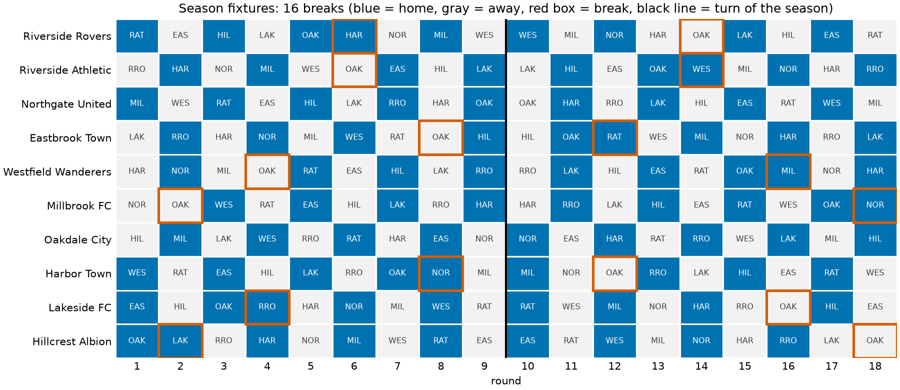
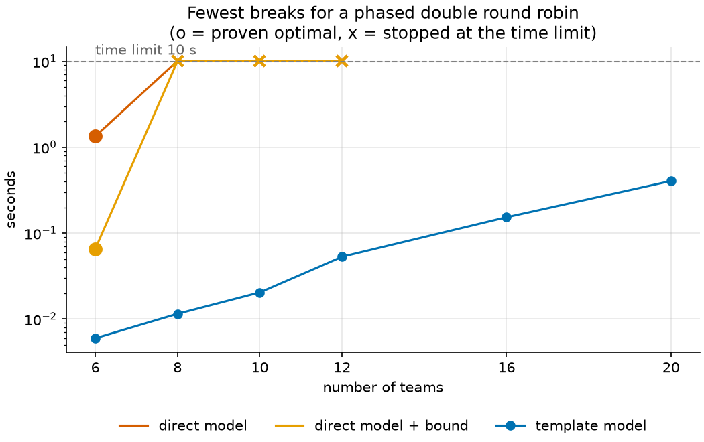

# 16 · Sports league scheduling

**Solver:** CP-SAT · **Problem class:** combinatorial scheduling ·
**Level:** advanced

Ten amateur football clubs need a fixture list for the season. Every club
plays every other club twice, once at each home ground. Clubs and fans
dislike *breaks*: two home games, or two away games, in a row. How few
breaks can a season have, and how do we find such a season when the league
has its own local rules?

This example shows a lesson that matters for every large combinatorial
model: **the direct model is not always the best model.** A smart model
that uses the structure of the problem, plus a bit of theory, solves in
hundredths of a second where the direct model gets stuck.

## The problem

The season has 18 rounds. Each half (rounds 1–9 and 10–18) is a full round
robin: every pair meets once in each half, once at each ground. Every
club plays in every round.

The league also has local rules:

- Riverside Rovers and Riverside Athletic share **Riverside Park**. They
  can never both play at home in the same round.
- **Millbrook FC** relays its pitch: no home games in rounds 1 and 2.
- **Harbor Town**'s ground hosts a concert in round 9.
- The champions, **Northgate United**, open the season at home.
- The **Riverside derby** opens and closes the season.
- No club plays three home games or three away games in a row.

**Goal:** as few breaks as possible.

## Theory first: how few breaks are possible?

A team's *pattern* is its sequence of home (H) and away (A) games, such as
`HAHAHHAHA`. A break is a repeated letter. Three classic facts give hard
lower bounds for $n$ teams ($n$ even):

**1. A single round robin has at least $n - 2$ breaks** (de Werra, 1981).
A team without breaks has the pattern `HAHA…` or `AHAH…`. Two teams with
the same pattern are at home in the same rounds, so they can never play
each other. But in a round robin, every pair plays. So at most one team
has `HAHA…` and at most one has `AHAH…`. All other $n - 2$ teams have at
least one break.

**2. A phased double round robin has at least $2n - 4$ breaks.** Each half
is a single round robin, so each half needs $n - 2$ breaks on its own.

**3. A mirrored double round robin has at least $3n - 6$ breaks.** Many
real leagues *mirror* the season: the second half repeats the first half
in the same order, with venues swapped. Take a team with $k$ breaks in the
first half. The second half is the complement of the first half, so it
also has $k$ breaks. Now look at the turn of the season. The first half
has $n - 1$ rounds, an odd number. Between rounds 1 and $n-1$ the venue
changes $n - 2 - k$ times, so the last first-half game has the same venue
as the first game exactly when $k$ is even. The second half starts with
the *opposite* of the first game. So there is a break at the turn exactly
when $k$ is odd. In total, the team has $2k + [k \text{ odd}] \ge 3$ breaks
if $k \ge 1$. At most two teams have $k = 0$ (fact 1). So the season has
at least $3(n - 2) = 3n - 6$ breaks.

The trick to avoid the extra break at the turn is the *inverted* scheme:
repeat the first-half rounds in **reverse** order, with venues swapped.
The second half then starts with the opposite of the *last* first-half
game, so no team gets a break at the turn.

**The circle method** builds schedules that meet these bounds. Fix one
team in the middle, put the others on a circle, and turn the circle one
step per round. [`circle.py`](circle.py) implements it in a few lines of
pure Python:

```text
Theory for 10 teams: fewest possible breaks, and the circle method

schedule            rounds  lower bound  circle method
------------------  ------  -----------  -------------
single round robin       9            8              8
double, mirrored        18           24             24
double, inverted        18           16             16
```

So our ten-club league needs at least **16 breaks**. Can we reach 16 with
the local rules too?

## The model

### The direct model

The textbook model has one Boolean per game and round:
$x_{h,a,r} = 1$ if team $h$ hosts team $a$ in round $r$. With
$\text{home}_{t,r} = \sum_a x_{t,a,r}$:

$$
\begin{aligned}
\sum_{a} (x_{t,a,r} + x_{a,t,r}) &= 1 && \text{every team plays once per round} \\
\sum_{r} x_{h,a,r} &= 1 && \text{every team hosts every other team once} \\
\sum_{r \le n-1} (x_{h,a,r} + x_{a,h,r}) &= 1 && \text{every pair meets once per half} \\
b_{t,r} &\ge \text{home}_{t,r} + \text{home}_{t,r-1} - 1 && \text{break: two home games} \\
b_{t,r} &\ge 1 - \text{home}_{t,r} - \text{home}_{t,r-1} && \text{break: two away games}
\end{aligned}
$$

and minimize $\sum b_{t,r}$. It is correct, and it is slow (see the
benchmark below). The teams are interchangeable, so CP-SAT faces a huge
number of equivalent schedules, and its lower bound hardly moves.

### The template model

Real leagues often work differently. They take a fixed *template*
schedule for slots 1 … $n$, then draw which club gets which slot. We copy
that idea:

- **The template** is the circle-method schedule, with the inverted
  second half. Slots stand in for teams. The template fixes who meets whom
  in each round.
- **Decision 1, the draw:** $d_{t,k} = 1$ if team $t$ gets slot $k$ (a
  one-to-one assignment).
- **Decision 2, the venues:** one Boolean $o_g$ per first-half template
  game $g$ says which of its two slots is at home. The second half follows
  from the inverted scheme.

Every local rule becomes "IF team $t$ has slot $k$ THEN slot $k$ …". For
example, Millbrook's rule is $d_{\text{MIL},k} \Rightarrow
\neg\text{home}_{k,1} \wedge \neg\text{home}_{k,2}$ for every slot $k$.

**Why can a template model be optimal?** It searches only template
schedules, a small part of all schedules. But theory says *no* schedule
has fewer than $2n - 4 = 16$ breaks. If the template model finds a season
with 16 breaks, that season is optimal among all schedules, not only the
template ones.

## The OR-Tools code

All modeling is in [`model.py`](model.py). The key ideas:

```python
# One Boolean per template game. Its two slots get the literal and its
# negation, so "exactly one of the two is at home" needs no constraint.
for r, games in enumerate(template):
    for a, b in games:
        first_at_home = model.new_bool_var(f"slot{a}_home_r{r}")
        home[a, r] = first_at_home
        home[b, r] = first_at_home.Not()

# Second half: first-half rounds in reverse order, venues swapped.
for s in range(half):
    for k in slots:
        home[k, half + s] = home[k, half - 1 - s].Not()
```

```python
# A rule about a team, written on slots with enforcement literals.
for team, rnd in league.home_banned:
    for k in slots:
        model.add_bool_and(home[k, rnd - 1].Not()).only_enforce_if(draw[team, k])
```

```python
# A redundant constraint: theory says no schedule does better. It cuts no
# solution, but CP-SAT can stop the moment it reaches the bound.
model.add(total >= lower_bound(n, "phased"))
```

Things to notice:

- **Negated literals are free.** `x.Not()` needs no new variable and no
  constraint. Use it whenever two facts are exact opposites.
- **Enforcement literals** (`only_enforce_if`) link the draw to the venue
  rules without any big-M tricks.
- **Redundant constraints help.** In the benchmark, the bound alone cuts
  the direct model's time for 6 teams from 1.34 s to 0.07 s.
- **A good model is often a smaller model.** The template model has 10 × 10
  draw variables and 45 venue variables. The direct model has 1,620 game
  variables for the same league.

## Run it

```bash
uv run python -m examples.ex16_sports_scheduling.main               # report
uv run python -m examples.ex16_sports_scheduling.main --plot        # + figures
uv run python -m examples.ex16_sports_scheduling.main --benchmark   # + timing
```

```text
The regional league: 16 breaks (bound 16, solved in 0.04 s)
This meets the lower bound, so no schedule at all has fewer breaks.

Home/away patterns (| = turn of the season)
team                 slot  pattern              breaks  in rounds
-------------------  ----  -------------------  ------  ---------
Riverside Rovers        5  HAHAHHAHA|HAHAAHAHA       2  6, 14
Riverside Athletic      6  AHAHAAHAH|AHAHHAHAH       2  6, 14
Northgate United        9  HAHAHAHAH|AHAHAHAHA       0  -
Eastbrook Town          8  AHAHAHAAH|AHHAHAHAH       2  8, 12
Westfield Wanderers     4  AHAAHAHAH|AHAHAHHAH       2  4, 16
Millbrook FC            2  AAHAHAHAH|AHAHAHAHH       2  2, 18
Oakdale City           10  AHAHAHAHA|HAHAHAHAH       0  -
Harbor Town             7  HAHAHAHHA|HAAHAHAHA       2  8, 12
Lakeside FC             3  HAHHAHAHA|HAHAHAAHA       2  4, 16
Hillcrest Albion        1  HHAHAHAHA|HAHAHAHAA       2  2, 18
```

The report also prints the full fixture list. Many seasons have exactly
16 breaks, and CP-SAT runs 8 workers in parallel, so the draw and the
fixtures can differ from run to run. The break count is always 16.

## Results

**The season reaches the bound: 16 breaks.** It meets every local rule,
and theory proves that no schedule can do better. CP-SAT needs about
0.04 s.



Read the figure row by row. Blue cells are home games, gray cells are away
games, and a red box marks a break. A few things stand out:

- **Two clubs never have a break:** the two alternating patterns from
  fact 1. In this run they are Northgate United and Oakdale City.
- **Every other club has one break per half,** placed symmetrically
  around the turn of the season (for example rounds 6 and 14). That is the
  inverted scheme at work.
- **Millbrook's forced break** (away in rounds 1 and 2) costs nothing. The
  solver gives Millbrook a slot whose single first-half break falls in
  round 2.
- **The Riverside clubs** have opposite patterns all season in this run,
  so they never both use Riverside Park. Their derby opens and closes the
  season.

### Benchmark: direct model versus template model

Without local rules, both models solve the same problem: the fewest breaks
for a phased double round robin.

```text
teams  bound  direct  opt    s      +bound  opt    s      template     s
-----  -----  ------  -----  -----  ------  -----  -----  --------  ----
    6      8  8       True   1.34   8       True   0.07          8  0.01
    8     12  16      False  10.10  16      False  10.05        12  0.01
   10     16  28      False  10.03  24      False  10.07        16  0.02
   12     20  42      False  10.02  46      False  10.01        20  0.05
   16     28                                                    28  0.15
   20     36                                                    36  0.40
```

From 8 teams on, the direct model hits the 10-second limit. Its best
schedules are far from the bound, even with the redundant bound
constraint. The template model reaches the bound for 20 teams in under
half a second. (Your timings and the direct model's numbers will differ
from run to run; the trend will not.)



## How we know the answer is right

[`check.py`](check.py) uses no OR-Tools:

1. **Every rule, round by round.** `schedule_errors` checks that each
   team plays once per round, that each team hosts each other team once,
   that each pair meets once per half, and every local rule.
2. **Breaks recounted.** `team_breaks` rebuilds each pattern from the
   fixtures and counts the breaks.
3. **The bound is proven.** The three facts above are proofs, not
   estimates. A season with 16 breaks is therefore optimal.
4. **Brute force for 4 teams.** `brute_force_min_breaks` tries every
   schedule of a 4-team league and confirms the bounds 2, 4, and 6 for the
   single, phased, and mirrored schemes.

The [tests](../../tests/test_ex16_sports_scheduling.py) also:

- check that the circle method meets all three bounds for 4 to 20 teams,
  and that its schedules are valid,
- check that the direct model proves the same bounds for 4 and 6 teams,
  with and without the redundant bound,
- check that the template model reaches the bound for 6 to 16 teams,
- check each local rule in the league season,
- check that a rule set with three away games in a row raises
  `NoScheduleError`, and
- feed broken schedules to the checker to make sure it catches them.

## Try this

- Switch the template to the *mirrored* scheme. The bound is now
  $3n - 6 = 24$. Does the league still reach it?
- Add a rule that the bound cannot survive, for example "Millbrook and
  Harbor Town both away in rounds 4 and 5". How many breaks do you get
  now? (The model then proves optimality only among template schedules.)
- Add a soft goal: big games (against Northgate United) should not fall
  in the first three rounds.
- Give the direct model the circle-method season as a solution hint
  (`model.add_hint`). How much does it help?

## References

- [CP-SAT documentation](https://developers.google.com/optimization/cp/cp_solver)
- D. de Werra, *Scheduling in sports*, Studies on Graphs and Discrete
  Programming, 1981 — the $n - 2$ break bound.
- G. L. Nemhauser and M. A. Trick, *Scheduling a major college basketball
  conference*, Operations Research 46(1), 1998.
- G. Kendall, S. Knust, C. C. Ribeiro, S. Urrutia, *Scheduling in sports:
  An annotated bibliography*, Computers & Operations Research 37(1),
  2010.
