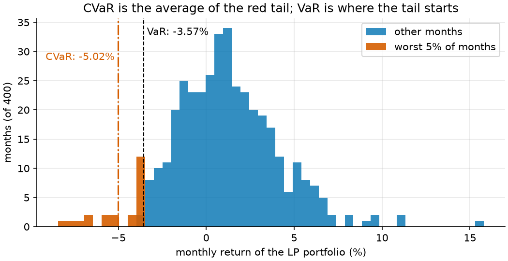
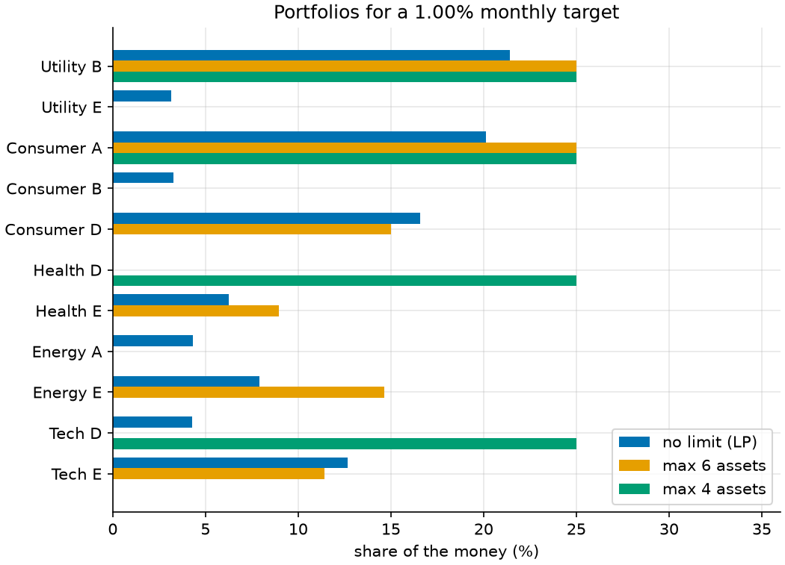
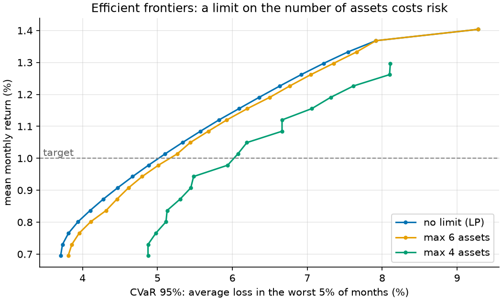

# 17 · Portfolio selection with CVaR and cardinality limits

**Solvers:** MathOpt with GLOP (LP) and HiGHS (MIP) · **Problem class:**
LP and MIP · **Level:** intermediate

An investor wants a steady return without big losses in bad months. This
example picks a portfolio from 30 assets with a risk measure that keeps
the model linear: **CVaR**, the average loss in the worst months. Then it
adds two rules that real investors often have, and that need integer
variables: hold **at most K assets**, and **no tiny positions**.

> All data is synthetic, and the asset names are generic labels, not real
> companies. This is a teaching example, not investment advice.

## The problem

- 30 assets in six sectors (Utility, Consumer, Health, Finance, Energy,
  Tech), five per sector.
- 400 scenarios: simulated monthly returns for all assets at once, from a
  factor model with fat tails (see [`data.py`](data.py)). Crashes hit many
  assets in the same month, as they do in real markets.
- Rules: invest all the money, at most 25% in one asset, at most 40% in
  one sector, and a mean return of at least **1.0% per month**.
- Goal: the lowest **CVaR at 95%**, the average loss in the worst 5% of
  months (here the worst 20 of 400).

Then two harder variants: hold at most 6 assets, or at most 4, and put at
least 3% into every asset you hold.

## Why CVaR?

The classic risk measure is variance (Markowitz). It punishes good
surprises as much as bad ones, and it needs a quadratic model. CVaR looks
only at the bad tail, and Rockafellar and Uryasev showed that it fits in
an LP. The figure shows the LP portfolio's 400 months: VaR is where the
worst 5% begins, and CVaR is the average of that red tail.



## The model

**Variables.** $w_i \ge 0$, the share in asset $i$; a free variable
$\zeta$; and $u_s \ge 0$ for each scenario $s$. In the MIP, also
$z_i \in \{0, 1\}$: is asset $i$ held?

Let $r_{si}$ be the return of asset $i$ in scenario $s$, $\mu_i$ its mean,
$S$ the number of scenarios, and $\alpha = 0.95$.

**Objective (CVaR, the Rockafellar–Uryasev form).**

$$\min\ \zeta + \frac{1}{(1-\alpha)S} \sum_s u_s$$

**Constraints.**

$$
\begin{aligned}
u_s &\ge -\textstyle\sum_i r_{si} w_i - \zeta && \text{loss beyond } \zeta \text{ in scenario } s \\
\textstyle\sum_i w_i &= 1 && \text{invest all the money} \\
\textstyle\sum_i \mu_i w_i &\ge \text{target} && \text{mean return} \\
\textstyle\sum_{i \in k} w_i &\le 0.40 && \text{for each sector } k \\
0 \le w_i &\le 0.25
\end{aligned}
$$

At the optimum, $\zeta$ sits at the value at risk, $u_s$ is the loss
beyond it, and the objective is exactly the average of the worst 5% of
losses. (When the tail holds a whole number of scenarios, any $\zeta$
between the 20th- and 21st-worst loss is optimal. So read $\zeta$ as *a*
VaR, and compute the VaR from the sorted losses.)

**The MIP additions.** Link each weight to its yes/no variable:

$$
\ell\, z_i \;\le\; w_i \;\le\; u\, z_i, \qquad \sum_i z_i \le K
$$

If $z_i = 0$, the weight must be 0. If $z_i = 1$, it must lie between
$\ell = 3\%$ and $u = 25\%$. Such a weight is called *semi-continuous*.

## The OR-Tools code

All the modeling is in [`model.py`](model.py). The CVaR rows:

```python
# u_s >= loss_s - zeta, with loss_s = -(returns in s) . w. Moved to one
# side: u_s + returns_s . w + zeta >= 0.
scenario_rows = [
    model.add_linear_constraint(
        excess[s]
        + mathopt.fast_sum(float(data.returns[s, i]) * weight[i] for i in range(n))
        + zeta
        >= 0.0
    )
    for s in range(S)
]
```

The link between continuous and binary variables:

```python
held = [model.add_binary_variable(name=f"hold {a.name}") for a in data.assets]
for w, z in zip(weight, held, strict=True):
    model.add_linear_constraint(w <= rules.max_weight * z)
    model.add_linear_constraint(w >= rules.min_weight * z)
model.add_linear_constraint(mathopt.fast_sum(held) <= rules.max_assets)
```

Things to notice:

- **The same code builds the LP and the MIP.** Without integer rules, GLOP
  solves it and gives dual values. With them, HiGHS solves it and gives a
  bound and a gap instead (`result.termination.objective_bounds`).
- **The big-M is small and natural.** The link uses the 25% cap as its
  "M", not a huge number. A tight M keeps the LP relaxation strong (see
  [example 06](../ex06_facility_location/)).
- **The frontier reuses one model.** `frontier()` changes only
  `return_row.lower_bound` between solves.
- **Why not Markowitz here?** A variance objective needs a quadratic
  solver. In our tests with the pip build of OR-Tools 9.15, PDLP solved
  a diagonal quadratic objective but rejected a full covariance matrix,
  and OSQP, ECOS, and SCS returned errors even on a tiny QP. SCIP accepted
  a 30-asset Markowitz model but did not prove an optimum within 10 s.
  The CVaR LP solves in 0.04 s.

## Run it

```bash
uv run python -m examples.ex17_portfolio.main          # report
uv run python -m examples.ex17_portfolio.main --plot   # + figures
```

```text
rules          assets  mean   VaR 95%  CVaR 95%  optimal  seconds
-------------  ------  -----  -------  --------  -------  -------
no limit (LP)      10  1.00%  3.57%    5.02%     yes         0.04
max 6 assets        6  1.00%  3.53%    5.17%     yes         1.28
max 4 assets        4  1.00%  4.43%    5.94%     yes         0.90

Weights (assets held by at least one portfolio)
asset       no limit (LP)  max 6 assets  max 4 assets
----------  -------------  ------------  ------------
Utility B   21.40%         25.00%        25.00%
Utility E   3.14%
Consumer A  20.14%         25.00%        25.00%
Consumer B  3.29%
Consumer D  16.57%         15.00%
Health D                                 25.00%
Health E    6.26%          8.96%
Energy A    4.33%
Energy E    7.90%          14.64%
Tech D      4.28%                        25.00%
Tech E      12.68%         11.40%

Shadow price of the target: 6.27. Raising the target
by 0.10% per month costs about 0.63% of CVaR.
LP dual bound (check.py): 5.02%; LP CVaR: 5.02%
```

Solve times vary by machine.

## Results

**The LP portfolio** spreads the money over 10 assets. In the worst 5% of
months it loses 5.02% on average. It leans on calm assets (Utility B,
Consumer A and D) and adds a little Tech and Energy for return. Four of
its positions are tiny, between 3.1% and 4.3%: a real investor would find
them a nuisance to manage.

**Six assets cost almost nothing.** With at most 6 assets and at least 3%
in each, the CVaR rises from 5.02% to 5.17%, only 3% more. The solver
drops the small positions and moves their money into similar assets.

**Four assets cost a lot.** The CVaR rises to 5.94%, 18% above the LP.
With four assets and a 25% cap, every asset must hold exactly 25%, and the
40% sector cap allows only one asset per sector. The solver has almost no
room left.

**The shadow price of the target** is 6.27: each extra 0.1 percentage
point of monthly return costs about 0.63 points of CVaR. It is the slope
of the efficient frontier at the target, just like the shadow prices in
[example 01](../ex01_production_planning/).

**A note on VaR.** The 6-asset portfolio has a *lower* VaR (3.53%) than
the LP portfolio (3.57%), though its CVaR is higher. We minimize CVaR, not
VaR. VaR says where the tail starts; CVaR says how bad the tail is.



**The efficient frontier** shows the lowest CVaR for each target return.
The LP frontier is smooth and convex: the risk grows faster and faster as
the target rises. The 6-asset frontier stays close to it. The 4-asset
frontier lies far to the right, has kinks, and ends early: no 4-asset
portfolio reaches more than 1.33% per month, while the others reach 1.40%.
MIP frontiers need not be convex, because each kink is a switch to a
different set of assets.



## How we know the answers are right

[`check.py`](check.py) uses no OR-Tools:

1. **Feasibility.** Every rule holds: budget, caps, sector caps, the
   number of assets, the minimum position, and the target return.
2. **The objective, computed a second way.** `cvar` sorts the 400
   portfolio losses and averages the worst 20. It does not use the LP
   formula. It matches the solver's objective for every portfolio to
   1e-9. `zeta_range` confirms that the solver's $\zeta$ lies between the
   20th- and 21st-worst loss.
3. **An optimality certificate for the LP.** `lp_lower_bound` turns the
   dual values into a lower bound on the CVaR of *every* portfolio that
   meets the rules (the Lagrangian bound, as in examples 01 and 02). The
   bound equals 5.02%, so no portfolio can do better.

The [tests](../../tests/test_ex17_portfolio.py) also:

- **enumerate every subset** of at most 3 assets on a 10-asset instance,
  solve the LP for each, and confirm the MIP finds the best one,
- compare GLOP, HiGHS, and PDLP on the LP, and HiGHS and SCIP on the MIP,
- confirm the shadow price by solving again with a slightly higher target,
- check that the bound holds for 50 sets of random prices,
- check that the LP frontier increases and is convex, and that the MIP
  frontier increases,
- check that a target above the best reachable return is infeasible, and
- check `cvar`, VaR, and the $\zeta$ range on a hand-worked example.

## Try this

- Change `alpha` to 0.99. How does the portfolio change when you care
  only about the worst 1% of months?
- Add a transaction-cost model: start from a given portfolio and charge
  0.2% for every unit you buy or sell. (Hint: split each change into a buy
  and a sell variable.)
- Use more scenarios, say 4,000. The LP grows tenfold. Does GLOP still
  solve it fast? Try PDLP.
- Replace CVaR with the mean absolute deviation (Konno–Yamazaki). It is
  also linear. Does it pick similar assets?

## References

- R. T. Rockafellar and S. Uryasev, *Optimization of conditional
  value-at-risk*, Journal of Risk 2 (2000) — the CVaR LP.
- H. Konno and H. Yamazaki, *Mean-absolute deviation portfolio
  optimization model*, Management Science 37 (1991).
- [MathOpt user guide](https://developers.google.com/optimization/math_opt)
