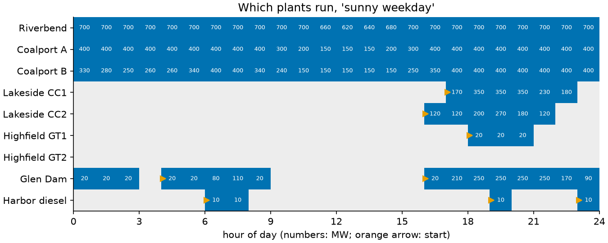
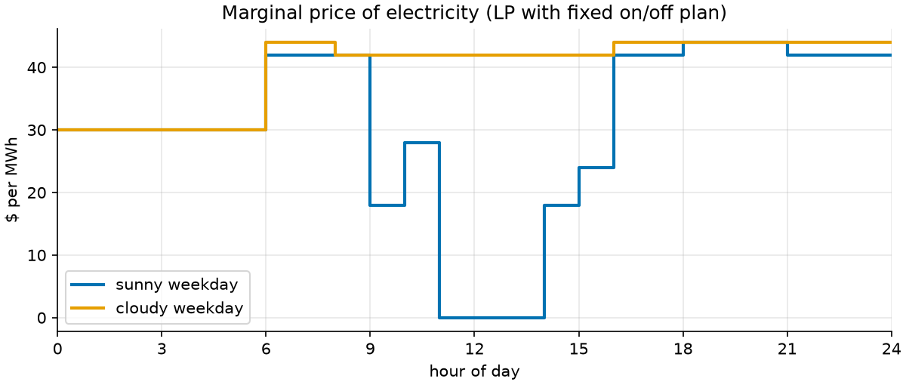

# 18 · Unit commitment for power plants (MIP)

**Solver:** MathOpt with HiGHS (SCIP and CP-SAT as checks) · **Problem
class:** MIP · **Level:** advanced

Every afternoon, grid operators plan the next day. Which power plants
run in which hour, and how much does each one produce? Big plants are
cheap to run but slow and costly to start. Small gas plants start fast but
burn expensive fuel. And on a sunny day, solar panels push the demand on
the plants down at noon and leave a steep climb into the evening peak.
This is the *unit commitment* problem. Grid operators around the world
solve it as a MIP every day.

## The problem

Nine plants serve one region for 24 hours:

| plant         | type       | MW when on | $/MWh | $/h on | $/start | min up / down (h) | ramp MW/h |
| ------------- | ---------- | ---------: | ----: | -----: | ------: | ----------------: | --------: |
| Riverbend     | nuclear    |    500–700 |     9 |      0 |  80,000 |           24 / 24 |        40 |
| Coalport A    | coal       |    150–400 |    28 |  1,800 |  30,000 |             8 / 8 |       100 |
| Coalport B    | coal       |    150–400 |    30 |  1,800 |  30,000 |             8 / 8 |       100 |
| Lakeside CC1  | gas CCGT   |    120–350 |    42 |  2,500 |  12,000 |             6 / 5 |       180 |
| Lakeside CC2  | gas CCGT   |    120–350 |    44 |  2,500 |  12,000 |             6 / 5 |       180 |
| Highfield GT1 | gas peaker |     20–120 |    85 |    200 |     600 |             1 / 1 |      none |
| Highfield GT2 | gas peaker |     20–120 |    90 |    200 |     600 |             1 / 1 |      none |
| Glen Dam      | hydro      |     20–250 |     2 |      0 |     100 |             1 / 1 |      none |
| Harbor diesel | diesel     |      10–80 |   160 |     50 |     100 |             1 / 1 |      none |

- Demand runs from 1,360 MW at night to 2,400 MW at 19:00.
- On a **sunny day**, solar gives up to 1,150 MW at noon. On a **cloudy
  day**, it gives 30% of that.
- The dam holds water for 1,800 MWh. It may not produce more in the day.
- Running plants must keep **spinning reserve**: spare room of 10% of the
  demand, in case a plant fails.
- Each plant starts the day in a known state (on or off, for how long,
  at what output).

## The model

For each plant $g$ and hour $t$: $u_{gt} \in \{0,1\}$ (on), $v_{gt}$
(start), $w_{gt}$ (stop), $p_{gt} \ge 0$ (MW). Plus $s_t$ (solar used) and
$\ell_t$ (load not served, at $5,000/MWh, a last resort).

**Objective.** Fuel, no-load, and startup costs:

$$\min \sum_{g,t} \left( c_g\, p_{gt} + n_g\, u_{gt} + k_g\, v_{gt} \right) + 5000 \sum_t \ell_t$$

**Constraints.**

$$
\begin{aligned}
& \textstyle\sum_g p_{gt} + s_t + \ell_t = D_t,\quad 0 \le s_t \le S_t && \text{demand met, solar may be curtailed} \\
& \textstyle\sum_g (P^{\max}_g u_{gt} - p_{gt}) \ge 0.1\, D_t && \text{spinning reserve} \\
& P^{\min}_g u_{gt} \le p_{gt} \le P^{\max}_g u_{gt} && \text{output limits} \\
& u_{gt} - u_{g,t-1} = v_{gt} - w_{gt},\quad v_{gt} + w_{gt} \le 1 && \text{starts and stops} \\
& p_{gt} - p_{g,t-1} \le R_g u_{g,t-1} + \max(P^{\min}_g, R_g)\, v_{gt} && \text{ramp up (and alike for down)} \\
& \textstyle\sum_t p_{\text{dam},t} \le 1800 && \text{water budget} \\
& \textstyle\sum_{\tau = t-U_g+1}^{t} v_{g\tau} \le u_{gt},\quad \sum_{\tau = t-L_g+1}^{t} w_{g\tau} \le 1 - u_{gt} && \text{min up } U_g \text{, min down } L_g
\end{aligned}
$$

Every row with $t-1$ links one hour to the next. That *time coupling* is
why you cannot plan hour by hour, and why this needs a MIP.

### Weak and strong minimum up/down rows

The last line above holds the *turn-on/turn-off inequalities* (Rajan and
Takriti, 2005): "if the plant started in any of the last $U_g$ hours, it
is on now". Many older models write the same rule as one row per start:

$$U_g\, v_{gt} \le \textstyle\sum_{\tau=t}^{t+U_g-1} u_{g\tau} \qquad \text{(weak)}$$

For 0/1 values the two say the same thing. But the LP relaxation, which
the MIP solver uses for its bounds, sees them differently. In the weak row
a start of 0.5 needs only an *average* of 0.5 "on" over the window. The
strong rows are the convex hull of the rule for one plant, so no linear
rows can describe it more tightly. Note also that $v$ and $w$ need not be
integer. The transition row alone does not force them to 0/1 once $u$ is
0/1: $v = w = 0.5$ also fits it. The startup cost and the strong min
up/down rows push them to 0/1.

## The OR-Tools code

All the modeling is in [`model.py`](model.py). The two key parts:

```python
# Strong minimum up time: starts in the last min_up hours <= on now.
for t in range(hours):
    model.add_linear_constraint(
        mathopt.fast_sum(v[s] for s in range(max(0, t - g.min_up + 1), t + 1)) <= u[t]
    )
```

```python
# Prices: fix the on/off plan, solve the LP, read the dual values.
cm = build_model(data, fixed_on=schedule.on)
result = mathopt.solve(cm.model, mathopt.SolverType.GLOP)
energy_prices = [result.dual_values(c) for c in cm.balance]
```

Things to notice:

- **The state before hour 0 matters.** A plant that started an hour ago
  must stay on for a while. `build_model` fixes those first hours.
- **One model, three solvers.** `solve_commitment(..., solver=...)` runs
  HiGHS, SCIP (`GSCIP`), or CP-SAT on the same MathOpt model.
- **Gap and bound.** `result.termination.objective_bounds.dual_bound` is
  the solver's proven lower bound. Set `relative_gap_tolerance` to stop
  early on big models.
- **A MIP has no dual values.** [Example 01](../ex01_production_planning/)
  read shadow prices from an LP. Here we fix the integer decisions and
  solve the LP that is left: that gives prices for the hours.

## Run it

```bash
uv run python -m examples.ex18_unit_commitment.main               # report
uv run python -m examples.ex18_unit_commitment.main --plot        # + figures
uv run python -m examples.ex18_unit_commitment.main --benchmark   # + weak vs strong on big fleets
```

```text
On/off plan, 'sunny weekday' (# = on; hours 0-23)

plant          type        on/off by hour            starts     MWh  load factor
-------------  ----------  ------------------------  ------  ------  -----------
Riverbend      nuclear     ########################       0  16,600  99%
Coalport A     coal        ########################       0   8,250  86%
Coalport B     coal        ########################       0   7,250  76%
Lakeside CC1   gas CCGT    .................######.       1   1,630  19%
Lakeside CC2   gas CCGT    ................######..       1   1,010  12%
Highfield GT1  gas peaker  ..................###...       1      60  2%
Highfield GT2  gas peaker  ........................       0       0  0%
Glen Dam       hydro       ###.#####.......########       2   1,800  30%
Harbor diesel  diesel      ......##...........#...#       3      40  2%

cost part        $
---------  -------
energy     725,900
no-load    117,200
startups    25,100
unserved         0
total      868,200

Solver: cost $868,200, bound $868,200, gap 0.0000%, proven optimal in 0.06 s

Other solvers on the same model:
solver   cost $  optimal  seconds
------  -------  -------  -------
GSCIP   868,200  True        0.18
CP_SAT  868,200  True        1.36

Weak vs strong minimum up/down rows (LP relaxation):

formulation  LP bound $  LP gap  MIP cost $  optimal
-----------  ----------  ------  ----------  -------
weak            855,588  1.45%      868,200  True
strong          858,670  1.10%      868,200  True
```

The report then lists the 24 hourly prices and compares the sunny and
the cloudy day (see below). Solve times differ from run to run and
machine to machine.

## Results

**The sunny day costs $868,200.** Nuclear and both coal plants run all
day. The two gas CCGTs start in the late afternoon for the evening peak,
and one peaker helps at the very top.


**At noon, the grid has too much power.** Demand minus solar drops to
870 MW. Nuclear ramps down from 700 to 620 MW, and both coal plants fall
to their minimum of 150 MW. That is still too much, so 130 MWh of solar
is curtailed over hours 11–13. Why not switch a coal plant off? A stop
means at least 8 hours off and a $30,000 restart, but the evening peak
comes 6 hours later. Throwing away free solar power is the cheaper choice.

**Small plants keep the reserve, not the lights on.** The diesel runs at
its minimum of 10 MW in four hours, at $160/MWh. It is there for its 70
MW of spare room. At 23:00, for example, the rule asks for 160 MW of
reserve. Without the diesel, the dam must produce 10 MW more, and the
spare room falls to 150 MW. The dam runs at its
minimum at night for the same reason. Starting a gas plant would give the
reserve too, but at a much higher cost.



### Prices from a MIP

Fix the on/off plan and solve the LP that is left. The dual value of each
hour's demand row is the cost of one more MWh in that hour: the
**marginal price**. This idea is behind the prices in many power markets.



- **Night: $30.** Coalport B is the plant that changes its output, so it
  sets the price.
- **Noon: $0.** Solar is curtailed, so one more MWh of demand is free.
- **Shoulder hours (9, 10, 14, 15): $18–$28.** Ramp limits tie these hours
  to the free hours around noon. A plant that runs higher at 14:00 must
  also run higher at 13:00, when power is worth nothing. So no single
  plant's cost sets these prices.
- **Morning and evening: $42–$44.** The gas plants and the dam set the
  price.
- **Water value: $40/MWh.** The dual of the water budget says what one
  more MWh in the dam is worth. Where the dam sets the price, the price is
  its $2 cost plus the $40 water value. The value itself comes from the
  evening: each MWh of water there replaces a $42 MWh from a CCGT.

Prices from a fixed plan do not pay for starts and no-load hours. The
diesel earns $42–$44/MWh but costs much more. Markets pay such plants an extra
"uplift" so that they do not lose money.

### Sunny day vs cloudy day

```text
day                cost $  solar MWh  curtailed  gas+diesel MWh  avg price  price range
--------------  ---------  ---------  ---------  --------------  ---------  -----------
sunny weekday     868,200      8,140        130           2,740      30.79  0-44
cloudy weekday  1,084,598      2,481          0           5,179      40.65  30-44
```

Clouds cost the region $216,398 (25%). Gas and diesel output almost
doubles, and the average price rises from $30.79 to $40.65. No solar goes
to waste, and the midday price dip disappears.

### Weak vs strong formulation

On the main day, the strong rows raise the LP bound from $855,588 to
$858,670. The gap the solver must close drops from 1.45% to 1.10%. Both
versions solve in a fraction of a second. On bigger random fleets
(`--benchmark`, 30-second limit) the difference grows:

```text
instance         formulation  LP gap  seconds  final gap  optimal
---------------  -----------  ------  -------  ---------  -------
12 units x 24 h  weak         2.35%      2.34  0.000%     True
12 units x 24 h  strong       1.64%      1.01  0.000%     True
30 units x 48 h  weak         0.69%     30.23  0.130%     False
30 units x 48 h  strong       0.48%     30.24  0.050%     False
40 units x 48 h  weak         0.50%     30.35  0.136%     False
40 units x 48 h  strong       0.19%      9.74  0.000%     True
```

With the strong rows, HiGHS proves the 40-unit, two-day plan optimal in
under 10 seconds. With the weak rows, it is still 0.14% away after 30
seconds. MIP solve times vary a lot between instances and runs. In one
of our other tests (20 units, two days) the weak model was even faster.
The LP gap is the reliable signal: the strong one was smaller in every
case we tried.

## How we know the answers are right

[`check.py`](check.py) uses no OR-Tools:

1. **Feasibility, hour by hour.** `feasibility_errors` checks demand,
   output limits, ramp limits (with the start-up and shut-down rule),
   reserve, the water budget, and the minimum up and down times. The
   up/down check reads the runs straight from the on/off sequence,
   including the run that started before hour 0.
2. **Cost.** `cost_breakdown` recounts fuel, no-load, and starts from the
   data. It matches the solver's cost to the cent.
3. **Brute force.** `brute_force` solves the 3-plant, 6-hour
   `tiny_grid()` exactly. It tries every on/off plan that obeys the
   up/down times and dispatches each hour by the merit order: every
   running plant gives its minimum, and the rest of the load goes to the
   cheapest plant first. That is exact here because costs are linear and
   the tiny grid has no ramp or water limits, so each hour stands alone.
   It finds $42,650, the same as the MIP.

The [tests](../../tests/test_ex18_unit_commitment.py) also:

- compare HiGHS, SCIP, and CP-SAT on the main day,
- compare the MIP with brute force on four random variants of the tiny
  grid,
- check that the strong LP bound is never below the weak one, and both
  are below the MIP optimum,
- check that weak and strong give the same optimum,
- add 1 MW of demand in an hour and confirm the cost rises by that hour's
  price,
- check that on the tiny grid each price equals the cost of the plant
  that sets it in the merit order,
- check that the price equals $2 + water value wherever the dam sets it,
- check that a grid that is too small sheds load but still meets every
  other rule, and
- give the checker broken schedules (a missing hour, a too-fast ramp) and
  confirm it catches them.

## Try this

- Make the reserve 15% of demand. Which plants start, and what happens to
  the prices?
- Cut Coalport B's startup cost to $5,000. Does it now switch off at noon?
- Give the dam 3,000 MWh of water. What happens to the water value?
- Add a CO₂ price: $30 per tonne, with 1.0 t/MWh for coal and 0.4 t/MWh
  for gas. How does the plan change?

## References

- [MathOpt user guide](https://developers.google.com/optimization/math_opt)
- D. Rajan and S. Takriti, *Minimum up/down polytopes of the unit
  commitment problem with start-up costs*, IBM Research Report, 2005.
- G. Morales-España, J. M. Latorre, A. Ramos, *Tight and compact MILP
  formulation for the thermal unit commitment problem*, IEEE Trans. Power
  Systems 28(4), 2013.
- R. O'Neill et al., *Efficient market-clearing prices in markets with
  nonconvexities*, European Journal of Operational Research 164(1), 2005 —
  prices from the LP with fixed integer decisions.
