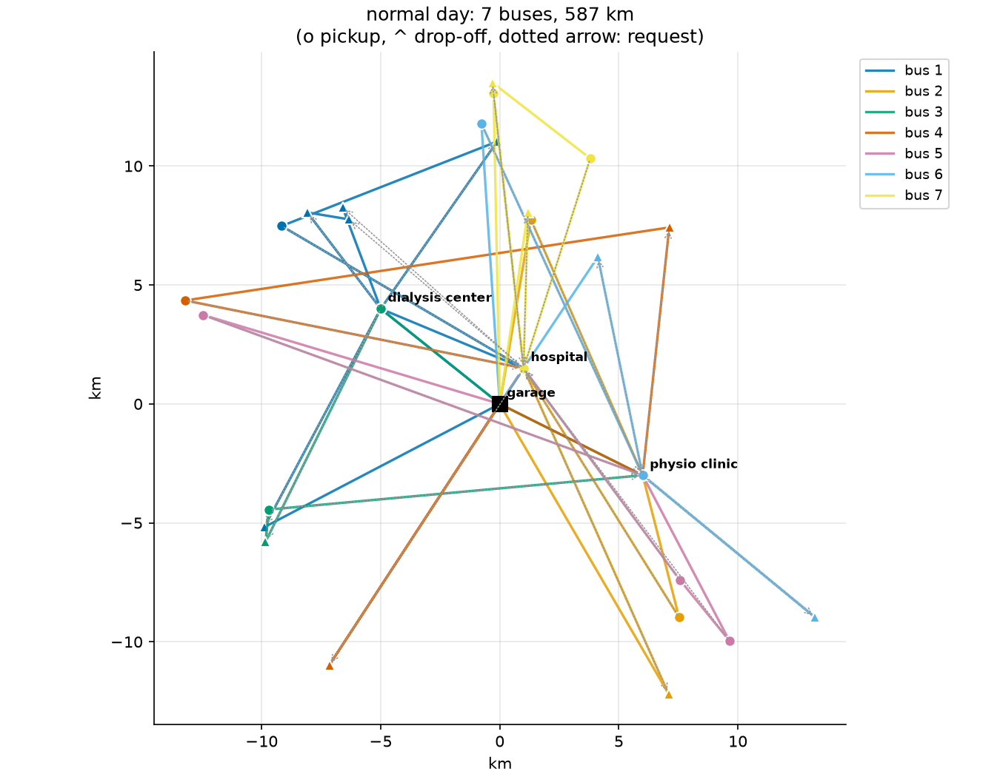
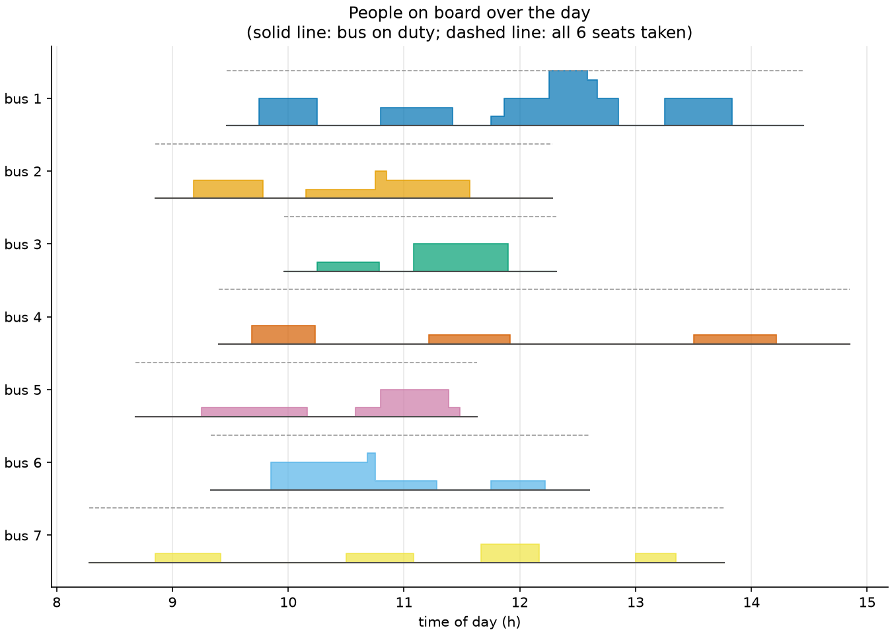

# 19 · Pickup and delivery routing (dial-a-ride)

**Solvers:** routing library, CP-SAT · **Problem class:** pickup and
delivery problem with time windows · **Level:** advanced

A charity drives patients from home to hospital and clinic appointments,
and back home afterwards. Every ride has two stops: a **pickup** and a
**drop-off**. The same bus must do both, the pickup must come first, and
nobody should sit in the bus much longer than a direct trip would take.

This example builds on [example 13](../ex13_vehicle_routing/) (capacity
and time dimensions) and adds the three pairing rules. It also shows what
those rules cost, and how to plan a day with too few drivers.

## The problem

On a normal Tuesday, 24 ride requests come in, for 41 passengers in all
(some patients bring a companion). The charity has 8 minibuses with 6
passenger seats each. Drivers work from 07:00 to 16:00.

- **To an appointment** at time $A$: the patient is ready between
  $A - 70$ and $A - 25$ minutes, and must arrive between $A - 30$ and
  $A - 5$.
- **Home after an appointment** that ends at $E$: pickup between $E$ and
  $E + 30$; the drop-off may be any time in the next two hours.
- **Boarding** takes $2 + 2 \cdot \text{seats}$ minutes, and so does
  getting off.
- **Ride time** (from the start of boarding to arrival at the drop-off)
  may exceed the direct trip by at most 20 minutes.
- **Cost:** driving distance, plus 30 km for each bus that leaves the
  garage (driver and running costs).

The map has a garage, a hospital, a dialysis center, and a physio clinic.
Patients live in five villages around them. See [`data.py`](data.py).

## The model

Each request $r$ has a pickup node $p_r$ and a drop-off node $d_r$. Node
$i$ has a load change $q_i$ ($+$seats at a pickup, $-$seats at a
drop-off), a service time $s_i$, and a time window $[a_i, b_i]$. Let
$\tau_{ij}$ and $c_{ij}$ be the driving time and distance from $i$ to
$j$.

The decisions are a set of routes (one per bus used) and, for each node,
the start of service $t_i$ and the number of people on board $Q_i$ after
the stop. A route that drives from $i$ to $j$ forces

$$
t_j \ge t_i + s_i + \tau_{ij}, \qquad Q_j = Q_i + q_j .
$$

Every plan must satisfy, for every node $i$ and every request $r$:

$$
\begin{aligned}
& a_i \le t_i \le b_i, \qquad 0 \le Q_i \le C && \text{windows, seats} \\
& \text{bus}(p_r) = \text{bus}(d_r) && \text{same bus} \\
& t_{p_r} \le t_{d_r} && \text{pickup first} \\
& t_{d_r} - t_{p_r} \le s_{p_r} + \tau_{p_r d_r} + 20 && \text{ride limit}
\end{aligned}
$$

The objective is

$$
\min \sum_{\text{arcs } (i,j) \text{ used}} c_{ij}
\;+\; F \cdot \#\text{buses used}
\;+\; P \cdot \#\text{declined requests},
$$

where declining is only allowed on the short-staffed day.

## The OR-Tools code

All the modeling is in [`model.py`](model.py). Seats and time are
dimensions, as in example 13. A pickup adds seats and a drop-off frees
them; the capacity dimension keeps the count in $[0, C]$ everywhere. The
new part is a short loop over the requests:

```python
for r in range(len(data.requests)):
    p = manager.NodeToIndex(pickup_node(r))
    d = manager.NodeToIndex(dropoff_node(r))
    routing.AddPickupAndDelivery(p, d)
    solver.Add(routing.VehicleVar(p) == routing.VehicleVar(d))
    solver.Add(time_dim.CumulVar(p) <= time_dim.CumulVar(d))
    limit = max_ride(data, r)
    if limit is not None:
        solver.Add(time_dim.CumulVar(d) - time_dim.CumulVar(p) <= limit)
```

Things to notice:

- **`AddPickupAndDelivery` tells the search about the pair.** Its
  insertion heuristics place both stops at once, and its local search
  moves them together. The two `solver.Add` lines state the rules
  themselves: same bus (`VehicleVar`) and pickup first (`CumulVar`).
- **The ride limit is one more line on the time dimension.** It links two
  cumul variables, like the precedence rule.
- **PARALLEL_CHEAPEST_INSERTION** is the first-solution strategy made for
  pairs. Guided local search then improves the plan for 3 seconds.
- **A safety net for tight windows.** With 8 buses and every request
  mandatory, every first-solution strategy we tried (seven of them)
  failed to find a start plan, although a plan exists. The fix: every request may be skipped, but at a
  huge penalty (10,000 km). The search always has a start, and it serves
  everyone as soon as it can. If a request is still skipped at the end,
  `solve_routing` reports that no plan was found.

  ```python
  routing.AddDisjunction([p, d], penalty, 2, routing.PENALIZE_ONCE)
  ```

  The disjunction holds *both* stops (`max_cardinality=2`), and
  `PENALIZE_ONCE` charges the penalty once per request, not once per
  stop. On the short-staffed day the same line, with a taxi price as the
  penalty, lets the plan decline requests.
- **Times after the search.** A route fixes the order of stops, not the
  exact minutes. Finalizers board each passenger as late as possible and
  drop them off as early as possible (`AddVariableMaximizedByFinalizer` /
  `AddVariableMinimizedByFinalizer`). Same route, shorter rides.
- **Loading policies.** `SetPickupAndDeliveryPolicyOfAllVehicles(...LIFO)`
  forces last-on, first-off order. That matters for a parcel van stacked
  from the back. We use it below to show what such a rule costs.

## Run it

```bash
uv run python -m examples.ex19_pickup_delivery.main          # report
uv run python -m examples.ex19_pickup_delivery.main --plot   # + figures
```

```text
Normal day: 24 ride requests, 41 passengers, 8 buses with 6 seats

Cost: 796.6 km-equivalent (7 buses)

bus    requests      km  leaves  back   most on board
-----  --------  ------  ------  -----  -------------
bus 1         6   99.46  09:28   14:27  6 / 6
bus 2         3   87.30  08:51   12:17  3 / 6
bus 3         2   53.52  09:58   12:19  3 / 6
bus 4         3  104.34  09:24   14:51  2 / 6
bus 5         3   73.65  08:41   11:38  3 / 6
bus 6         3   82.68  09:20   12:36  4 / 6
bus 7         4   85.67  08:17   13:46  2 / 6

The price of the rules

rules                 buses      km  cost (km-eq.)  avg extra min  max extra min
--------------------  -----  ------  -------------  -------------  -------------
ride limit (+20 min)      7  586.63         796.63           3.62             20
no ride limit             6  535.36         715.36          18.46             74
ride limit + LIFO         7  607.36         817.36           0.96             13

Short-staffed day: 4 buses, a taxi costs 60 km-eq.

Cost: 891.1 km-equivalent: 411.1 km driven, 6 taxis
Taxi rides: R06, R09, R12, R20, R21, R22
```

Each plan comes from a 3-second search, so the numbers can differ a
little between machines and runs. In our runs they did not change.

## Results

**The normal day** needs 7 of the 8 buses and 587 km of driving. The
appointments fall between 08:30 and 14:30, so the buses work in
parallel more than in sequence. Bus 1 is the busiest: 6 requests, and at
one point all 6 seats are taken.





**The price of the rules.** Without the ride limit, the plan needs one
bus less and 51 km less driving: 10% cheaper. But passengers pay for it.
On average they ride 18 minutes longer than a direct trip, and one rides
74 minutes longer. For patients on their way to dialysis, that is not
acceptable. With the limit, the average detour drops to under 4 minutes.

A last-on, first-off rule (LIFO) costs 21 km more here. For passengers it
does not matter much who gets off first, but for a parcel van it can.
The rule also makes rides shorter: a passenger who boards last and gets
off first never rides along while others are dropped off.

**The short-staffed day.** With only 4 drivers, the plan sends 6 requests
by taxi and serves the other 18 with the 4 buses. The day costs 891 km-
equivalent instead of 797. The planner declines whole requests, never
half of one.

## How we know the answers are right

[`check.py`](check.py) uses no OR-Tools:

1. **Every rule of every plan.** `plan_errors` checks that each request
   is fully served by one bus with the pickup first (or fully declined),
   that the bus is never overfull, and that the solver's own timetable
   meets all travel times, windows, the shift, and every ride limit.
   `plan_cost` recomputes the cost from the map.
2. **An exact referee for tiny instances.** `exact_optimum` tries every
   stop order for every set of requests, then splits the requests over
   the buses in the cheapest way.
3. **Timing done right.** With ride limits, "drive as early as possible"
   is not enough to decide if a stop order works. The test
   `test_schedule_test_allows_waiting_before_a_pickup` shows why: if the
   bus picks up Ann at 8:00 and then waits for Ben until 9:00, Ann rides
   too long. The bus must wait at Ann's door instead. So
   `schedule_exists` treats all timing rules as difference constraints
   ($t_j - t_i \le w$). Such a system has a solution exactly when its
   constraint graph has no negative cycle, and Bellman-Ford finds out.

The [tests](../../tests/test_ex19_pickup_delivery.py) also:

- compare brute force, CP-SAT, and the routing library on 7 tiny
  instances (3 to 6 requests, with and without ride limits and taxis);
  all three give the same optimal cost,
- solve two 8-request instances with CP-SAT to proven optimality and
  check that the routing plan is within 1% (in our runs, it matched
  exactly),
- check the LIFO order, the declined requests on the short-staffed day,
  and that one bus alone cannot do the normal day, and
- feed broken plans to the checker (a pair split over two buses, an
  overfull bus, a broken ride limit).

**What about the normal day itself?** `solve_exact` (CP-SAT with
`add_multiple_circuit` and route labels) can model it, but at 49 nodes it
cannot prove much. In our 30-second run, it found the same 796.6 km-eq.
plan as the routing library, with a lower bound of 717.6, a gap of 10%.
So the normal-day plan is valid and probably optimal, but not proven.

## Try this

- Tighten the ride limit to 10 minutes (`max_detour=10`). How many buses
  does the day need now?
- Give two buses a wheelchair lift and mark some requests as wheelchair
  users. Use `routing.SetAllowedVehiclesForIndex` to keep them on those
  buses.
- Add a lunch break for each driver with
  `time_dim.SetBreakIntervalsOfVehicle`.
- Charge for driver time with a span cost (see example 13). Do the buses
  still leave the garage early and wait?

## References

- [OR-Tools pickup and delivery guide](https://developers.google.com/optimization/routing/pickup_delivery)
- J.-F. Cordeau and G. Laporte, *The dial-a-ride problem: models and
  algorithms*, Annals of Operations Research 153, 2007.
- R. Dechter, I. Meiri, J. Pearl, *Temporal constraint networks*,
  Artificial Intelligence 49, 1991 — difference constraints and negative
  cycles.
