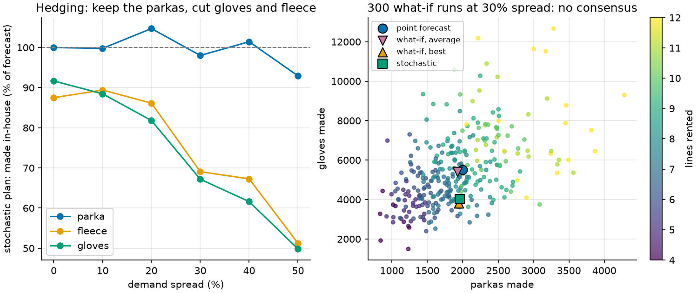
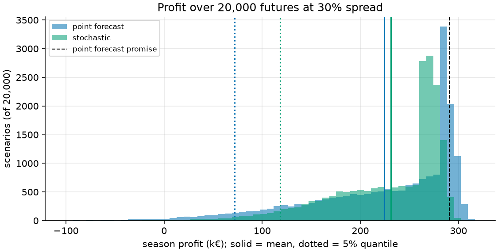
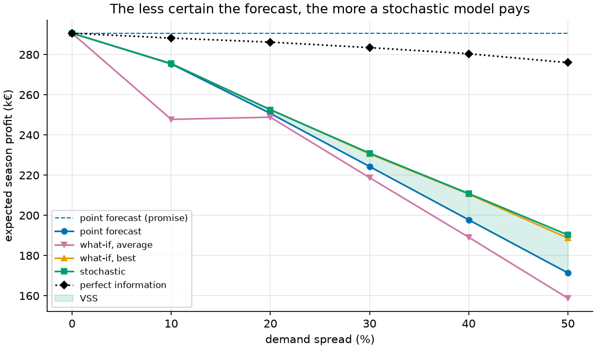
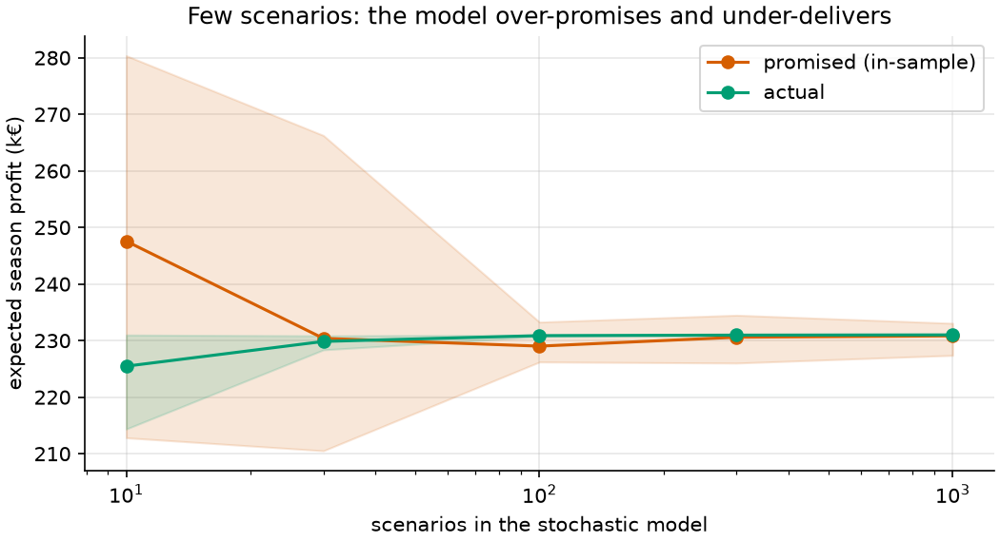

# 20 · Planning under uncertain demand (two-stage stochastic MIP)

**Solver:** MathOpt with HiGHS · **Problem class:** stochastic MIP
(extensive form) · **Level:** advanced

Every example so far trusts its data. The demand is 2,000 units, so we
plan for 2,000 units. But a forecast is a guess. This example asks what
happens when we take the guess seriously, and it compares the usual ways
to handle it:

1. **Plan for the point forecast** and hope.
2. **Rerun the model** for many possible futures ("what-if"), then
   average the plans or pick the best one.
3. **Reformulate**: one stochastic model that sees all futures at once and
   finds a single plan that does well across them.

Then it turns up the uncertainty step by step and watches the gap between
the approaches grow.

## The problem

A clothing maker plans its winter season in summer. It sells three
products:

| product | price | cost | outlet | express price | express cap | sewing h | forecast |
| ------- | ----: | ---: | -----: | ------------: | ----------: | -------: | -------: |
| parka   |   240 |   70 |     65 |           180 |         200 |     2.00 |    2,000 |
| fleece  |    80 |   35 |     10 |            65 |         300 |     1.00 |    3,000 |
| gloves  |    24 |   12 |      0 |            20 |         500 |     0.25 |    6,000 |

All money is in euros per unit.

**In summer** (before it knows the demand), the company must:

- rent sewing lines: €30,000 each for the season, 1,000 sewing hours each,
  at most 12 lines;
- make its stock of each product on those lines.

**In winter** (when the demand is known), it can:

- buy extra units from an express subcontractor, at most the express cap;
- sell up to the demand;
- send leftovers to the outlet after the season.

Two things are uncertain:

- **Demand.** A cold winter lifts all products together. Each product also
  has its own luck (fashion, a rival's sale). The *spread* is about the
  coefficient of variation: at 30%, demand is often 30% above or below the
  forecast.
- **The express price.** In a cold winter every brand wants express
  capacity, so the price goes up exactly when we need it most. This is
  cost uncertainty, and it is tied to the demand.

The economics differ by product. A parka earns €170, and a leftover parka
still sells for €65 at the outlet. A pair of gloves earns €12, and
leftover gloves are worth nothing. Keep this in mind for the results.

## Why a point forecast is not enough

Profit is a *concave* function of demand: if demand is low, we are stuck
with stock; if it is high, we lose sales or pay for express. So profit at
the average demand is **more** than the average profit over all demands
(Jensen's inequality). A plan built on the average demand is too
optimistic, and often it is the wrong plan, too. Sam Savage calls this
the *flaw of averages*.

## The model

**First stage (here and now).** Lines $n \in \{0,\dots,12\}$ and stock
$x_p \ge 0$.

**Second stage (wait and see).** For each scenario $s$ with demand
$d_{sp}$ and express price $r_{sp}$: express units $y_{sp}$ and sales
$z_{sp}$. Each scenario gets its own copy of these variables. We react to
what we see; $n$ and $x$ stay the same in every scenario.

With $q$ = price, $c$ = cost, $v$ = outlet price, $a$ = sewing hours,
$u$ = express cap, $F$ = line cost, $H$ = hours per line, and $S$
equally likely scenarios:

$$
\max\ -F n - \sum_p c_p x_p + \frac{1}{S}\sum_{s,p}
\Big[ q_p z_{sp} + v_p\,(x_p + y_{sp} - z_{sp}) - r_{sp}\, y_{sp} \Big]
$$

$$
\begin{aligned}
\textstyle\sum_p a_p x_p &\le H n && \text{sewing hours fit} \\
z_{sp} &\le x_p + y_{sp} && \text{sell only what we have} \\
z_{sp} &\le d_{sp} && \text{sell only what customers want} \\
y_{sp} &\le u_p && \text{express cap}
\end{aligned}
$$

This one model covers every approach:

| approach | scenarios given to the model | solves | output |
| -------- | ---------------------------- | -----: | ------ |
| point forecast | 1: the mean demand, normal express price | 1 | one plan |
| what-if | 1 at a time, for each of $S$ scenarios | $S$ | $S$ different plans |
| stochastic | all $S$ at once (the *extensive form*) | 1 | one hedged plan |
| perfect information | the what-if runs, scored as a bound | $S$ | a number, not a plan |

The stochastic model is a reformulation in the plain sense: the same
first stage, with the second stage copied once per scenario. It is called
*sample average approximation* (SAA) when the scenarios are random draws.
With 300 scenarios, it has 1,804 continuous variables, one integer, and
901 constraints. HiGHS solves it in 0.08 s.

### The standard measures

Let EV be the point-forecast plan.

- **EEV**: what the EV plan earns *on average over the real futures*.
- **RP** (recourse problem): what the stochastic plan earns on average.
- **WS** (wait and see): the average profit if we knew each future in
  advance. No plan can beat it.
- **VSS = RP − EEV**, the *value of the stochastic solution*: what we gain
  by modeling the uncertainty.
- **EVPI = WS − RP**, the *expected value of perfect information*: the
  most a better forecast could ever be worth.

For a profit (maximization), always $\text{WS} \ge \text{RP} \ge
\text{EEV}$.

## The OR-Tools code

All modeling is in [`model.py`](model.py). The second stage, one copy per
scenario:

```python
for s in range(S):
    for i in P:
        prod = data.products[i]
        sell = model.add_variable(lb=0.0, ub=float(scenarios.demand[s, i]))
        rush = model.add_variable(lb=0.0, ub=prod.rush_cap)
        model.add_linear_constraint(sell <= make[i] + rush)
        margin_rush = float(scenarios.rush_price[s, i]) - prod.salvage
        stage2.append((prod.price - prod.salvage) * sell - margin_rush * rush)
```

The what-if approach calls the same function once per scenario:

```python
def solve_each(data, scenarios):
    return [solve_plan(data, scenarios.subset([s])) for s in range(scenarios.count)]
```

Things to notice:

- **The demand is a variable bound.** `sell` gets the scenario's demand as
  its upper bound. No extra constraint is needed.
- **Every unit we own is worth at least its outlet price.** The objective
  uses $v x + (q - v) z - (r - v) y$, which equals the profit above. The
  margins at stake become clear: $(q - v)$ for a sale, $(r - v)$ for an
  express unit.
- **Judge plans on fresh scenarios.** The solver sees 300 scenarios.
  [`main.py`](main.py) then plays each plan out on 20,000 *other*
  scenarios. A plan's score on its own training scenarios is biased
  upward (see below).
- **Compare plans on the same scenarios.** All plans meet the same 20,000
  futures, so their difference has a small standard error (common random
  numbers).

## Run it

```bash
uv run python -m examples.ex20_stochastic_planning.main                 # report
uv run python -m examples.ex20_stochastic_planning.main --convergence   # + scenario count
uv run python -m examples.ex20_stochastic_planning.main --plot          # + figures
```

```text
approach             lines  parka  fleece  gloves  promised  actual  bad year  loss  solves  seconds
-------------------  -----  -----  ------  ------  --------  ------  --------  ----  ------  -------
point forecast       8      2,000  2,625   5,500   290.6k    224.3k  72.0k     0.9%       1  0.01
what-if, average     8      1,922  2,626   5,409   214.7k    218.8k  73.3k     0.9%     300  1.46
what-if, best        7      1,944  2,156   3,823   228.9k    230.6k  118.6k    0.1%     300  1.47
stochastic           7      1,960  2,072   4,031   229.1k    231.0k  118.5k    0.1%       1  0.08
perfect information                                283.5k                               300

Flaw of averages: the point forecast promises 66.3k more than it earns.
Value of the stochastic solution (VSS): 6.7k +- 0.2k (2.9%).
Value of perfect information (EVPI):    52.5k +- 4.0k (22.7%).
The 300 what-if runs rent between 4 and 12 lines (point forecast: 8).

spread  promised  forecast  avg what-if  best what-if  stochastic  perfect  VSS   lines  stochastic plan
------  --------  --------  -----------  ------------  ----------  -------  ----  -----  ---------------------
0%      290.6k    290.6k    290.6k       290.6k        290.6k      290.6k   0.0%      8  2,000 / 2,625 / 5,500
10%     290.6k    275.3k    247.8k       275.5k        275.5k      288.2k   0.1%      8  1,995 / 2,682 / 5,308
20%     290.6k    250.7k    248.8k       252.6k        252.6k      286.2k   0.7%      8  2,094 / 2,584 / 4,909
30%     290.6k    224.3k    218.8k       230.6k        231.0k      283.5k   2.9%      7  1,960 / 2,072 / 4,031
40%     290.6k    197.7k    189.1k       210.6k        210.8k      280.4k   6.2%      7  2,029 / 2,018 / 3,696
50%     290.6k    171.3k    158.8k       188.7k        190.3k      276.0k   9.9%      6  1,858 / 1,536 / 2,988
```

*promised*: what the method expects to earn. *actual*: the average over
20,000 fresh futures. *bad year*: the 5% quantile. *loss*: the chance of
a loss. Times vary by machine.

## Results

### 1. The point forecast over-promises

The point-forecast plan promises €290.6k. In the real futures (30%
spread), it earns €224.3k on average, €66k less. Nothing is wrong with
the solver. The model answered the question it was asked: "what if demand
is exactly the forecast?" That future never happens.

### 2. The what-if runs do not agree

The 300 what-if runs rent anywhere from 4 to 12 lines. Each run is the
perfect plan for its own future, and each is a bad plan for most other
futures. In summer, we cannot know which run will turn out right.



Two ways to turn the runs into one plan:

- **Average the plans.** This is the worst approach in the table, even
  below the point forecast. An average of plans that are each perfect
  for one future is perfect for none. It also breaks on integer choices.
  At 10% spread, the averaged stock needs 8.1 lines of sewing hours, so
  we must rent 9, and the extra line costs €30k. (Look for the dip in the first figure.)
- **Pick the best run.** Score every run's plan on all 300 scenarios and
  keep the winner. This comes close to the stochastic plan here, because
  300 diverse candidates happened to include a near-hedge. It needs 300
  solves plus a scoring loop, and nothing guarantees a good candidate:
  no single run *looks* for a hedge.

### 3. The stochastic plan hedges

The stochastic model sees all 300 futures at once. At 30% spread, it:

- keeps parkas at about the forecast (high margin, good outlet price);
- cuts fleece by 31% and gloves by 33% (low margin, leftovers worth
  little or nothing);
- rents **7 lines instead of 8**.

It promises €229.1k and earns €231.0k: an honest promise. It earns €6.7k
(2.9%) more per season than the point-forecast plan, and the bigger gain
is in the bad years:



| at 30% spread | point forecast | stochastic |
| ------------- | -------------: | ---------: |
| average profit | €224.3k | €231.0k |
| bad year (5% quantile) | €72.0k | **€118.5k** |
| chance of a loss | 0.9% | 0.1% |

The point-forecast plan does better in a normal winter: its tall bar sits
near €290k. It does much worse when demand falls short and it is stuck
with an extra line and a warehouse of gloves.

### 4. More uncertainty, more value from the model



- At **0% spread**, all approaches give the same plan. Uncertainty you do
  not have does not need a model.
- At **10%**, VSS is 0.1%. The point forecast is fine.
- At **30%**, VSS is 2.9%, and the bad year is 65% better.
- At **50%**, VSS is 9.9% (€19k a season), and the stochastic plan rents
  only 6 lines.
- **Perfect information** (the dotted line) falls slowly. The gap to the
  stochastic plan (EVPI) is what a better forecast could be worth: €52k at
  30% spread. That is a ceiling for a forecasting budget.

### 5. How many scenarios?

```text
scenarios  promised  actual  worst   best    over-promise
---------  --------  ------  ------  ------  ------------
       10  247.6k    225.5k  214.4k  231.0k  22.1k
       30  230.4k    229.8k  228.4k  230.9k  0.5k
      100  229.0k    230.9k  230.7k  231.0k  -1.9k
      300  230.6k    231.0k  230.9k  231.0k  -0.4k
    1,000  230.8k    231.0k  231.0k  231.0k  -0.2k
```

Each row solves the stochastic model on 8 separate random scenario sets.
With 10 scenarios, the model fits their quirks: it promises €248k and
earns €226k. In expectation, the optimum of a sample average is biased
upward. From about 100 scenarios on, the plan is stable, and the promise
matches the result.



## When to use which approach

| your situation | use |
| -------------- | --- |
| Spread under ~10%, or costs nearly symmetric | Point forecast. Simple and good enough. |
| You need to *see* the range of futures | What-if runs. Good for insight; do not average the plans. |
| A decision you cannot change later, and wide uncertainty | Stochastic model. One solve, one hedged plan. |
| You want to know if a better forecast pays off | EVPI = WS − RP. |

Rerunning tells you *that* the answer depends on the future.
Reformulating tells you *what to do* about it.

## How we know the answers are right

[`check.py`](check.py) uses no OR-Tools:

1. **Feasibility.** `plan_errors` checks whole lines, no negative stock,
   and the sewing hours.
2. **Playout.** `profits` plays out a plan in each scenario with the best
   winter reaction, in closed form: buy express only to cover a shortfall
   (and only while it costs less than the sale price), sell up to demand,
   and send the rest to the outlet. It recomputes the solver's objective
   to 1e-9, and it scores every plan on 20,000 fresh futures.
3. **An exact referee.** `best_plan` finds the optimal plan without a
   solver. For fixed stock, each product's average profit is concave and
   piecewise linear in its stock, with kinks at $d_{sp}$ and $d_{sp} -
   u_p$. So for a fixed number of lines, the best stock fills the sewing
   hours greedily, highest profit per hour first (the fractional knapsack
   rule, exact here). Try all 13 line counts and keep the best. It
   matches HiGHS on the point forecast, the stochastic model, and the
   what-if runs.

This referee works only because the model has a special shape. Add one
constraint that links the products in winter (say, a shared express
budget), and only the solver remains.

The [tests](../../tests/test_ex20_stochastic_planning.py) also check:

- that HiGHS matches the referee for 1, 25, and 200 scenarios at three
  spreads,
- the order WS ≥ RP ≥ EEV, and that the point forecast over-promises,
- that the stochastic plan beats the point-forecast plan on fresh futures
  by more than 5 standard errors, on average and in a bad year,
- that VSS grows with the spread,
- that 200 random feasible plans never beat the referee,
- that the averaged what-if plan fits the lines,
- that `sample` keeps the forecast mean and clips the express price, and
- `product_profit` on a hand-worked example.

## Try this

- **Care about bad years.** Maximize expected profit minus a weight times
  CVaR of the loss. Use the CVaR rows from
  [example 17](../ex17_portfolio/). How much average profit does a better
  bad year cost?
- **Share the express budget.** Give the subcontractor one capacity for
  all products. The greedy referee no longer applies; the MIP does not
  care.
- **Add a mid-season reorder.** Let the company make more units in
  December, after it sees November sales. Now the model has three stages
  and a scenario *tree*.
- **Robust instead of stochastic.** Maximize the *worst-case* profit over
  a box of demands. Compare it with the stochastic plan's bad year.
- **Make the forecast smarter.** Halve the spread of the market factor
  only (a better weather forecast). How much of the EVPI does it capture?

## References

- J. R. Birge and F. Louveaux, *Introduction to Stochastic Programming*,
  2nd ed., Springer (2011) — two-stage models, VSS, and EVPI.
- A. J. Kleywegt, A. Shapiro, and T. Homem-de-Mello, *The sample average
  approximation method for stochastic discrete optimization*, SIAM J.
  Optim. 12 (2002).
- W. K. Mak, D. P. Morton, and R. K. Wood, *Monte Carlo bounding
  techniques for determining solution quality in stochastic programs*,
  Oper. Res. Letters 24 (1999) — why the in-sample optimum is biased.
- S. L. Savage, *The Flaw of Averages*, Wiley (2009).
- [MathOpt user guide](https://developers.google.com/optimization/math_opt)
